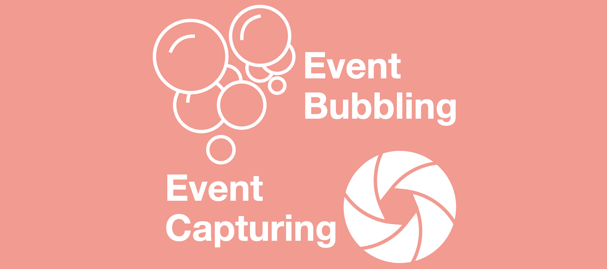
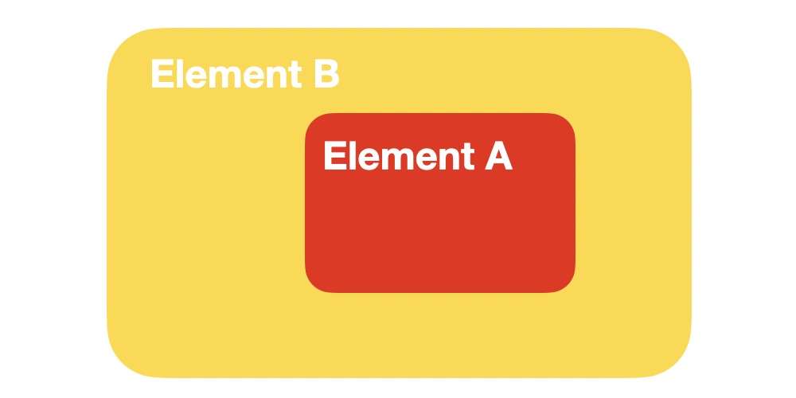

# Event Bubbling VS Event Capturing

### 이벤트 전파(Propagation)

자바스크립트로 HTML 엘리먼트들의 이벤트를 추가할 수 있다는 것을 알것이다.  
그리고 우리는 그 이벤트들을 제어하여 여러가지 기능들을 만들게 된다.  
네비게이션 바 혹은 케로셀등이 그 대표적인 예이다.



다음과 같은 엘리먼트 A와 B가 있다고 하자.(엘리먼트 A는 엘리먼트 B의 자식 엘리먼트이다.)  
그리고 엘리먼트들에 다음과 같은 클릭 이벤트를 생성했다.

```javascript
ElementA.addEventListener('click', () => {
  console.log("Clicked Element A!");
});

ElementB.addEventListener('click', () => {
  console.log("Clicked Element B!");
});
```

만약 사용자가 엘리먼트 A를 클릭했다면 어떤 일이 일어날까?

우리는 다음과 같은 답을 얻을 수 있다.

```
Clicked Element A!
Clicked Element B!
```

분명 엘리먼트 A만 클릭했을 뿐인데 엘리먼트 B의 클릭 이벤트까지 발생했다.

이와 같이 HTML 요소들이 계층적 구조를 이루고 있고 각각의 이벤트가 존재할 경우 이벤트가 전파된다.  
예시와 같이 상위 엘리먼트로 이벤트가 전파되는 것을 **이벤트 버블링(Bubbling)**, 그 반대로 하위 엘리먼트로 전파되는 것을 **이벤트 캡쳐링(Capturing)** 이라고 한다.
이는 `addEventListener` 메소드의 세번째 인자를 `true`로 설정한다면 **캡쳐링**이, `false`로 설정하면 **버블링**이 설정된다.  
또한 **버블링과 캡쳐링을 모두 이벤트로 생성할 수 있고 하나만 발생하는 것이 아닌 캡쳐링부터 시작하고 버블링으로 종료**된다.

<p align="center"></center></p>

출처 : [W3C-UI Event](https://www.w3.org/TR/DOM-Level-3-Events/#dom-event-architecture)

위 그림과 같이 캡쳐링 다음 버블링 순으로 이벤트가 발생하게 된다.

캡쳐링의 경우, IE8 이하에서는 지원되지 않으니 주의하길 바란다.

---

### 이벤트 전파 막기

그렇다면 이런 이벤트 전파를 막을 수 있는 방법은 있는 것일까?  
**당연히 존재한다.**

이벤트를 막는 방법으로는 3가지가 존재한다.(JQuery 사용시에도 있지만, 현재는 JQuery를 사용하지 않으므로 생략한다.)

1. **Event.stopPropagation**

   `stopPropagation`이란 메소드를 사용하면 전파를 막을 수 있다.

2. **Event.stopImmediatePropagation**

   해당 메소드는 `stopPropagation`메소드 보다  좀 더 세밀하게 동작한다.

   만약 한 엘리먼트에 여러개의 이벤트를 생성했다고 해보자.  
   그 다음 `stopPropagation` 메소드를 사용하면 어떻게 될까?  
   **해당 엘리먼트에 생성한 모든 이벤트가 실행되며 상위 엘리먼트에는 전파가 되지 않는다.**

   그렇다면 해당 메소드를 사용하면 어떻게 될까? 
   **해당 메소드를 쓴 이벤트 까지만 전달되고 그 이후로는 같은 엘리먼트 이벤트라도 전파되지 않는다.**  
   1,2,3이라는 이벤트를 차례대로 선언 했을 때, 2에 `stopImmediatePropagation` 메소드를 사용했다면, 1,2까지만 실행되고 3은 실행되지 않는다.

3. **Event.preventDefault**

   해당 메소드는 이름 그대로 기본적인 이벤트가 실행되지 않도록 막는 역할을 한다.  
   만약 a 태그로 엘리먼트를 생성시에는 기본적으로 지정한 URL로 이동하는 이벤트 있다.  
   이 a 태그 엘리먼트에 새로운 이벤트를 적용하고 해당 메소드를 사용시에는 새로운 이벤트는 실행되고, 기본 기능인 URL 이동은 막히게 된다.

---

<br>

### Reference

* [이벤트 - Poiemaweb](https://poiemaweb.com/js-event)

* [JavaScript에서 이벤트 전파를 중단하는 네가지 방법](https://programmingsummaries.tistory.com/313)
