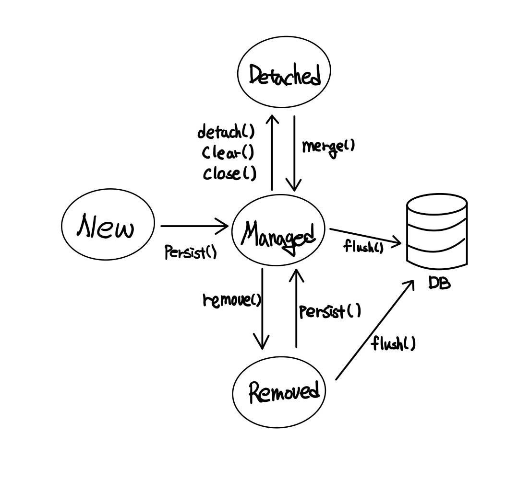

# 03. 영속성 관리

> 🍤  이 글은 김영한님의 ['자바 ORM 표준 JPA 프로그래밍'](https://www.inflearn.com/course/ORM-JPA-Basic)을 공부하며 정리한 것임을 알립니다.

<br>

## 3.1 엔티티 매니저 팩토리와 엔티티 매니저

* 데이터베이스를 하나만 사용하는 애플리케이션은 일반적으로 `EntityManagerFactory` 를 하나만 생성

  ```java
  // 엔티티 매니저 팩토리 생성
  EntityManagerFactory emf = Persistence.createEntityManagerFactory("jpabook");
  
  // 엔티티 매니저 생성
  EntityManager em = emf.createEntityManager();
  ```

  * 위와 같은 코트를 사용하여 엔티티 매니저 팩토리를 생성하면 `META-INF/persistence.xml` 에 있는 정보를 바탕으로 `EntityManagerFactory` 생성

* 엔티티 매니저 팩토리는 비용이 상당히 크므로 애플리케이션 전체에서 공유하도록 설계  
  반면, 엔티티 매니저 같은경우엔 생성 비용은 거의 들지 않음

* 엔티티 매니저 팩토리는 Thread Safe 하지만, 엔티티 매니저는 그렇지 않음

* 엔티티 매니저의 경우 데이터베이스 연결이 꼭 필요한 시점까지 커넥션을 얻지 않음

<br>

## 3.2 영속성 컨텍스트란?

* 영속성 컨텍스트는 **엔티티를 영구 저장하는 환경**으로 생각하면 좋음
* `persist()` 메서드를 호출시에 엔티티 메니저를 사용하여 영속성 컨텍스트에 이를 저장
* 영속성 컨텍스트는 논리적인 개념으로 엔티티 매니저를 생성할 때 생성되며, 무조건 1:1 매칭이 되는 것이 아닌 여러 엔티티 매니저가 하나의 영속성 컨텍스트에 접근 가능

<br>

## 3.3 엔티티의 생명주기

* 엔티티에는 4가지 상태가 존재

  * 비영속(new/transient) : 영속성 컨텍스트와 전혀 관계가 없는 상태
    * 엔티티 객체를 생성하고 아직 저장하지 않은 상태(영속성 컨텍스트와 디비와는 전혀 관련 없음)
  * 영속(managed) : 영속성 컨텍스트에 저장된 상태
    * 엔티티 매니저를 통해 엔티티를 영속성 컨텍스트에 저장
    * 영속성 컨텍스트가 관리하는 상태
  * 준영속(detached) : 영속성 컨텍스트에 저장되었다가 분리된 상태
    * 영속성 컨텍스트가 관리하지 않는 상태
  * 삭제(removed) : 삭제된 상태
    * 엔티티를 영속성 컨텍스트와 데이터베이스에서 삭제

  

<br>

## 3.4 영속성 컨텍스트의 특징

* 영속성 컨텍스트는 엔티티를 식별자 값(`@Id` 로 지정한 프로퍼티)으로 구분  
  따라서 영속 상태에서는 식별자 값이 무조건 존재해야 함
* 트랜잭션을 커밋하는 순간 영속성 컨텍스트에 새로 저장된 엔티티를 데이터베이스에 반영 이를 `flush`라고 함
* 다음과 같은 장점 존재
  * 1차 캐시
    * 영속성 컨텍스트 내부에 캐시가 존재(Map 형태, key는 `@Id`로 매핑한 식별자 value는 엔티티 인스턴스), 이를 1차 캐시라고 하는데 여기에 영속 상태의 엔티티를 저장
    * 만약 1차 캐시에 존재하지 않는다면 데이터베이스에서 조회하고 이를 1차 캐시에 반영 후 엔티티 반환
    * 반복 가능한 읽기(Refeatable Read) 등급의 트랜잭션 격리 수준을 애플리케이션 차원에서 제공
  * 동일성 보장
    * 1차 캐시에 저장되어 있는 엔티티를 반환하기 때문에 동일한 인스턴스임을 보장
  * 트랜잭션을 지원하는 쓰기 지연
    * 엔티티 매니저는 트랜잭션을 커밋하기 전까지 내부 쿼리 저장소에 쿼리를 모아둠
    * 트랜잭션 커밋이 될 때 모아둔 쿼리를 한번에 디비에 보내는데 이를 트랜잭션을 지원하는 쓰기 지연
  * 변경 감지
    * 엔티티의 변경사항을 자동으로 반영하는 기능
    * 영속성 컨텍스트에 엔티티를 저장할 때 최초의 상태를 복사하여 저장(스냅샷)하고 플러시 시점에서 스냅샷과 엔티티를 비교하여 변경점을 찾음
    * 변경 감지는 영속 상태의 엔티티에만 적용
    * 변경시에는 엔티티의 모든 필드를 업데이트  
      이로써 수정 쿼리가 항상 같아지므로 재사용 가능하며, 데이터베이스에서는 동일 쿼리를 받을 시에 파싱된 쿼리를 재사용 가능
    * 만약 필드가 너무 많거나(대략 30개 이상) 저장되는 내용이 너무 크면 수정된 데이터면 사용하영 동적으로 UPDATE 쿼리를 생성할 수 있음, 이 때 하이버네이트의 확장 기능을 사용 `@org.hibernate.annotations.DynamicUpdate`   
      해당 어노테이션을 사용하면 수정된 데이터만 사용하여 동적으로 UPDATE 쿼리 생성
  * 지연 로딩

<br>

## 3.5 플러시

* 영속성 컨텍스트의 변경 내용을 데이터베이스에 반영하는 행위

* 플러시 하는 방법은 다음과 같음

  * `em.flush()` 메서드를 직접 호출
    * 강제로 플러시
    * 테스트 혹은 다른 프레임워크와 JPA를 함께 사용할 때를 제외하고는 거의 사용 X
  * 트랜잭션 커밋 시 플러시가 자동 호출
    * 데이터베이스에 변경된 사항을 반영하지 않고 커밋을 하면 말짱 도루묵, 따라서 자동으로 플러시 호출
  * JPQL 쿼리 실행시 플러시 자동 호출
    * 객체지향 쿼리를 호출시에 자동으로 플러시 호출
    * 참고로 식별자를 기준으로 조회하는 `find()` 메서드 호출은 플러시가 호출 되지 X

* 플러시 모드가 존재

  * FlushModeType.AUTO : 커밋이나 쿼리 실행 시 플러시(default)
  * FlushModeType.COMMIT : 커밋할 때만 플러시

  COMMIT 모드를 사용하여 성능 최적화 가능

<br>

## 3.6 준영속

* 영속 상태가 아니므로 영속성 컨텍스트가 제공하는 기능을 사용할 수 없음
* 준영속으로 만드는 방법은 크게 3가지
  * `em.detach(entity)` : 특정 엔티티만 준영속 상태로 전환
    * 이를 호출 시 1차 캐시부터 쓰기 지연 SQL 저장소까지 존재하던 정보가 모두 제거
  * `em.clear()` : 영속성 컨텍스트를 완전히 초기화
  * `em.close()` : 영속성 컨텍스트를 종료
* 영속 상태의 엔티티는 주로 영속성 컨텍스트가 종료되며 준영속 상태로 전환  
  개발자가 이를 직접 전환하는 일은 거의 없음
* 준영속 상태는 다음과 같은 특징을 가짐
  * 거의 비영속 상태와 동일
  * 식별자의 값을 가짐
  * 지연 로딩 불가능
* 준영속 상태에서 다시 영속 상태로 변경하려면 병합을 사용, 이 때 새로운 영속 상태의 엔티티를 반환
* 준영속 상태만이 아닌 비영속 엔티티도 영속 상태로 변경 가능