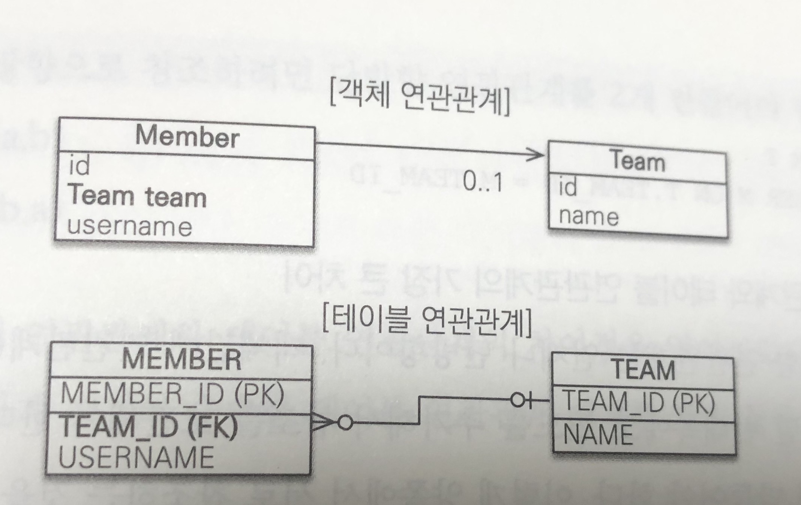
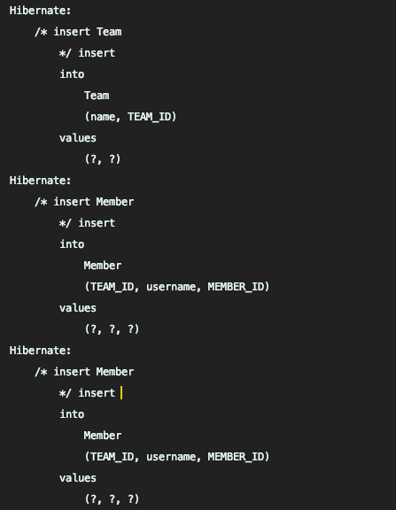
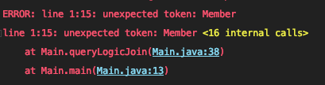
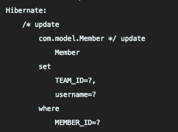
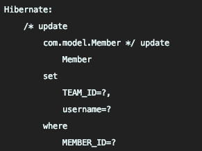
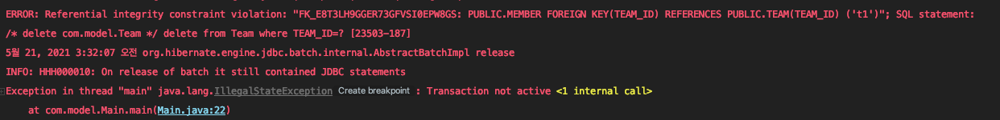
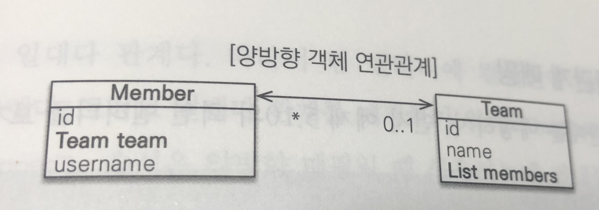

# 05. 연관관계 매핑 기초

> 👑  이 글은 김영한님의 ['자바 ORM 표준 JPA 프로그래밍'](https://www.inflearn.com/course/ORM-JPA-Basic)을 공부하며 정리한 것임을 알립니다.

<br>

## 5.1 단방향 연관관계



* 객체 연관관계
  * 회원 객체는 team이라는 멤버변수로 팀 객체와 연관관계를 맺음
  * **단방향 관계**로 회원의 team 필드를 통해 접근이 가능하지만 반대로는 접근이 불가능
* 테이블 연관관계
  * 회원 테이블은 TEAM_ID 외래 키로 팀 테이블과 연관관계를 맺음
  * **양방향 관계**로 회원 테이블에서 외래 키를 사용하여 회원과 팀을 조인 가능, 반대 조인도 가능
* 객체 VS 테이블 = 참조(주소) VS 외래 키
* 객체에서 양방향 관계를 맺으려면 참조가 하나 더 필요하며 이는 엄밀히 말하면 양뱡향이 아닌 단방향 관계가 두개

### 5.1.1 순수한 객체 연관관계

* 객체는 참조를 사용하여 연관관계를 탐색이 가능 이를 **객체 그래프 탐색**이라고 함

  ```java
  Team findTeam = member.getTeam();
  ```

### 5.1.2 테이블 연관관계

* 테이블의 경우 외래 키를 사용하여 연관관계를 탐색이 가능, 이를 **조인**이라고 함

  ```sql
  SELECT T.*
  FROM MEMBER M
  	JOIN TEAM T ON M.TEAM_ID = T.TEAM_ID
  WHERE M.MEMBER_ID = 'm1'
  ```

### 5.1.3 객체 관계 매핑

* `@ManyToOne`

  > 다대일(N:1) 관계라는 매핑 정보  
  > 연관관계를 매핑할 때 다중성을 나타내는 어노테이션을 필수로 사용

* `@JoinColumn`

  > 조인 컬럼은 외래 키를 매핑할 때 사용  
  > name 속성에는 매핑할 외래 키 이름을 지정(생략 가능)
  >
  > 만약 생략시 외래 키를 찾을 때 기본 전략을 사용  
  >
  > * 기본 전략: 필드명 + '_' + 참조하는 테이블의 컬럼명

<br>

## 5.2 연관관계 사용

### 5.2.1 저장

* 팀과 멤버 엔티티를 참조하고 저장

  ```java
  Team t1 = new Team("t1", "team1");
  em.persist(t1);
  
  Member m1 = new Member("m1", "jong");
  m1.setTeam(t1);
  em.persist(m1);
  
  Member m2 = new Member("m2", "yoon");
  m2.setTeam(t1);
  em.persist(m2);
  ```

* 저장시 쿼리 출력

  

  * 멤버를 넣을 때 TEAM_ID가 포함되서 들어가는 것을 볼 수 있음

### 5.2.2 조회

* 연관관계가 있는 엔티티를 조회하는 방법은 크게 2가지

  1. 객체 그래프 탐색

     ```java
     Member m = em.find(Member.class, "m1");
     Team team = m.getTeam(); // 객체 그래프 탐색
     ```

  2. 객체지향 쿼리 사용(JPQL)

     ```java
     String jpql = "select m from Member m join m.team t where t.name=:teamName";
     List<Member> resultList = em.createQuery(jpql, Member.class)
     							.setParameter("teamName", "team1")
     							.getResultList();
     for(Member m : resultList) {
     	System.out.println(m.getUsername());
     }
     ```

     **주의! 🖐🏻  JPQL을 사용할 때 Member를 읽지 못하는 에러가 날 수 있음**

     

     해당 에러는 현재 Member 클래스가 default 패키지 안에 존재하여 생기는 에러로 임의의 패키지 안에 옮겨 해결([참고](https://stackoverflow.com/questions/34021250/jpql-does-not-work-on-member-entity/34025097#34025097))

### 5.2.3 수정

* 수정은 앞선 장에서 얘기했듯이 값이 변경되면 플러시 될 때 자동으로 변경을 감지 및 반영

  ```java
  Team t2 = new Team("t2", "team2");
  em.persist(t2);
  
  Member m = em.find(Member.class, "m1");
  m.setTeam(t2);	// 자동으로 감지
  ```

* 수정시 쿼리 출력

  

### 5.2.4 연관관계 제거

* 연관관계를 `null`로 변경하면 제거

  ```java
  Member m = em.find(Member.class, "m1");
  m.setTeam(null);

* 연관관계 제거시 출력 쿼리

  

  * TEAM_ID가 다시 설정되는 것을 볼 수 있음

### 5.2.5 제거

* 연관된 엔티티를 제거하려면 기존에 존재하는 연관관계를 제거하고 삭제해야 함  
  그렇지 않을 시에는 에러 발생(외래키 제약조건)

  

<br>

## 5.3 양방향 연관관계



* 양방향 객체 연관관계
  * 멤버 : 팀 = 다 : 일,  팀 : 멤버 = 일 : 다
  * 일대다의 관계는 여러 객체와 연관관계를 맺어야 하므로 컬렉션을 사용
* 양방향 테이블 연관관계
  * 테이블의 경우 양방향 연결이 이미 되어있으므로 똑같음

### 5.3.1 양방향 연관관계 매핑

* `@OneToMany` 

  > `@ManyToOne`의 반대인 어노테이션
  >
  > `mappedBy` 속성의 경우 양방향 매핑일 때 사용하며 반대쪽 매핑 필드의 이름을 작성

### 5.3.2 일대다 컬렉션 조회

* 주의! 🖐🏻 예제 5.12의 코드만으로는 조회가 되지 않음, `t1` 의 매핑한 컬렉션에 멤버들을 넣어주는 코드를 따로 작성

<br>

## 5.4 연관관계의 주인

* 앞서 객체에서는 양방향이 없으며 단방향 2개로 양방향을 흉내낸다고 언급, 따라서 객체의 참조는 2개인데 테이블의 외래키는 하나이므로 차이가 발생
* 따라서 두 객체 연관관계 중에 하나를 선택하여 테이블의 외래 키를 관리, 이를 **연관관계의 주인**이라고 함

### 5.4.1 양방향 매핑의 규칙: 연관관계의 주인

* 양방향 매핑시에는 두 연관관계 중 하나를 주인으로 설정
* 연관관계의 주인은 외래 키 관리(등록, 수정, 삭제)를 할 수 있는 반면 주인이 아닌 쪽은 읽기만 가능
* 연관관계의 주인을 설정하는 것은 `mappedBy` 속성을 사용
* 주인은 `mappedBy` 속성을 사용하지 않고 그 반대는 `mappedBy`를 사용하여 주인을 지정
* 연관관계의 주인을 정한다는 것은 외래 키 관리자를 선택
* 위 예제를 보면, 테이블에 존재하는 TEAM_ID란 외래 키를 관리할 객체를 지정  
  Member를 선택한다면 테이블 안에 TEAM_ID를 관리하면 되지만, Team의 경우엔 물리적으로 나눠져 있는 Member 테이블의 TEAM_ID를 관리해야함(TEAM_ID는 Member 테이블에 존재)

### 5.4.2 연관관계의 주인은 외래 키가 있는 곳

* 연관관계의 주인은 외래 키가 있는 곳으로 지정

  

* 데이터베이스 테이블에서 다대일, 일대다 관계에서는 항상 '다' 쪽이 외래 키를 가짐  
  '다' 쪽인 `@ManyToOne` 은 항상 연관관계의 주인이므로 `mappedBy`를 설정하지 못함, 따라서 해당 속성은 존재하지 않음

<br>

## 5.5 양방향 연관관계 저장

* 단방향 연관관계의 코드와 동일
* 이는 연관관계의 주인이 외래 키를 관리하기에 주인이 아닌 방향은 값을 지정하지 않아도 무방
* 따라서 주인이 아닌 방향에서 해당 값의 변화를 주어도 무시

<br>

## 5.6 양방향 연관관계의 주의점

* 양방향 연관관계에서 가장 흔한 실수는 연관관계의 주인에 값을 입력하지 않고 주인이 아닌 곳에 값을 입력
* 이때는 외래 키 값이 `null`로 지정

### 5.6.1 순수한 객체까지 고려한 양방향 연관관계

* 객체 관점에서 양쪽 방향에 모두 값을 입력해주는 것이 가장 안전
* 5.3.2에서 Team 객체를 조회했을 때 아무런 값이 존재하지 않았던 것이 바로 이 문제

### 5.6.2 연관관계 편의 메소드

* 각각의 연관관계를 맺는 코드를 호출하다 보면 실수가 나오기 때문에 묶어서 하나의 함수로 관리

* 연관관계의 주인인 쪽에 Setter 함수에 하나의 코드로 모으는 것이 가장 적절

  ```java
  public void setTeam(Team team) {
  	this.team = team;
  	team.getMembers().add(this);
  }

### 5.6.3 연관관게 편의 메소드 작성 시 주의사항

* 위 메소드에서는 심각한 버그가 존재

* 이는 중간에 팀이 변경되어도 기존 팀에서 삭제가 되지 않음

  ```java
  m1.setTeam(t1);
  m1.setTeam(t2);
  List<Member> members = t1.getMemebers() // m1이 그대로 남아있음
  ```

* 따라서 다음과 같이 리팩토링 진행

  ```java
  public void setTeam(Team team) {
      // 기존 팀에서 해당 멤버를 제거
  	if(this.team != null) {
      	this.team.getMembers().remove(this);
      }
      this.team = team;
      team.getMembers().add(this);
  }
  ```

* 만약 새로운 영속성 컨텍스트에서 조회시에는 이러한 버그가 발견되지 않지만 조심하는 것이 좋음

<br>

## 5.7 정리

* 단방향 매핑만으로 테이블과 객체의 연관관계의 매핑은 끝
* 단방향을 양방향으로 만들면 반대 방향으로 객체 그래프 탐색 기능이 추가
* 양방향 연관관계를 매핑하려면 객체 양쪽 방향을 모두 관리
* 양방향 매핑을 굉장히 복잡하기에 우선은 단방향으로 사용하고 반대방향으로 탐색이 필요하다면 그 때 추가
* 연관관계의 주인을 정할 때는 **중요도**로 선택하는 것이 아닌 **외래 키의 위치**로 하는 것이 중요
* 양방향 매핑시에 무한 루프에 빠질 수 있으므로 조심  
  `.toString()` 메소드에서는 서로 참조하려고 시도하므로 무한루프에 빠짐  
  이 상황은 엔티티를 JSON 형태로 변환할 때 자주 발생하나 왠만한 라이브러리는 이를 해결할 어노테이션 혹은 기능 제공  
  Lombok 또한 조심