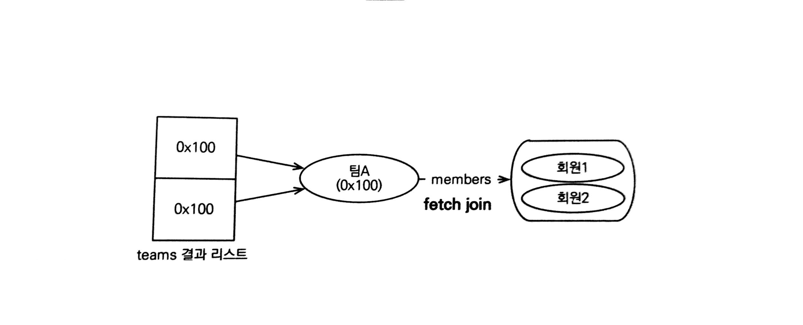
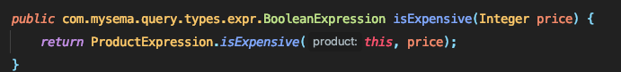

# 10. 객체지향 쿼리 언어

> 🕺  이 글은 김영한님의 ['자바 ORM 표준 JPA 프로그래밍'](https://www.inflearn.com/course/ORM-JPA-Basic)을 공부하며 정리한 것임을 알립니다.

<br>

## 10.1 객체지향 쿼리 소개

* JPA에서 기본적으로 제공하는 엔티티 매니저 메소드로만은 개발하기 힘듦
* 따라서 JPQL을 사용하여 이를 해결하는데 다음과 같은 특징이 존재
  * 테이블이 아닌 객체를 대상으로 검색하는 **객체지향 쿼리**
  * SQL을 추상화하여 특정 데이터베이스에 의존적이지 않음
* 이 외에도 Criteria 쿼리, Native SQL, Query DSL, 매퍼 프레임 워크 사용 등이 있음

### 10.1.1 JPQL 소개

* JPQL(Java Persistence Query Language)은 엔티티 객체를 조회하는 **객체지향 쿼리**

* 문법은 SQL과 비슷하고 ANSI 표준 SQL이 제공하는 기능과 유사

* SQL을 추상화하여 특정 데이터베이스에 의존 X(방언만 변경하면 끝)

* JPQL은 SQL보다 간결(엔티티 직접 조회, 묵시적 조인, 다형성 지원)

* ```java
  // 엔티티
  @Entity(name="Member")
  public class Member {
      @Column(name="name")
      private String name;
      ...
  }
  
  // JPQL
  // 멤버 테이블에 유저 이름이 kim인 엔티티를 조회
  // m.username => 테이블 컬럼명 X, 엔티티 객체 필드명 O
  String jpql = "select m from Memeber as m where m.username='kim'";
  List<Member> resultList = em.createQuert(jpql, Member.class).getResultList();
  ```

### 10.1.2 Criteria 쿼리 소개

* Criteria는 JPQL을 생성하는 빌더 클래스

* 장점은 문자열이 아닌 메소드 체이닝을 통해 JPQL을 작성할 수 있다는 점

* 문자열 쿼리는 런타임에서 에러 발생, 반면 메소드 기반 쿼리는 컴파일 시점에서 오류 발생

* 동적 쿼리 작성하기에 편리함

* ```java
  // "select m from Memeber as m where m.username='kim'"
  
  // CriteriaBuilder 생성
  CriteriaBuilder cb = em.getCriteriaBuilder();
  CriteriaQuery<Member> query = cb.createQuery(Member.class);
  
  // 조회를 시작할 클래스
  Root<Member> m = query.from(Member.class);
  
  // 쿼리 생성
  CriteriaQuery<Member> cq = 
      query.select(m).where(cb.equal(m.get("username"), "kim"));
  List<Member> resultList = em.createQuery(cq).getResultList();

* 필드명은 문자열인데 이를 **메타 모델**을 사용한다면 코드로 변경 가능
* 메타 모델은 Criteria 전용 클래스로 자바가 제공하는 어노테이션 프로세서를 기반으로 생성한 것
* `m.get("username")` → `m.get(Memeber_.username)`
* 모든 장점을 상쇄할 정도로 복잡하고 장황하기 때문에 사용하기엔 불편

### 10.1.3 QueryDSL 소개

* Criteria 처럼 빌더 클래스이지만, Criteria보다 단순하고 사용하기 편함

* ```java
  // QueryDSL 사용 준비
  JPAQuery query = new JPAQuery(em);
  QMember member = QMember.member;
  
  // 쿼리
  List<Member> members = query.from(member).where(member.username.eq("kim")).list(member);
  ```

* QueryDSL 또한 어노테이션 프로세서를 사용하여 쿼리 전용 클래스를 만들며 위 예제에서는 `QMember` 가 쿼리 전용 클래스

### 10.1.4 네이티브 SQL 소개

* SQL을 직접 사용할 수 있는 기능을 지원하는데 이를 네이티브 SQL이라고 함

* 아무리 추상화를 하더라도 JPQL에서 지원하지 않은 기능들이 존재, 따라서 이를 보완하기 위해 네이티브 SQL을 사용

* 데이터베이스에 의존적이기 때문에 데이터베이스가 변경되면 쿼리 또한 변경

* ```java
  String sql = "SELECT * FROM MEMBER WHERE NAME = 'kim'";
  list<Member> resultList = em.createNativeQeury(sql, Member.class).getResultList();

### 10.1.5 JDBC 직접 사용, SQL 매퍼 프레임워크 사용

* JDBC를 직접 사용하려면 JPA에서 제공하는 API가 없으므로 구현체들이 사용하는 방법으로 커넥션을 획득
* `EntityManager`에서 하이버네이트 `Session`을 구함
* 영속성 컨텍스트를 **적절한 시점에 강제로 플러시**
* JPA를 거쳐 사용하는 것이 아닌 우회하여 사용하므로 JPA가 인식 X, 따라서 영속성 컨텍스트와 데이터베이스가 불일치 될 수 있음
* 이를 해결하기 위해 우회하여 SQL을 실행하기 직전에 영속성 컨텍스트를 수동으로 플러시하여 동기화
* 스프링에서는 AOP를 적절하게 활용하여 JPA를 우회하여 데이터베이스에 접글할 때마다 플러시를 호출

<br>

## 10.2 JPQL

### 10.2.1 기본 문법과 쿼리 API

* SQL과 비슷하게 SELECT, UPDATE, DELETE 문을 사용, 저장시에는 `EntityManager.persist()` 메소드 사용

* SELECT

  * `select m from Memeber as m where m.username='kim'` 와 같이 사용
  * 엔티티 관련한 키워드(Memeber, username)는 대소문자를 구분하지만 JPQL과 관련된 키워드(SELECT, FROM, AS)는 대소문자 구분 X
  * `Member`는 클래스명이 아닌 엔티티명, 만약 엔티티명을 지정하지 않으면 자동으로 클래스 명으로 사용
  * 별칭은 무조건 사용(AS는 생략 가능)

* TypeQuery, Query

  * JPQL을 실행하기 위해서는 쿼리 객체를 생성
  * 쿼리 객체에는 TypeQuery와 Query가 존재하는데 TypeQuery는 반환할 타입을 명확하게 지정할 수 있을 때 사용
  * `em.createQuery()` 메소드에서 2번째 파라미터에 반환할 타입을 지정하면 TypeQuery를 그렇지 않으면 Query를 반환
  * Qeury는 조회 대상이 둘 이상이면 `Object[]`를 하나면 `Object`를 반환

* 결과 조회

  * 다음 메소드들을 호출한다면 실제 쿼리를 실행하여 데이터베이스를 조회

    `query.getResultList()` : 결과를 예제로 반환, 만약 없다면 빈 컬렉션

    `query.getSingleResult()` : 결과를 정확히 하나일 때 사용, 결과가 없거나 1개보다 많다면 예외 발생

### 10.2.2 파라미터 바인딩

* JPQL은 이름 기준 파라미터 바인딩을 지원

* 이름 기준 파라미터

  * 파라미터를 이름으로 구분하는 방법

  * 파라미터 앞에 `:`를 사용

    ```java
    TypedQuery<Member> query = 
        em.createQuery("SELECT m FROM Member m where m.username = :username", Member.class)
        .setParameter("username", usernameParam)
        .getResultList();

* 위치 기준 파라미터

  * `?` 다음에 위치 값을 줌

  * 위치값은 1부터 시작

    ```java
    List<Member> members = 
        em.createQuery("SELECT m FROM Member m where m.username = ?1", Member.class)
        .setParameter(1, usernameParam)
        .getResultList();
    ```

* 위치 기준 파라미터보단 이름 기준 파라미터 방식이 더 명확

* 파라미터 바인딩 방식을 사용하지 않고 일반 문자열만 사용하면 SQL 인젝션 공격을 당할 수 있음  
  또한, 파라미터만 변경된다면 같은 쿼리로 인식되어 SQL로 파싱한 결과를 재사용 가능하여 성능상 이점을 가짐

* 따라서, 파라미터 바인딩 방식은 선택이 아닌 필수!

### 10.2.3 프로젝션

* SELECT 절에서 조회할 대상을 지정하는 것을 프로젝션이라고 함  
  `SELECT [프로젝션 대상] FROM ...`으로 대상을 선택

* 엔티티 프로젝션

  * `SELECT m FROM Member m`, `SELECT m.team FROM Member m` 과 같이 사용
  * 이러한 방식으로 조회한 엔티티는 영속성 컨텍스트에서 관리

* 임베디드 타입 프로젝션

  * 엔티티와 거의 비슷하게 사용 
  * 임베디드 타입은 엔티티 타입이 아닌 값 타입이므로 영속성 컨텍스트에서 관리되지 않음

* 스칼라 타입 프로젝션

  * 숫자, 문자, 날짜와 같은 기본 데이터 타입
  * 중복 데이터를 제거하려면 DISTINCI 사용
  * 통계 쿼리도 주로 스칼라 타입으로 조회

* 여러 값 조회

  * 여러 값을 선택한다면 TypeQuery를 사용할 수 없음
  * 스칼라 말고도 엔티티 타입도 여러 값을 함께 조회 가능

* NEW 명령어

  * 여러 값을 조회시에 `Object[]` 타입을 사용하지 않고 DTO 객체로 변경하여 사용

  * 코드로 변경해도 되지만, new 키워드를 사용하여 DTO 객체로 바로 변경이 가능

    ```java
    TypedQeury<UserDTO> query = 
        em.createQuery("SELECT new jpabook.jpql.UserDTO(m.username, m.age) FROM Member m", userDTO.class);
    
    List<UserDTO> resultList = query.getResultList();
    ```

  * 이를 사용할 때는 패키지 명을 포함한 전체 클래스 명을 입력, 순서와 타입이 일치하는 생성자 필요

### 10.2.4 페이징 API

* 페이징 처리용 SQL은 반복적이고 지루함, 또한 데이터베이스마다 SQL 문법이 다름
* JPA에서는 두 API로 추상화
  * `setFirstReulst()` : 조회 시작 위치(0부터 시작)
  * `setMaxResults()` : 조회할 데이터 수
* 이는 데이터베이스 방언을 통해 데이터베이스마다 SQL문이 변경

### 10.2.5 집합과 정렬

* 집합함수

  | 함수     | 설명                                                         |
  | -------- | ------------------------------------------------------------ |
  | COUNT    | 결과 수를 구함(반환 : Long)                                  |
  | MAX, MIN | 최대, 최소 값을 구함(문자, 숫자 날짜 등에 사용)              |
  | AVG      | 평균값 구함(숫자 타입만 사용 가능, 반환 : Double)            |
  | SUM      | 합을 구함(숫자 타입만 사용 가능, 반환 타입 : Long, Double, BigInteger, BigDecimal) |

* 집함 함수 사용시 참고사항

  * NULL 값은 무시하므로 통계 결과에 반영 X
  * 값이 없는데 SUM, AVG, MAX, MIN 함수를 사용하면 NULL, COUNT는 0
  * DISTINCT를 집합 함수 안에 사용해서 중복을 제거하고 집합을 구할 수 있음(COUNT의 경우 임베디드 타입 지원 X)

* GROUP BY, HAVING

  * GROUP BY

    > 통계 데이터를 구할 때 특정 그룹끼리 묶음

  * HAVING

    > GROUP BY와 함께 사용, 그룹화한 데이터를 기준으로 필터링

* 정렬(ORDER BY)

  * 결과를 정렬할 때 사용
  * ASC : 오름차순(기본값), DESC : 내림차순

### 10.2.6 JPQL 조인

* 내부 조인
  * INNER JOIN 사용(INNER 생략 가능)
  * ```"SELECT m FROM Member m INNER JOIN m.team t WHERE t.name = :teamName"```
* 외부 조인
  * `SELECT m FROM Member m LEFT [OUTER] JOIN m.team t`
* 컬렉션 조인
  * 컬렉션을 사용하는 곳에 조인하는 것
  * 컬렉션 조인시에는 IN을 사용 가능, 기능상 JOIN과 같지만 컬렉션일 경우에만 사용 가능
* 세타 조인
  * WHERE 절을 사용하여 세타 조인
  * 내부 조인만 지원
* JOIN ON 절
  * JPA 2.1부터 조인 시에 ON 절을 지원
  * ON절을 사용하면 필터링을 하고 조인 가능
  * 내부 조인의 ON 절은 WHERE과 결과가 같으므로 보통 외부 조인에서 사용

### 10.2.7 페치 조인

* 페치 조인은 JPQL에서 성능 최적화를 위해 제공하는 기능

* 연관된 엔티티나 컬렉션을 한 번에 같이 조회하는 기능(`join fetch`)

* 엔티티 페치 조인

  * `select m from Member m join fetch m.team` 이란 쿼리가 존재할 때

    Member와 Team을 함께 조회(페치 조인에는 별칭 X, 하이버네이트는 허용)

  * 지연 로딩을 사용해도 페치 조인을 사용하면 아무 의미가 없음

* 컬렉션 페치 조인

  * 엔티티 페치 조인과 동일

  * 원래 결과는 하나이지만, 다쪽과 조인하면서 결과가 증가(주소는 같음)

    

  * 일대다 조인은 결과 증가 가능, 다대일 조인은 결과 증가 X

* 페치 조인과 DISTINCT

  * 위 일대다 조인의 결과에 DISTINCT를 사용해도 회원 정보가 2개이기 때문에 효과는 존재하지 않음

  * 하지만 팀 엔티티 결과 중복은 제거할 수 있음

    ​	

* 페치 조인과 일반 조인의 차이

  * 일반 조인의 경우 SELECT절에 쓴 프로젝션만 조회
  * 페치 조인은 모든 엔티티를 조회

* 페치 조인의 특징과 한계

  * 페치 조인은 일반 조인보다 SQL 호출 횟수를 줄여 성능을 최적화 할 수 있음
  * 또한 글로벌 로딩 전략보다 우선순위가 위(`join fetch` > `FetchType.LAZY`)
  * 최적화를 위해 즉시 로딩을 하는 것보다 필요한 곳에 페치 조인을 사용하는 것이 더 이득
  * 준영속 상테에서도 객체 그래프를 탐색 가능
  * 페치 조인 대상에는 별칭을 줄 수 없음  
    따라서 SELECT, WHERE 절, 서브 쿼리에서 페치 조인 대상을 사용할 수 없음  
    (하이버네이트를 포함한 몇몇 구현체에서는 별칭을 사용할 수 있지만 잘못 사용하면 연관된 데이터 수가 달라져 무결성이 깨질 수 있어 조심해서 사용)
  * 둘 이상의 컬렉션을 페치 할 수 없음(구현체에 따라 되기도 하지만 결과가 카테시안 곱이 만들어지므로 주의)
  * 컬렉션을 페치 조인하면 페이징 API를 사용할 수 없음  
    컬렉션이 아닌 단일 값 연관 필드들에 페치 조인을 사용해도 페이징 API 사용 가능
  * 하이버네이트에서 컬렉션 페치 조인 후에 페이징 API를 사용하면 경고 로그 발생, 메모리에서 페이징 처리  
    데이터가 많다면 성능 이슈와 메모리 초과 예외 발생

### 10.2.8 경로 표현식

* 경로 표현식은 `.`을 찍어 객체 그래프를 탐색하는 것  
  `select m.username from Member m join m.team t join m.orders o where t.name = '팀A'`  
  여기서 `m.username`, `m.team`, `m.orders`, `t.name`이 모두 경로 표현식

* 경로 표현식의 용어 정리

  * 상태 필드

    > 단순히 값을 저장하기 위한 필드(필드 or 프로퍼티)

  * 연관 필드

    > 연관관계를 위한 필드, 임베디드 타입 포함(필드 or 프로퍼티)
    >
    > * 단일 값 연관 필드 : @ManyToOne, @OneToOne, 대상이 엔티티
    > * 컬렉션 값 연관 필드 : @OneToMany, @ManyToMany, 대상이 컬렉션

* 경로 표현식과 특징

  * 상태 필드 경로

    > 경로 탐색의 끝

  * 단일 값 연관 경로

    > 묵시적으로 내부 조인 발생
    >
    > 단일 값 연관 경로는 계속 탐색 가능

  * 컬렉션 값 연관 경로

    > 묵시적으로 내부 조인 발생
    >
    > 더는 탐색 불가능, 단 FROM 절에서 조인을 통해 별칭을 얻으면 별칭으로 탐색 가능

* 경로 탐색을 사용한 묵시적 조인 시 주의사항

  * 항상 내부 조인
  * 컬렉션은 경로 탐색의 끝, 따라서 컬렉션에서 경로 탐색을 하려면 조인하여 별칭을 얻어야 함
  * 주로 SELECT, WHERE 절에서 많이 사용하지만 묵시적 조인으로 인해 SQL의 FROM절에 영향

* 조인의 경우 성능 이슈가 발생할 수 있는 가능성이 높기에 묵시적 조인보다는 명시적 조인을 사용하는 것이 좋음

### 10.2.9 서브 쿼리

* 서브 쿼리는 WHERE, HAVING 절에서만 사용 가능(나머지에서는 불가, 하이버네이트에서는 SELECT는 가능)

* 서브 쿼리 함수

  * [NOT] EXISTS (subquery)

    > 서브 쿼리에 결과가 존재하면 참(NOT은 반대)

  * {ALL | ANY | SOME} (subquery)

    > 비교 연산자와 같이 사용  
    > 조건을 모두 만족일 때 참(ALL), 조건 중 하나라도 만족하면 (ANY, SOME)

  * [NOT] IN (subquery)

    > 서브 쿼리의 결과 중 하나라도 같은 것이 있으면 참  
    > IN은 서브 쿼리가 아닌 곳에서도 사용

### 10.2.10 조건식

* 타입 표현

  | 종류        | 설명                                                         | 예제                                                         |
  | ----------- | ------------------------------------------------------------ | ------------------------------------------------------------ |
  | 문자        | 작은 따옴표 사이에 표현  <br />작은 따옴표 사용시에는 연속 두개 사용 | 'HELLO'  <br />'She''s'                                      |
  | 숫자        | L(Long), D(Double), F(Float)                                 | 10L, 10D, 10F                                                |
  | 날짜        | DATE {d 'yyyy-mm-dd'}  <br />TIME {t 'hh-mm-ss'}  <br />DATETIME {ts 'yyyy-mm-dd hh:mm:ss.f'} | {d '2021-07-02'}  <br />{t '10-20-10'}  <br /> {ts '2021-07-02 10:20:10.123'} |
  | Boolean     | TRUE, FALSE                                                  |                                                              |
  | Enum        | 패키지명을 포함한 전체 이름 사용                             | jong.MemberType.Admin                                        |
  | 엔티티 타입 | 엔티티 타입을 표현. 주로 상속 관련                           | TYPE(m) = Member                                             |

* 나머지 생략

### 10.2.11 다형성 쿼리

* 부모 엔티티를 조회하면 그 자식 엔티티도 함께 조회
* TYPE
  * 엔티티의 상속 구조에서 조회 대상을 특정 자식 타입으로 한정할 때 주로 사용
* TREAT(JPA 2.1)
  * 2.1에서 새롭게 추가된 기능으로 자바의 타입 캐스팅과 비슷
  * 상속 구조에서 부모 타입을 특정 자식 타입으로 다룰 때 사용
  * JPA 표준은 FROM, WHERE 절에서 사용할 수 있지만, 하이버네이트는 SELECT 절에서도 TREAT를 사용

### 10.2.12 사용자 정의 함수 호출(JPA 2.1)

* 2.1부터 사용자 정의 함수를 지원
* 하이버네이트를 사용하면 데이터베이스 방언 클래스를 상속하여 구현하고 사용할 데이터베이스 함수 미리 등록

### 10.2.13 기타 정리

* ENUM은 = 비교 연산만 지원
* 임베디드 타입은 비교를 지원 X
* EMPTY STRING
  * ''을 길이 0인 Empty String으로 정했지만, 데이터베이스에 따라 NULL로 사용하는 것도 존재
* NULL
  * 조건을 만족하는 데이터가 없을 때
  * 알 수 없는 값
  * NULL과 모든 수학적 계산 결과는 NULL
  * Null == Null은 알 수 없는 값
  * Null is Null은 참

### 10.2.14 엔티티 직접 사용

* 생략

### 10.2.15 Named 쿼리 : 정적 쿼리

* JPQL 쿼리는 크게 동적 쿼리와 정적 쿼리로 나눌 수 있음

* 동적 쿼리

  * JPQL을 문자로 완성하여 직접 넘기는 것
  * 런타임에 특정 조건에 따라 JPQL을 동적으로 구성

* 정적 쿼리

  * 미리 정의한 쿼리에 이름을 부여하여 필요할 때 사용할 수 있는데 이를 Named 쿼리라 함
  * 이는 한번 정의하면 변경할 수 없는 정적인 쿼리

* Named 쿼리는 애플리케이션 로딩 시점에 JPQL 문법을 체크하고 미리 파싱

* 따라서 오류를 빠르게 확인 가능하고 사용하는 시점에는 파싱된 결과를 재사용하므로 성능상 이점 존재

* 변하지 않는 정적 SQL이 생성되므로 데이터베이스의 조회 성능 최적화에도 도움

* 어노테이션에 정의

  * Named 쿼리를 이름 그대로 쿼리에 이름을 부여하여 사용하는 방법

  * `@NamedQuery` 어노테이션 사용

  * ```java
    @Entity
    @NamedQuery(
        // 충돌 방지
    	name = "Member.findByUsername",
        query = "select m from Member m where m.username = :username")
    public class Member{
        ...
    }
    
    List<Member> resultList = em.createNamedQuery("Member.findByUsername", Member.class).setParameter("username", "jong").getResultList();
    ```

  * 두개 이상의 `@NamedQueries()` 사용

* XML에 정의

  * 어노테이션이 더 직관적이지만 XML을 사용하는 것이 더 편리(멀티라인 때문)

* 만약 어노테이션과 XML에 같은 설정이 존재한다면 XML에서 우선권을 가짐

<br>

## 10.3 Criteria

> 생략

<br>

## 10.4 QueryDSL

* 쿼리를 문자가 아닌 코드로 작성해도 쉽고 간결하며 쿼리와 비슷하게 개발할 수 있는 프로젝트
* QueryDSL은 이름 그대로 쿼리를 조회하는데 특화

### 10.4.1 QueryDSL 설정

* 필요 라이브러리
  * querydsl-jpa : QueryDSL JPA 라이브러리
  * querydsl-apt : 쿼리 타입을 생성할 때 필요한 라이브러리

### 10.4.2 시작

* `JPAQuery` 객체를 생성 및 엔티티 매니저를 생성자에 넘겨줌
* 쿼리 타입을 생성 및 별칭 주기
* 기본 Q 생성
  * 사용시 편리를 위해 인스턴스를 따로 보관
  * 하지만 별칭을 직접 설정해야될 때는 새로 생성

### 10.4.3 검색 조건 쿼리

* QueryDSL의 WHERE 절에는 AND 혹은 OR 사용 가능 및 여러가지 검색 조건 사용 가능

### 10.4.4 결과 조회

* 결과 조회 메소드를 호출 시에 실제 데이터베이스에서 조회
* 조회 메소드
  * `uniqueResult()` : 조회 결과가 한 건일 때 사용, 없으면 null, 하나 이상이면 예외 발생
  * `singleResult()` : `uniqueResult()`와 비슷, 하나 이상의 결과에서는 처음 데이터 반환
  * `list()` : 결과가 하나 이상일 때 사용, 결과가 없다면 빈 컬렉션 반환

### 10.4.5 페이징과 정렬

* 정렬의 경우 `orderBy()` 메소드 사용
* 페이징은 `offset()` 과 `limit()` 을 조합하여 사용 혹은 `restrict()` 메소드 사용
* 만약 전체 데이터 수를 알고 싶다면 `list()` 대신에 `listResults()`를 사용(이 때는 전체 데이터 조회를 위한 count 쿼리 추가 실행)

### 10.4.6 그룹

* `groupBy()`를 사용하고 그룹화된 결과를 제한하기 위해 `having()`을 사용

### 10.4.7 조인

* 조인의 경우 `innerJoin`, `leftJoin`, `rightJoin`, `fullJoin`을 사용 가능
* 성능 최적화를 위한 `fetch` 조인도 사용 가능

### 10.4.8 서브 쿼리

* `JPASubQuery`를 생성하여 사용
* 서브 쿼리의 결과가 하나면 `unique()`, 여러개면 `list()`를 사용

### 10.4.9 프로젝션과 결과 반환

* 프로젝션 대상이 하나면 해당 타입으로 반환
* 여러개의 애상이라면 기본적으로 Tuple 이라는 Map과 흡사한 내부 타입을 사용
* 쿼리 결과를 엔티티가 아닌 특정 객체로 받고 싶다면 빈 생성 기능을 사용(프로퍼티 접근, 필드 직접 접근, 생성자 사용) 
* 빈 생성기능을 사용하려면 `Projections` 를 사용 `bean()` 의 경우는 `Setter`를 이용하고 `fields()` 사용하면 필드에 직접 접근하여 값을 채움(`private`도) , `constructor()` 는 생성자를 사용(프로젝션 순서와 파라미터 순서가 동일한 생성자가 필요)
* 만약, 쿼리 결과의 이름과 프로퍼티의 이름이 다르면 `as()` 를 사용하여 별칭을 부여

### 10.4.10 수정, 삭제 배치 쿼리

* QueryDSL에서도 수정, 삭제 같은 배치 쿼리가 있지만, JPQL과 같이 영속성 컨텍스트를 무시하고 데이터베이스로 직접 쿼리

### 10.4.11 동적 쿼리

* `BooleanBuilder`를 사용하면 특정 조건에 따른 동적 쿼리를 편리하게 생성 가능

### 10.4.12 메소드 위임

* 메소드 위임 기능을 사용하면 쿼리 타입에 검색 조건을 직접 정의 가능

* 이 기능을 사용하려면 정적 메소드를 만들고 `QueryDelegate` 어노테이션 속성으로 적용할 엔티티를 지정

* 해당 가격보다 비싼지를 확인하는 메소드

  ```java
  public class ProductExpression {
      @QueryDelegate(Product.class)
      public static BooleanExpression isExpensive(QProduct product, Integer price) {
          return product.price.gt(price);
      }
  }
  ```

  이후 mvn build를 하고 `QProduct` 를 살펴보면 다음과 같이 생성이 되어있는것을 볼 수 있음

  

<br>

## 10.5 네이티브 SQL

> 생략

<br>

## 10.6 객체지향 쿼리 심화

### 10.6.1 벌크 연산

* 엔티티를 수정하거나 삭제할 때 기존 방법처럼 변경 감지 기능이나 병합, `remove()` 메소드를 사용하는 것은 시간이 너무 오래 걸림. 이 때 여러건을 한 번에 수정하거나 삭제하는 벌크 연산을 사용

* 벌크 연산의 경우 `excuteUpdate()` 메소드를 사용, 이후 영향을 받은 엔티티 건수를 반환

  ```java
  int resultCnt = em.createQuery("~~~")
      				.setParameter("price", 1000)
      				.excuteUpdate();
  ```

* 하이버네이트의 경우, INSERT 벌크 연산도 지원

* 벌크 연산시 주의점
  * 벌크 연산의 경우 영속성 컨텍스트를 무시하고 데이터베이스에 직접 쿼리
  * 발생할 수 있는 예제
    * 가격이 1000원인 상품 A를 조회(영속성 컨텍스트에서 관리)
    * 벌크 연산으로 모든 상품의 가격을 10% 상승, 이로인해 상품 A는 1100원
    * 기존 조회한 상품 A의 가격을 출력하면 1100원이 아닌 1000원 출력
  * 해결 방안
    * `em.refresh()` 메소드를 사용하여 데이터베이스에서 상품 A를 다시 조회
    * 벌크 연산을 먼저 실행 후에 엔티티를 조회(JPA, JDBC를 함께 사용시에 유용)
    * 벌크 연산 직후에 영속성 컨텍스트를 초기화

### 10.6.2 영속성 컨텍스트와 JPQL

* JPQL로 엔티티를 조회하면 영속성 컨텍스트에서 관리를 하지만 임베디드 타입은 그렇지 않음. 따라서 변경 감지에 의한 수정이 발생하지 않음
* 만약, JPQL로 조회한 엔티티가 영속성 컨텍스트에 존재한다면 JPQL로 조회한 엔티티는 버리고 기존 영속성 컨텍스트에서 관리하는 엔티티를 반환(이때, 식별자를 통해 비교)
* 시나리오
  1. JPQL을 사용하여 조회 요청
  2. JPQL → SQL 변환 및 데이터베이스 조회
  3. 조회한 결과와 영속성 컨텍스트를 비교
  4. 식별자 값을 기준으로 있는 것은 버리고 없는 것은 추가
  5. 요청한 값 반환
* 왜 이런 동작을 하는가?
  * 새로운 엔티티를 영속성 컨텍스트에 추가한다고 한다면, 식별자 값은 중복될 수 없기 때문에 불가
  * 새로운 엔티티로 바꾼다고 한다면, 영속성 컨텍스트에서 수정중인 데이터가 사라질 위험이 존재
* `find()` 메소드와는 달리 항상 데이터베이스를 조회하기에 성능상 차이가 발생

### 10.6.3 JPQL과 플러시 모드

* 플러시는 영속성 컨텍스트의 변경 내역을 데이터베이스에 동기화 하는 작업
* 플러시는 `flush()` 메소드를 통해 강제로 실행하거나 플러시 모드에 따라 커밋하기 직전 혹은 쿼리 실행 직전에 자동으로 호출(쿼리 실행 직전 호출이 기본값)
* JPQL의 경우 바로 데이터베이스에 접근하기 때문에 영속성 컨텍스트에서 데이터베이스로 반영되지 않은 데이터들이 존재 할 수 있음.(AUTO 모드에서는 발생 X, COMMIT 모드에서 주로 발생) 이런 상황에서는 `flush()` 를 호출하거나 `setFlushMode()` 를 사용해서 해당 쿼리에서만 사용할 플러시 모드를 설정(따로 설정하는 것이 엔티티 매니저에만 설정하는 것보다 우선권을 가짐)
* 그렇다면 COMMIT은 언제 쓸까?  
  AUTO의 경우 트랜잭션 내부에 여러 쿼리가 존재한다면 쿼리 수대로 플러시가 발생. 이때, COMMIT 모드를 사용한다면 커밋 한번으로 플러시가 발생하므로 최적화가 가능
* JDBC를 사용할 때에는 JPA가 쿼리를 인식할 방법이 없기 때문에 AUTO를 하여도 플러시 발생 X. 이때는 JDBC 쿼리를 실행하기 직전 `flush()` 메소드를 통해 직접 플러시 호출