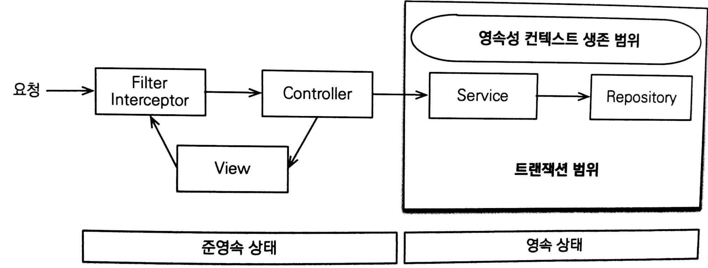
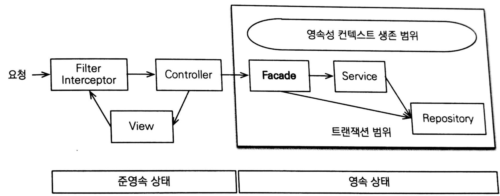
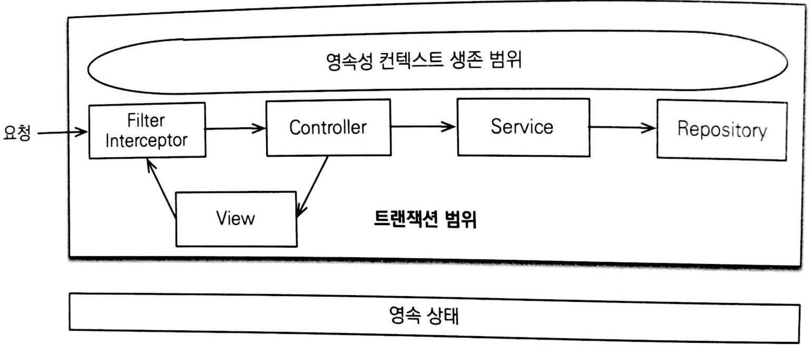
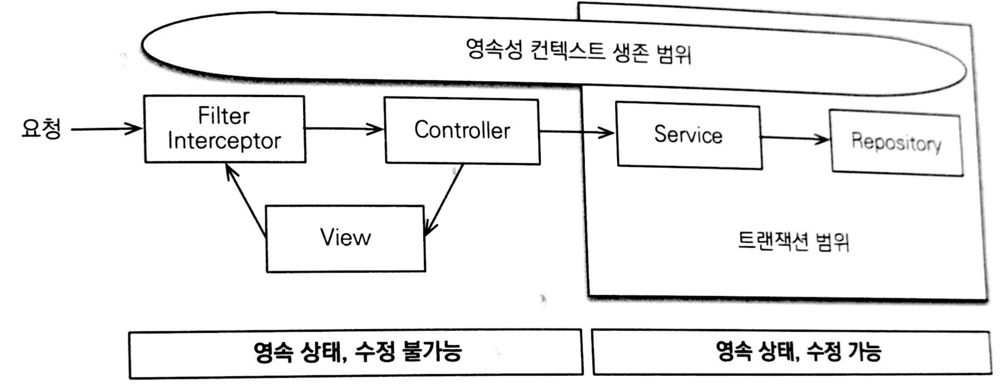
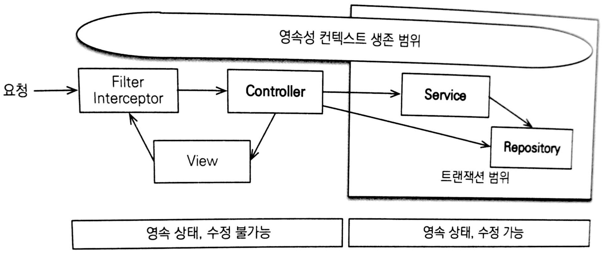

# 13. 웹 애플리케이션과 영속성 관리

> 🔫 이 글은 김영한님의 ['자바 ORM 표준 JPA 프로그래밍'](https://www.inflearn.com/course/ORM-JPA-Basic)을 공부하며 정리한 것임을 알립니다.

<br>

## 13.1 트랜잭션 범위의 영속성 컨텍스트

* J2SE 환경에서 JPA 개발에는 직접 엔티티 매니저를 생성하고 트랜잭션을 관리
* 스프링 혹은 J2EE 컨테이너 환경에서 JPA를 사용하기 위해서는 컨테이너가 제공하는 전략을 따름

### 13.1.1 스프링 컨테이너의 기본 전략

* 스프링의 경우 **트랜잭션 범위의 영속성 컨텍스트 전략**을 기본으로 사용

* 트랜잭션 범위의 영속성 컨텍스트 → 트랜잭션 범위와 영속성 컨텍스트의 생존 범위가 같음  
  같은 트랜잭션 안에서는 항상 같은 영속성 컨텍스트에 접근

  

  * 다양한 위치에서 엔티티 매니저를 주입받아 사용해도 트랜잭션이 같을 시에는 항상 같은 영속성 컨텍스트 사용
  * 여러 스레드에서 동시 요청이 와서 같은 엔티티 매니저를 사용해도 트랜잭션에 따라 접근하는 영속성 컨텍스트가 다름(멀티 스레드 상황에서 안전)

* 스프링에서는 `@Transactional` 어노테이션을 사용하여 트랜잭션의 범위를 지정  
  즉, 어노테이션이 붙은 메소드를 실행하기 직전에 트랜잭션 AOP가 동작하여 트랜잭션을 시작하고, 메소드가 정상적으로 종료되었을 때는 트랜잭션을 커밋(커밋하기 전에 먼저 영속성 컨텍스트를 플러시)

* 만약 중간에 예외 발생시에는 트랜잭션을 롤백하고 종료(영속성 컨텍스트 플러시 X)

<br>

## 13.2 준영속 상태와 지연 로딩

* 트랜잭션이 살아있는 서비스 계층과 레포지토리 계층에서 엔티티는 영속 상태  
  반면 프리젠테이션 계층에서 엔티티는 준영속 상태  
  따라서 프리젠테이션 계층에서는 **변경 감지와 지연 로딩 X**

* 프리젠테이션 계층에서도 이를 사용하기 위해서는 여러가지 방법이 존재

  1. 글로벌 페치 전략 수정

     * 지연 로딩 → 즉시 로딩

     * 이 때 발생할 수 있는 문제 2가지

       1. 사용하지 않는 엔티티를 로딩

          > A라는 뷰에서는 Order와 Member 둘 다 사용
          > B라는 뷰에서는 Order만 사용
          >
          > 즉시 로딩 전략으로 인해 B에서는 Order, Member 둘 다 로딩

       2. N+1 문제 발생(JPQL 사용시)

          > JPA가 JPQL을 분석하여 SQL을 생성할 때 글로벌 페치 전략을 참고 X
          >
          > 따라서 Order을 먼저 가져오고 나서 Member의 전략이 즉시 로딩이므로 그제서야 Member를 가져옴  
          > 이 때, Member의 수만큼 SQL문이 발생하므로 이를 N+1이라고 함
          >
          > 이는 JPQL 페치 조인으로 해결 가능

  2. JPQL 페치 조인

     * Join 명령어 마지막에 fetch를 넣어주면 됨
     * N+1 문제를 해결하면서 화면에 필요한 엔티티를 미리 로딩하는 현실적인 방법
     * 무분별하게 사용시 화면에 맞춘 레포지토리 메소드가 증가  
       즉, 뷰와 레포지토리 간의 논리적인 의존성이 발생

  3. 강제 초기화

     * 영속성 컨텍스트가 살아있을 때 프리젠테이션 계층이 필요한 엔티티를 강제로 초기화

       ```java
       @Transactional
       public Order findOrder(Long id) {
           Order o = orderRepository.findOrder(id);
           o.getMember().getName(); // 프록시 객체 강제 초기화
           return o;
       }
       ```

     * 하이버네이트를 사용하면 `initialize()` 메소드를 사용하여 프록시를 강제로 초기화(JPA 표준에선 없음)

     * 서비스 계층에서 프리젠테이션 계층에 필요한 엔티티를 초기화 한다면 서비스가 프리젠테이션에 종속적이게 되므로 중간 계층을 두어 분리, 이가 바로 FACADE 계층

  4. FACADE(퍼사드) 계층 추가

     * 프리젠테이션 계층과 도메인 모델 계층(서비스, 레포지토리) 간의 논리적 의존성 분리

       

     * 프록시 객체를 초기화

     * 레포지토리를 직접 호출하여 뷰가 요구하는 엔티티를 검색

     * 결과적으로는 코드를 더 많이 작성하는 것은 같음

* 이 모든 문제는 엔티티가 프리젠테이션에서는 준영속 상태이기 때문에 발생

<br>

## 13.3 OSIV(Open Session In View)

* OSIV는 영속성 컨텍스트를 프리젠테이션 계층까지 열어 놓는 것을 뜻함  
  따라서 뷰에서도 지연 로딩과 변경 감지등 사용 가능
* OSIV는 하이버네이트에서 사용하는 언어로 JPA에서는 OEIV(Open EntityManager In View)라고 함

### 13.3.1 과거 OSIV(요청 당 트랜잭션)

* 클라이언트의 요청이 들어오자마자 서블릿 필터 혹은 스프링 인터셉터에서 트랜잭션을 시작, 요청이 끝나면 트랜잭션도 끝  
  이를 요청 당 트랜잭션 OSIV라고 함

  

* 이에 가장 큰 문제점은 프리젠테이션 계층에서 엔티티 변경이 가능하다는 것

  > 프리젠테이션 계층에서 엔티티를 변경한 뒤 요청을 끝내면 의도한 것이 아니더라도 데이터베이스에 반영이 가능

* 이로인해 유지보수가 상당히 힘들어지므로 다음과 같은 방법을 사용

  1. 엔티티를 읽기 전용 인터페이스로 제공

     * 읽기 전용 메소드만 제공하는 인터페이스를 프리젠테이션 계층에 제공

       ```java
       interface MemberView {
           public String getName();
       }
       
       @Entity
       class Member implements MemberView {
           ...
       }
       
       class MemberService {
           public MemberView getMember(Long id) {
               return memberRepository.findById(id);
           }
       }

  2. 엔티티 래핑

     * 엔티티의 읽기 전용 메소드만 가지고 있는 엔티티를 감싼 객체를 만들고 이를 반환

       ```java
       class MemberWrapper {
           private Member m;
           
           public MemberWrapper(Member m) {
               this.m = m;
           }
           
           public String getName() {
               return m.getName();
           }
       }

  3. DTO 반환

     * 가장 전통적인 방법으로 단순한 데이터만 전달하는 DTO를 생성하여 반환
     * OSIV를 사용하는 장점을 살릴 수 없고 엔티티를 복사한 듯한 DTO 클래스를 만들어야 하는 단점

* 이러한 문제점들을 보안하기 위해 비지니스 계층에서만 트랜잭션을 유지하는 방식의 OSIV를 사용(스프링에서 제공하는 OSIV)

### 13.3.2 스프링 OSIV(비지니스 계층 트랜잭션)

* spring-orm.jar 에서는 다양한 OSIV 클래스 제공

* OSIV를 사용하지만 트랜잭션은 비지니스 계층에서만 사용

  

* 동작 원리

  1. 클라이언트의 요청이 들어오면 서블릿 필터나 스프링 인터셉터에서 영속성 컨텍스트 생성
  2. 서비스 계층에서 `@Transactional` 로 인하여 트랜잭션이 시작할 때, 미리 생성해 둔 영속성 컨텍스트를 찾아와 시작
  3. 서비스 계층이 끝나면 영속성 컨텍스트 플러시 및 트랜잭션 커밋, 종료
  4. 프리젠테이션 계층까지 영속성 컨텍스트가 유지되므로 엔티티는 영속 상태 유지
  5. 모든 작업이 끝나고 서블릿 필터 혹은 스프링 인터셉터에 응답이 가면 영속성 컨텍스트를 종료, 플러시 X

* 엔티티를 변경하지 않고 단순히 조회할 때는 트랜잭션이 필요 X, 이를 **트랜잭션 없이 읽기**라고 함

* 만약 프리젠테이션 계층에서 엔티티를 수정하고 트랜잭션을 시작하는 서비스 계층을 호출하면 문제 발생

  >미리 변경 후에 트랜잭션 안으로 들어가 플러시가 될 수 있기 때문

* 여러 트랜잭션이 하나의 영속성 컨텍스트를 공유하므로 주의(특히 트랜잭션 롤백 시 주의)

* 꼭 OSIV만이 답은 아님, 여러가지 엔티티를 사용하는 뷰의 경우 JPQL을 작성하여 DTO로 조회하는 것이 더 효과적

* JVM을 벗어난 환경(외부 API 호출 시)에서는 OSIV를 사용할 수 없기 때문에 엔티티를 직접 노출하는 것이 아닌 DTO로 변경한 뒤에 노출하는 것이 안전

<br>

## 13.4 너무 엄격한 계층

* OSIV를 사용한다면, 단순한 엔티티 조회할 시에 프리젠테이션 계층에서도 레포지토리를 직접 호출해도 아무런 문제가 없음

  

