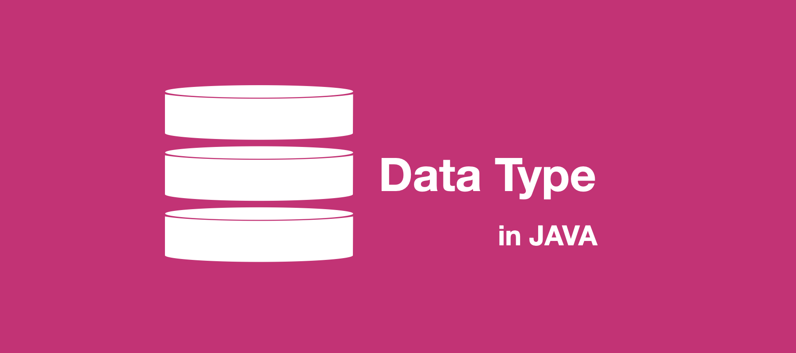
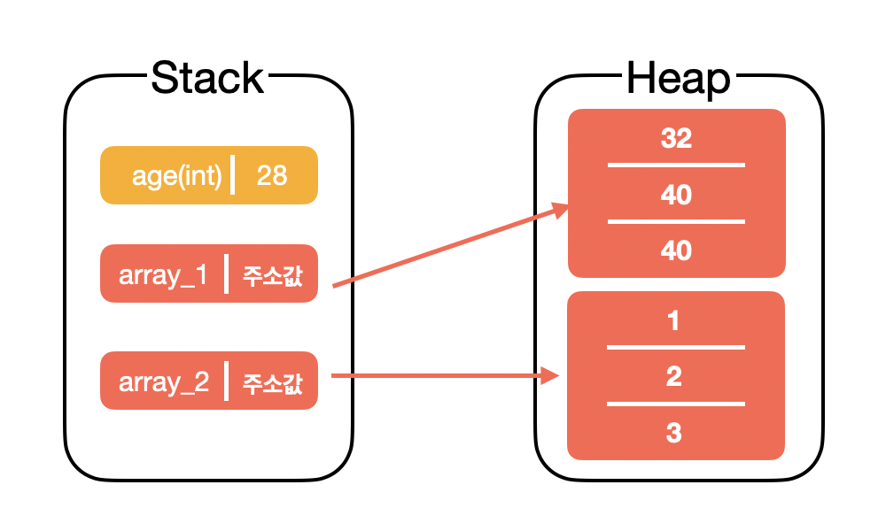
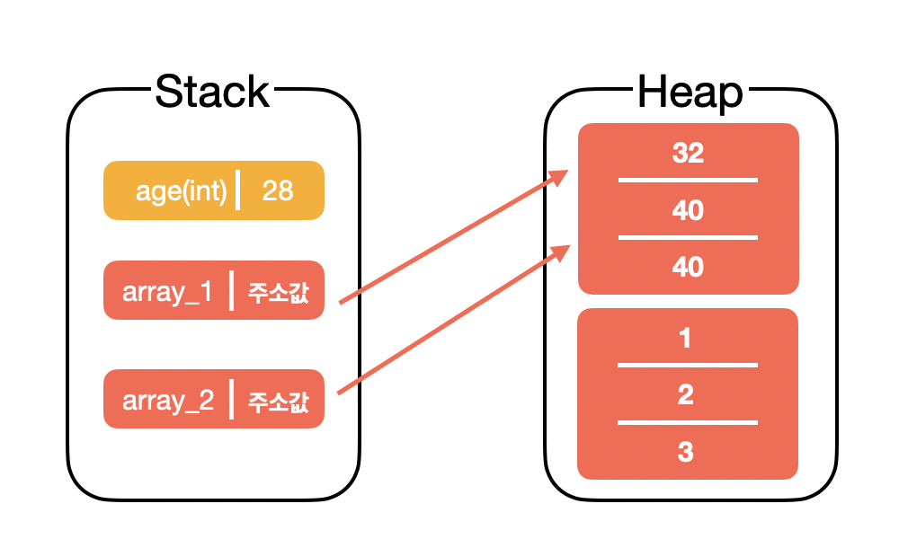

# Data Type in Java

> 데이터 타입이란, 미리 정해놓은 약속으로 데이터마다 기준을 나누며 데이터 처리시 이를 구분짓기 위함이다.
>
> 숫자면 숫자, 문자면 문자라고만 칭하면되지 왜 나누게 된 것일까?  
> 그 이유는 바로 **메모리 절약**에 있다.   
> 모든 수를 8byte인 `long` 타입으로 나타냈을 때, 1 혹은 2 와 같이 한자리 수만 저장한다면 나머지 비트는 놀게된다.  
> 이런 이유로 데이터를 여러개의 타입으로 나누어 사용하는 것이다.
>
> 자바에서는 데이터 타입이 크게 기본형 타입과 참조형 타입로 나뉜다.

<br>

## Primitive(기본형/원시형) Type

자바에서 제공하는 기본형 데이터 타입은 총 8가지이다.  

| Data type        | Default Value | Size   |
| ---------------- | ------------- | ------ |
| boolean(참/거짓) | false         | 1 bit  |
| char(문자)       | '\u0000'      | 2 byte |
| byte(정수)       | 0             | 1 byte |
| short(정수)      | 0             | 2 byte |
| int(정수)        | 0             | 4 byte |
| long(정수)       | 0L            | 8 byte |
| float(실수)      | 0.0f          | 4 byte |
| double(실수)     | 0.0d          | 8 byte |

### Boolean

기본적으로 `true`, `false`만 저장할 수 있으며, 길이를 변경할 수 없다.
따라서 간단하게 참/거짓 2가지 상태를 갖는 경우 사용된다.

### Char

단일 16-bit 유니코드 문자이며, `'\u0000' ~ '\uffff'`까지 나타낼 수있다.  
7bit의 ASCII 코드의 확장으로 16bit의 유니코드를 사용

### Byte

8bit 단위의 정수를 저장할 수 있는 가장 기본이 되는 타입이며, `-128~127`까지 수를 나타낼 수 있다.  
보통 메모리 절약이 가장 필요한 큰 배열 안에서 메모리를 나타내는 용도로 많이 사용된다.

### Short

16bit의 부호가 존재하는 정수를 저장할 수 있으며, `-32,768~32,757` 사이의 수를 나타낼 수 있다.  
byte 타입과 마찬가지로 메모리를 절약 할 수 있다.

### Int

메모리 절약을 위해 byte와 short를 사용하지 않는한 일반적으로 정수를 저장하기에 int 형을 많이 사용한다.  
32bit의 부호가 존재하는 정수를 저장할 수 있기에 `-2,147,483,648(-2^31^)~2,147,483,647(2^31^-1)` 의 수를 나타낼 수 있다.

### Long

int 타입보다 더 많은 수가 필요할 때가 존재하는데 이 때 사용하는 것이 long 타입이다.  
`-9,223,372,036,854,775,808(-2^63^)~9,223,372,036,854,775,807(2^63^ -1)`의 수를 나타낼 수 있다.  
int 형과 구분짓기 위해 숫자 뒤에 `L`을 붙힌다.

### Float

32bit의 부동 소수점 값을 나타내며 값의 범위는 `3.4 X 10^-38^ ~ 3.4 X 10^38^` 이다.  
무제한이지만 매우 큰 수를 나타낼 때는 double 타입으로 나타내는 것이 좋으며, 부동 소수점이기 때문에 오차가 있을 수 있다.  
따라서 정확한 값을 요구하는 시스템에서 사용하면 안된다.  
double과 구분짓기 위해 숫자 뒤에 `f`를 붙힌다.

#### 부동 소수점

> 부동 소수점은 1.11212... 과 같이 무제한으로 나타낼 수 있는 실수 값을 컴퓨터가 정확하게 측정할 수 없기 때문에 근사한 값으로 계산을 하기 위해 사용하는 방법이다.
>
> 1bit의 부호 비트를 가지고, 8bit의 지수비트(float, double은 11bit) 나머지 비트를 가수를 사용하여 값을 나타낸다.

### Double

64bit의 부동 소수점 값을 나타내며, `1.7 X 10^-308^~1.7 X 10^308^` 사이의 값을 나타낼 수 있다.  
이 또한 부동 소수점을 사용하므로 정확한 값을 판단하는 곳에 사용하면 안된다.  
float과 구분짓기 위해 숫자 뒤에 `d`를 붙힌다.

<br>

## Reference(참조형) Type

기본형을 제외한 모든 타입 혹은 `java.lang.Object`를 상속 받게 된다면 참조형 타입이 된다.  
기본형과 달리 기본값으로 빈 객체를 의미하는 `Null` 값을 사용할 수 있다.

참조형의 경우, 스택 영역에 바로 값을 저장하는 기본형과는 달리 힙 영역에 인스턴스를 생성하게 된다.  
이를 핸들링하기 위해 스택 영역에 힙 영역의 인스턴스를 참조할 수 있는 메모리 값을 가지고 있게 된다.

<p align=center></p>

다음 그림과 같이 `array_1`,`array_2`와 같이 배열(참조형 데이터 타입)을 선언시에는 힙 영역에 생성이 된다.(간단한 그림)
만약 다음 코드와 같이 `array_2`에 `array_1` 값 자체를 할당한다면 어떻게 될까?  

```java
array_2 = array_1;
```

밑 그림과 같이 스택 영역에 값은 힙 영역을 참조하는 주소 값이므로 `array_2` 값은 `array_1`의 주소 값이 들어가 참조하는 인스턴스가 바뀌게 된다.

<p align=center></p>

이를 **얕은 복사**라고 하며, 참조가 되지 않는 인스턴스는 가비지 컬렉터에 의해 메모리를 해제 당한다.  
그 반대로 **깊은 복사**는 배열 자체의 값을 변경하여 복사를 한다.

```java
for(int idx = 0; idx < array_1.size(); idx++){
  array_2[idx] = array_1[idx];
}
```

이러한 특징을 가진 참조형 데이터 타입의 대표적인 예로 **배열(array)**, **열거(enum),** **인터페이스(interface)**, **클래스(class)** 타입이 존재한다.

### Array

배열 타입은 기본형 혹은 참조형으로도 만들 수 있다.  

```java
int [] numArr = new int[5];		  //기본형
int [][] twoDimenNumArr = new int[5][5];  //[][]를 사용하면 2차원 배열을 만들 수 있다.
Object[] objectArr = new Object[5];	  //참조형
```

### Enum

열거 타입의 경우, 불변 객체이며 상수들의 집합 혹은 어떠한 객체의 상태들의 집합을 만들 때 가독성이 높은 코드를 제공한다.

```java
enum BloodType {
  A, B, O, AB
}
```

### Interface

인터페이스를 선언하게 되면 참조형 데이터 타입을 만드는 것과 같다.  
즉, 자신을 구현한 객체의 주소를 가지고 있다는 것이다.

```java
interface CalcInterface<T> {
  T add(T value, T value);
  T sub(T value, T value);
  T mul(T value, T value);
  T div(T value, T value);
}
```

### Class

클래스 타입의 경우, 객체를 참조하는 형태를 띈다.  

```java
class Person {
  private String name;
  private int age;
  Person(String name, int age){
    this.name = name;
    this.age = age;
  }
}
```

자바에서 모든 클래스 타입들은 **Object Class**를 직접 혹은 간접으로 상속하고 있다.

* **Object Class**

  클래스 계층구조에서 루트 클래스로 기본형 데이터 타입이 아닌 경우(배열, 열거, 인터페이스 등등), 이 Object 클래스를 직접/간접적으로 상속한다.  
  이 Object 클래스는 java.lang 패키지 안에 존재하며, import 문을 사용하지 않아도 바로 사용 가능하다.  
  모든 클래스는 Object 클래스를 상속하므로 이 안에 있는 메소드들을 사용이 가능하며, 이들은 클래스 인스턴스 생성과 소멸 등의 생명주기 관리 및 비교, 클래스 정보 확인 작업등을 수행한다.

  - clone() - 객체와 동일한 클래스의 새로운 객체를 생성
  - toString() - 객체를 표현하는 문자열을 반환
  - equals(Object) - 두 객체의 비교
  - finalize() - 메모리 회수시 호출

  이러한 Object 클래스를 상속하는 데이터 타입 관련 클래스로는 **String**, **Wrapper** 클래스가 존재하는데 하나씩 살펴보자.

* **String Class**

  String의 경우 참조형에 속하나 사용은 기본형과 같이 사용할 수 있다. 
  또한, 불변(immutable) 객체로 항상 새로운 객체를 만들어 할당을 한다.

  ```java
  String name = "jongnan";
  name += "a";	           //기존 문자열을 사용하는 것이 아닌, jongnana이라는 새로운 문자열을 생성
  System.out.println(name) // output : jongnana 
  ```

* **Wrapper Class**

  기본형의 경우 객체가 아니므로 기본 값이 다 정해져 있으며 `null` 값으로 지정할 수 없다.  
  또한, 자바의 경우 객체지향 프로그래밍 언어이므로 객체를 사용해야할 경우가 있다.

  * 직렬화(Serialization)

    직렬화를 하기 위해서는 객체로 변경이 필요

  * 동기화(Synchronization)

    자바에서 멀티 스레딩 안에서 동기화는 객체를 가지고 동작한다.

  * Collection Framework

    자바 컬렉션 프레임워크는 값을 객체로만 처리한다.

  다음과 같은 경우가 있기 때문에 기본형에서 참조형으로 변경을 해야되는데 이때 사용하는 것이 Wrapper 클래스이다.

  Wrapper 클래스는 다음과 같이 기본형과 매칭이 된다.

  | Primitive Type | Wrapper Class |
  | -------------- | ------------- |
  | boolean        | Boolean       |
  | byte           | Byte          |
  | short          | Short         |
  | int            | Integer       |
  | long           | Long          |
  | float          | Float         |
  | double         | Double        |
  | char           | Character     |

  보통 기본형 → 참조형을 **Boxing**, 그 반대인 참조형 → 기본형을 **Unboxing**이라고 한다.  
  JDK 1.5 이전 버전의 경우 해당 과정을 수동으로 해주어야 했지만, JDK 1.5 이상부터는 **Autoboxing**을 지원한다.

  ```java
  int primNum = 20;
  Integer autoWrapperNum = primNum		        //AutoBoxing
  Integer wrapperNum = new Integer(primNum); 	//Boxing
  int unBoxedNum = (int)wrapper 		          //Unboxing
  ```

<br>

---

<br>

### Reference

- [Data Types in Java - java T point](https://www.javatpoint.com/java-data-types)
- [Wrapper classes in Java - java T point](https://www.javatpoint.com/wrapper-class-in-java)
- [자바의 변수와 데이터 타입 (Java Variables & Data type)](https://futurecreator.github.io/2017/01/27/java-variable-data-type/)
- [[JAVA] Primitive type과 Reference type 그리고 Object 클래스](https://ironmask.net/271)
- [자바의 데이터 타입(Primitive type, Reference type)](https://gbsb.tistory.com/6?category=735872)
- [자바 자료형 정리(Java Data Type](https://jdm.kr/blog/213)
