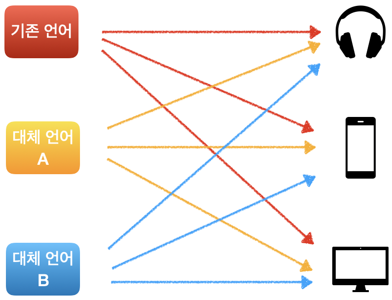
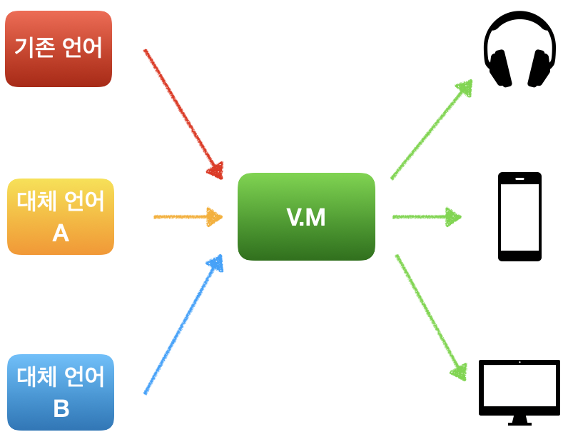
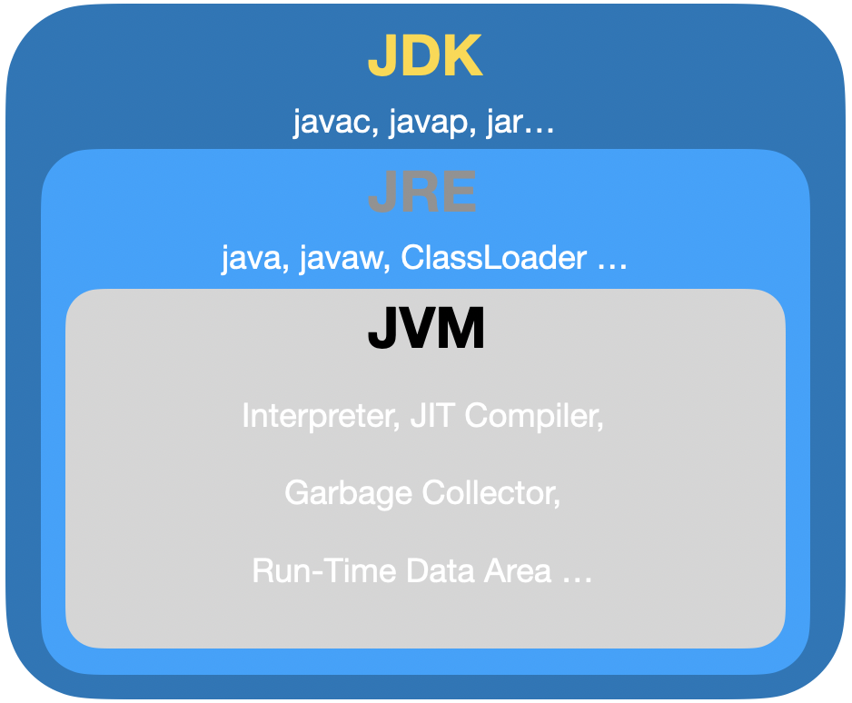

# Java 코드가 실행되기 까지의 여정

> 해당 글은 뒤태지존님의 Back to the Essence - Java 컴파일에서 실행까지 [1편](https://homoefficio.github.io/2019/01/31/Back-to-the-Essence-Java-컴파일에서-실행까지-1/)과 [2편](https://homoefficio.github.io/2019/01/31/Back-to-the-Essence-Java-컴파일에서-실행까지-2/)을 보고 정리한 글이다.  
> 런타임시에 실행 예제의 경우 뒤태지존님이 굉장히 친절히 설명을 해주셨기 때문에 그것을 보는 것을 추천한다.

<br>

## 전통적인 컴파일

전통적인 컴파일의 경우 기계가 이해하는 기계어로 변환하는 것을 말한다.

대표적으로 C 언어의 경우 다음과 같은 컴파일 과정을 거치게 된다.

```c
[C언어] → 전처리 → 컴파일 → 어셈블리 → 링크 → [기계어]
```

우리가 프로그래밍한 C 언어는 주석 제거, include 파일 인라인화 등의 전처리 과정을 거치고, 컴파일 단계를 거쳐 어셈블리어로 변경한다.  
이후 어셈블러가 이를 기계어로 변경하고, 사용한 공유 라이브러리 등을 합쳐(링크) 최종 실행 파일을 생성한다.

<br>

## 컴파일 in Java

이러한 전통적인 컴파일러는 기계가 이해할 수 있는 기계어로 변환한다는 목적을 가진다.

하지만, 자바에서의 컴파일은 이와는 조금 다르다.  
Java를 한번이라도 사용해보았으면 Java가 C/C++ 언어와는 다르게 JVM(Java Virtual Machine)이라는 가상 머신 상에서 실행되는 것을 알 수 있다.

이러한 JVM에서는 기계어로 프로그램을 실행하는 것이 아닌 **바이트코드**라는 새로운 중간 단계 언어에서 바로 프로그램을 실행하며, 링크 과정은 JVM에 의해 동적으로 수행된다.  
그러므로 Java에서 컴파일은 Java 언어로 작성된 코드를 JVM이 알아 들을 수 있는 바이트코드로 변환하는 것에 목적을 두고 있다.

그렇다고 기계어로 변경을 안하는 것은 아니다.  
JVM에서는 실행 퍼포먼스를 위해 **JIT(Just-In-Time) 컴파일러**를 사용하여 자주 사용되거나 좀 더 효율적으로 짤 수 있는 코드를 기계어로 변환하여 사용하기도 한다.

<br>

## 바이트코드 생성 과정

### 어휘 분석(Lexical Analysis)

어휘 분석기(Lexer/Tokenizer)가 소스 코드를 문자 단위로 읽어 어휘소(Lexeme)를 식별 및 이를 설명하는 토큰 스트림을 생성한다.  
어휘소는 식별이 가능한 문자열로 다음과 같다.

* 키워드(Keyword) 

  > `public`, `class`, `main` 등

* 리터럴(Literals)

  > `"안녕하세요!"`, `1L` , `2.3f` 등

* 식별자(Identifiers)

  > 변수 이름, 상수 이름, 함수 이름 등

* 연산자(Operators)

  > `+`, `-` 등

* 구분 문자(Punctuation characters)

  > `,`, `[]`, `{}` 등

이렇게 생성된 식별자 토큰은 **심볼 테이블**에 저장되고 다음 단계에서 사용된다.

### 구문 분석(Syntax Analysis)

구문 분석기(Parser)가 이전 단계에서 나온 토큰 스트림이 문법에 맞는지 검사하고 이가 맞다면 **Parse Tree**(Abstract Syntax Tree라고도 불림)를 생성하고, 맞지 않다면 컴파일 에러를 낸다.

### 의미 분석(Symantic  Analysis)

이 단계에서는 타입 검사와 자동 타입 변환등이 수행되며, Parse Tree에 타입 정보 등이 추가된다.

```  java
int jong = "nan";
```

다음과 같은 코드는 구문 분석 단계까지는 에러없이 통과하나, 의미 분석 단계를 거치면서 에러가 발생한다.

### 중간 코드 생성

여러 단계를 거쳐 생성된 Parse Tree를 기반으로 기계어로 변환하기 좋은 중간 코드로 생성한다.

여기서 왜 중간 코드가 필요할까? 라고 의문을 가질 수 있다.  
이는 JVM을 사용하는 이유인 "**종속성**"에 있다.

만약 어떠한 회사가 있고 그 회사는 기존에 어떠한 언어로 스마트폰, 테스크탑 등에 대응되는 프로그램을 만들었다고 하자.  
그 언어가 굉장히 구식이고 새로운 개발자가 유입이 없는 언어여서 다른 언어로 대응을 해야되는 상황이 일어나면, 각각의 제품마다 프로그램을 만들어야 한다.

<p align="center"></p>

위 그림을 보면 세가지 언어로 세개의 대응되는 프로그램을 만들었을 시에 총 9개의 프로그램을 만들어야 되는 것이다.

하지만, 중간 언어로 변환하고 이를 돌아갈 수 있는 가상 머신을 만든다면? 

<p align="center"></p>

각자의 하나씩의 프로그램만 만들면 되기 때문에 효율성이 높아진다.

이 단계에서는 중간 코드를 생성하는 것뿐만 아니라 여지것 만들어왔던 정보들로 클래스/인터페이스의 **상수 풀(Constant Pool)**을 만드는 데 사용된다.  
상수 풀의 경우 실제로 코드가 돌아가면서 클래스/인터페이스가 생성될 때 사용하는 Run-Time Constant Pool을 구성하는데 사용된다.

### 중간 코드 최적화(Code Optimization)

중간 코드를 더 효율적인 기계어로 변환하기 위해 최적화 과정을 거치게 된다.  
최적화 방법은 다음과 같이 매우 다양하다.

* Peephole 최적화

  > 중복 명령어 및 도달 불가능한 코드 제거, 제어 흐름 최적화, 비용이 적은 연산자로 변환 등

* 지역 최적화

  > 지역 공통 부분 제거, 복사 전파, 상수 폴딩 등

* 루프 최적화

  > 코드 이동, 귀납 변수 최적화, 루프 융합/교환/전개 등

* 전역 최적화

  > 전역 공통 부분식 제거, 상수 폴딩 등

<br>

## JVM의 외부 환경 및 구동 준비

자바 어플리케이션을 실행하는 명령어는 `java`이다.  
이 명령어는 **JRE(Java Runtime Environment)**를 시작하고, 인자로 지정된 클래스를 로딩 후에 `main()` 메소드를 호출한다.

자바로 프로그래밍을 하다보면 JDK, JRE 등등 많이 들어봤을 것이다.  
이들의 상관 관계는 다음 그림과 같다.

<p align=center></p>

* JDK (Java Development Kit)

  > 자바를 개발할 때 사용되는 도구 모음으로 컴파일러, 역어셈블러, 디버거 등을 제공한다.

* JRE (Java Runtime Environment)

  > 자바로 만들어진 프로그램을 실행하기 위해 클래스 로더, 기본 라이브러리 등을 제공한다.

* JVM (Java Virtual Machine)

  > 인터프리터, JIT 컴파일러, 링커, 가비지 컬릭터 등 여러 OS에 독립적으로 실행 될 수 있는 추상층을 제공한다.

간단하게 정리를 해보면, **JDK를 통해 개발자가 작성한 코드를 바이트 코드로 변경하고 이를 JRE를 사용하여 실행되어지며 JVM이 구동되면서 바이트 코드를 실행하게 된다.**

<br>

## JVM의 메모리 영역

바로 전 장에서 JVM 외부 환경에서부터 실제 프로그램이 실행하기 직전까지 알아보았다.  
많은 개발자가 예상하다시피 간단하게 뿅하고 실행되는 것이 아니다.  
그럼 세부적으로 어떻게 실행되는지 살펴보자.

### Run-Time Data Area

명령어를 통해 프로그램이 실행될 때, Class Loader(클래스 로더)가 시작 클래스(개발자가 정의한 클래스)를 생성하게 되는데 이는 JVM 안에 있는 메모리에 해당 클래스를 적재한다는 뜻이다.  
JVM 안에 메모리 영역이 따로 있으며 우리는 이것을 **Run-Time Data Area**라고 한다.

이 메모리 영역은 크게 6개 구역으로 다음과 같이 나뉠 수 있다.

* Heap (JVM 단위)
* Method Area (JVM 단위)
* Run-Time Constant Pool (Class 단위)
* PC Register (스레드 단위)
* JVM Stack (스레드 단위)
* Native Method Stack (스레드 단위)

가로 안에 JVM, Class, 스레드 단위를 적어 놓았는데 이는 3개의 단위로 해당 영역들이 생성되고 삭제되기 때문이다.

**Heap** 과 **Method Area** 은 JVM이 구동 되어질 때 같이 생성/소멸을 하며 하나씩 생성된다.

**Run-TIme Constant Pool** 은 클래스가 로드되어 생성시 같이 생성되며 생명주기를 함께한다.

나머지 **PC Register**, **JVM Stack**, **Native Method Stack** 은 스레드와 같이 생성/소멸 된다.

이제 실행되는 순서별로 영역들을 자세히 살펴보도록 하자.

<br>

## 0. JVM의 구동

### Heap

힙 영역은 **인스턴스화 된 모든 객체, 클래스 배열 등을 저장하는 공간**이며, **스레드끼리 공유가 가능**하다..  
여기서 할당된 메모리는 명시적인 방법으로는 절대 회수하지 못하고 오직, **Garbage Collector에 의해 회수**된다.

### Method Area

**필드와 메서드 데이터, 생성자 및 메소드 코드 내용, 런타임 상수 풀 등을 저장하는 곳**이다.  
저장되는 내용의 경우 바이트코드의 내용과 거의 일치하는데 이는 바이트코드에 상수 풀을 포함하기 때문이다.  
또한, 런타임 상수 풀은 상수 풀을 기반으로 메소드 영역에 저장할 때 생성된다.

메소드 영역은 논리적으로 힙 영역의 일부이지만, 스펙에서는 이 위치를 강제하지 않는다.  
즉, **메소드 영역의 위치는 JVM을 어떻게 구현하느냐에 따라 달라질 수 있다.**

OpenJDK에 사용되는 Hotspot VM의 경우, 이 메소드 영역을 **Metaspace**라는 이름을 사용하여 구현했다.(JAVA 8 이상 부터, 그 이전에는  Permanent Area)

<br>

## 1. 시작 클래스의 생성

### 클래스 로더

앞서서 시작 클래스를 메모리에 적재하면서 시작이 된다고 했었다.  
이 시작 클래스를 로딩하는 주체는 **클래스 로더**이며, 이는 JRE에서 3가지 내장된 클래스 로더(Bootstrap, Platform, System)를 제공한다.

시작 클래스는 시스템 클래스 로더가 로딩을하고, 시스템 클래스 로더는 플랫폼 클래스 로더가, 플랫폼 클래스 로더는 부트스트랩 클래스 로더가 로딩을하고 부트스트랩 클래스 로더는 JRE가 조성될 때 실행된다.  
즉, **JRE 실행 → 부트스트랩 → 플랫폼 → 시스템 → 시작 클래스 순으로 실행**이 되는 것이다.

### Run-Time Constant Pool

클래스가 생성되면서 런타임 상수 풀도 함께 생성된다.  
이곳에는 컴파일시에 알 수 있는 숫자 리터럴 값부터 런타임시에 해석되는 메소드와 필드 참조까지 **여러 종류의 상수가 저장**된다.

<br>

## 2. 링크

클래스/인터페이스의 Super 클래스/인터페이스, 또는 배열의 원소의 클래스/인터페이스를 **확인**, **준비**하고 **심볼릭 참조를 해석**하는 과정을 링크라고 한다.  
쉽게 말하자면, **코드 중간에 다른 클래스를 참조할 일이 생겼을 때 해당 클래스를 로드하기 위한 과정**이라고 보면 된다.

* **확인(Verification)**

  클래스 혹은 인터페이스의 바이너리 표현이 **구조적으로 올바른지를 보장**해주는 과정

* **준비(Preparing)**

  클래스나 인터페이스의 **정적(Static) 필드를 생성하고 기본값으로 초기화**하는 과정  
  기본값이 아닌 특정값으로 정적 필드를 초기화하는 것은 해당 과정이 아닌 초기화 과정에서 따로 처리

* **해석(Resolution)**

  런타임 상수 풀에 있는 **심볼릭 참조가 구체적인 값을 가리키도록 동적으로 결정**을 하는 과정

JVM 스펙에서 링크 과정이 언제 실행되야 한다는 명확한 규정을 하지 않았기 때문에 JVM 구현체마다 달라질 수 있다.  
**지연(lazy) 링크 전략을 사용하는 경우 클래스/인터페이스에 포함된 심볼릭 참조는 실제 참조가 사용될 때 개별적으로 해석**되지만(초기화 과정을 거친 후에 해석이 될 수 있음), **즉시(eager) 링크 전략의 경우 클래스/인터페이스가 확인 될 때 모든 심볼릭 참조가 해석**된다.

<br>

## 3. 초기화

초기화(Initialization)는 클래스/인터페이스의 초기화 메소드를 실행할 때 수행되는 과정이다.  
이곳에서 초기화는 "정적(Static) 초기화를 한다."라고 할 수 있다. 

### 초기화 메소드

초기화 메서드에는 **인스턴스 초기화 메소드**, **클래스/인터페이스 초기화 메서드**가 존재한다.

* **인스턴스 초기화 메소드**

  우리가 클래스 내부에 선언하는 생성자가 이에 해당하며, 클래스는 0개 이상의 인스턴스 초기화 메서드를 가지고 있다.  
  인스턴스 초기화 메소드는 다음과 같은 조건을 충족해야 된다.

  * 클래스 안에 정의
  * 바이트코드 상에서 `<init>`이라는 특수한 이름으로 표현
  * 반환 타입은 `void`

  인스턴스 초기화 메소드는 힙에 인스턴스를 생성하는 역할을 하고, 클래스/인터페이스 초기화 메소드를 호출한다.

* **클래스/인터페이스 초기화 메소드**

  앞선 링크 단계에서 특정값으로 정적 필드를 초기화 하기 위해서는 따로 처리한다고 언급을 했었는데, 해당 메소드가 그 역할을 맡아서 한다.

  이 메소드는 클래스/인터페이스에 1개만 존재할 수 있으며 다음과 같은 조건을 충족해야 된다.

  * 바이트코드 상에서 `<clinit>`이라는 특수한 이름으로 표현
  * 반환 타입은 `void`
  * class 파일 버전 51 이상에서는 `ACC_STATIC` 플래그가 붙음

  이 메소드는 스펙에서는 구체적인 설명이 존재 하지 않지만, **static 블록들의 내용을 하나로 합친 것**이라고 볼 수 있다.  

  ```java
  public class initializationTest {
    public final static int i ;
    static {
      i = 1;
    }
    public final static int j ;
    static {
      j = 2;
    }
  }
  
  /*
  바이트코드 일부분
   static {};
      descriptor: ()V
      flags: ACC_STATIC
      Code:
        stack=1, locals=0, args_size=0
           0: iconst_1
           1: putstatic     #2                  // Field i:I
           4: iconst_2
           5: putstatic     #3                  // Field j:I
           8: return
        LineNumberTable:
          line 8: 0
          line 12: 4
          line 13: 8
  
  */
  ```

  위와 같은 코드가 존재할 때, 바이트코드를 살펴보면 하나의 블럭(`static{}`) 으로 변경된 것을 볼 수 있다.

<br>

## 4. Main 메소드 호출

이 시점부터 실제 프로그램이 실행된다.  
프로그램이 실행되기 위해 프로그램 흐름의 최소 단위인 스레드가 존재해야 되며, JVM에서는 `main()` 메소드를 호출하기 위해 Main이 되는 스레드를 생성한다.  
메인 스레드가 생성되면 **PC 레지스터**, **JVM 스택**, **네이티브 메서드 스택**이 함께 생성된다.

### PC Register

PC 레지스터는 현재 실행중인 메소드가 **네이티브 메소드가 아니면 현재 실행 중인 JVM 명령어의 위치가 저장**되고, **네이티브 메소드일 경우 저장되는 값은 정의 되지 않는다(undefined)**.

### JVM Stack

JVM 스택은 이름에서 알 수 있듯이 LIFO 방식으로 동작하며 **프레임(Frame)이라는 단위로 저장**이 된다.

#### Frame

> 프레임은 데이터나 중간 결과의 저장, 동적 링크, 값 반환, 예외 디스패치에 사용된다.  
> 즉, **메소드가 호출될 때마다 새 프레임이 생성되어 스택에 쌓이고, 메소드 호출이 정상적으로 완료 되거나 예외가 던져지면 프레임은 스택에서 빠지며 소멸된다.**  
> 프레임은 **로컬 변수 배열**, **오퍼랜드 스택**, **해당 메서드가 속한 클래스의 런타임 상수 풀에 대한 참조**로 구성된다.
>
> * **Local Variables**
>
>   로컬 변수 배열의 크기는 컴파일 타임에 결정되며, 바이트코드에서 `Code` 속성에 `locals`로 표시된다.  
>   `long`과 `double`의 경우 2개의 슬롯에 걸쳐 저장되고 나머지는 1개의 슬롯에 저장된다.
>
>   메소드가 클래스 메소드일 경우, 인자는 0번 슬롯부터 차례대로 저장된다.  
>   인스턴스 메소드일 경우에는 `this`가 0번 슬롯, 인자들이 1번 슬롯부터 차례대로 저장된다.  
>   나머지 지역 변수들이 나머지 슬롯에 저장된다.
>
> * **Operand Stack**
>
>   오퍼랜드 스택의 최대 깊이는 컴파일 타임에 결정되고 비어있는 상태로 생성되며,  바이트코드에서 `Code` 속성에 `stack`으로 표시된다.  
>   메소드에 전달되는 파라미터를 준비하거나 메소드가 반환하는 결과값을 받을 때 등 거의 모든 과정에서 오퍼랜드 스택이 사용된다.
>
> * **Reference To Run-Time Constant Pool**
>
>   이름 그대로 해당 프레임에 대응되는 메소드가 속한 클래스의 런타임 상수 풀에 대한 참조를 의미한다.

### Native Method Stack

보통 C 스택이라고 부르며, 자바가 아닌 다른 언어로 작성된 네이티브 메소드를 지원하기 위해 사용되는 스택이다.  
JVM이 반드시 네이티브 메소드를 지원하는 것이 아니기 때문에 네이티브 메소드 스택 역시 필수는 아니다.

### Main 메소드 실행

생성된 바이트 코드에 있는 명령어에 따라 여태 생성된 정보들을 가지고 메소드를 생성한다.  
뒤태지존님이 들어주신 적당한 예시가 있기에 그것을 보면서 어떻게 실행되는지 보면 좋을것 같다.(그림도 있어 이해하기 편함)