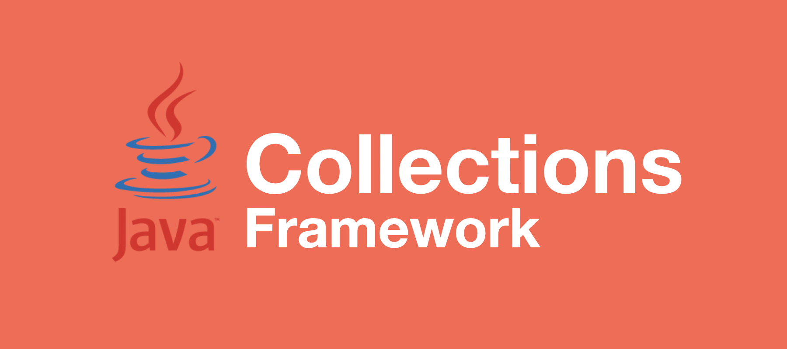
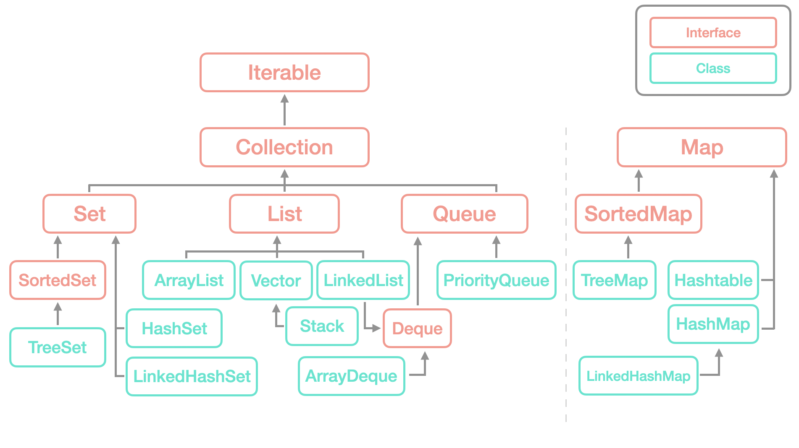

# Java Collections Framework

> *The **Java collections framework** is a set of classes and interfaces that implement commonly reusable collection data structures.  
> Although referred to as a framework, it works in a manner of a library. The collections framework provides both interfaces that define various collections and classes that implement them.*  - [위키 백과](https://en.wikipedia.org/wiki/Java_collections_framework)

위키 백과에서는 자바 컬렉션즈 프레임워크를 다음과 같이 설명하고 있다.

컬렉션즈 프레임워크의 경우 배열의 불편함(크기 고정, 메모리 낭비 등)을 느낀 개발자들이 이를 보완하고 재사용성이 높은 프로그래밍을 하기 위해 만든 라이브러리이다.  
널리 알려져 있는 자료구조를 바탕으로 데이터를 효율적으로 사용하기 위해 여러가지 구현체들을 제공한다.  
위 설명에서도 볼 수 있듯 프레임워크라 불리긴하지만, 라이브러리 방식으로 동작한다.

그렇다면 컬렉션즈 프레임워크는 어떠한 구조로 되어있고 어떤 구현체들이 있는지 알아보자.

<br>

## Collections Framework Structure

<p align="center"></p>

컬렉션즈의 구조는 위 그림과 같이 되어있다.   
우리가 많이 봤던 Stack, Queue, Map들이 여러가지 구현체로 구현되어있는 것을 볼 수 있다.

일단, 컬렉션즈는 크게 **List**, **Set**, **Map**으로 나뉘게 되는데 Map만 따로 Collection을 상속 하지 않는것을 볼 수 있다.  
Map의 경우, **키와 값**으로 이루어진 자료구조이며 이는 나머지 자료구조(List, Set...)등과 같이 값만 저장하는 구조상 차이를 가지고 있다.  
따라서 Map은 Collection 인터페이스를 상속 받지 않는다.

또한, 컬렉션즈의 모든 데이터의 형태는 객체로 기본형 데이터 타입은 Wrapper 클래스를 통해 객체로 변경 후에 사용이 가능하다.

이들을 더욱 자세히 알아보도록 하자.

<br>

## Collection Interface

기본적으로 값으로만 이루어진 자료구조들이 상속받는 인터페이스로 순서적인 자료를 저장하는 List, 중복을 허용하지 않는 집합적인 자료를 저장하는 Set 인터페이스등이 이를 상속 받는다.  
대부분의 컬렉션 클랙스들이 구현해야 할 메소드들을 포함하고 있다.

<br>

## List Interface

이름에서 알 수 있듯 **순서**라는 개념이 들어있는 컬렉션이다.

데이터들의 순서를 관리하기 위해 데이터들에 인덱스를 부여하고 이를 통해 접근이 가능하다.  
이때, 인덱스마다 객체를 저장하는 것이 아닌 객체의 주소를 가지고 있으며 동일한 객체의 주소를 중복으로 저장할 수 있다.

구현체로는 **ArrayList**, **LinkedList**, **Vector**, **Stack**등이 있다.

### ArrayList

굉장히 많이 사용되는 컬렉션 클래스로 내부적으로 **배열을 사용**하여 객체를 순차적으로 저장한다.  
배열을 사용하기 때문에 인덱스를 통해 빠르게 요소에 접근할 수 있다는 장점을 가지고 있다.  
배열의 경우 고정된 사이즈로 중간에 변경을 할 수 없지만, **ArrayList는 저장 공간이 없을 시 이를 동적으로 늘린다**.  
ArrayList는 사용하는 배열에 저장할 공간이 없다면 해당 배열보다 큰 배열을 만들어 기존 배열을 복사하고 새로운 객체를 저장한다.  
이 작업은 자동으로 이루어지긴 하지만 정적 크기 배열에 데이터 삽입/삭제 작업 보다 시간이 길어질 수 있다는 단점을 가지고 있다.

```java
ArrayList<Integer> numList = new ArrayList<Integer>();
```

다음과 같이 ArrayList를 생성할 수 있으며, 제네릭 타입이기 때문에 여러가지 자료형으로 만들 수 있다.  
만약, 자료형을 명시하는 부분에 타입을 지정하지 않으면 Object 타입으로 자동 지정된다.

또한 기본 사이즈는 10으로 지정되어있으며, 이는 선언시에 크기를 정할 수 도 있다.

### LinkedList

ArrayList 클래스가 배열을 사용하므로써 생기는 단점을 극복하기 위해 내부적으로 **연결 리스트**를 사용하여 객체를 저장한다.  
연결된 노드들 사이를 자유롭게 이동하기 위해 **이중 연결 리스트**로 구현되어 있으며, ArrayList 클래스와 같이 List 인터페이스를 구현하므로 거의 비슷한 메소드를 가지고 있다.

```java
LinkedList<String> strList = new LinkedList<String>();
```

다음과 같이 LinkedList를 선언할 수 있다.

중간에 데이터를 삽입/삭제할 때 많은 비용이 들어가는 ArrayList의 단점을 극복하긴 했지만, 데이터들의 끝에 삽입/삭제가 자주 일어난다면 ArrayList를 사용하는것이 더욱 빠르다.  
그리고 index를 통해 바로 접근이 불가능한 구조이기에 검색에 불리하다.  
그렇기 때문에 프로그래밍 환경에 따라 적절한 자료구조를 사용하는것이 바람직하다.

### Vector

Vector 클래스는 JDK 1.0부터 사용된 클래스로 ArrayList와 동일한 동작을 한다.  
ArrayList와 다른점은 Vector 클래스의 메소드의 경우 동기화가 가능한 메소드이기 때문에 멀티 스레드 환경에서 안전하게 객체를 삽입/삭제할 수 있다는 것이다.  
하지만, 1개의 스레드일 경우에도 동기화를 하기 때문에 ArrayList보다 느리고, ArrayList에서도 동기화 옵션을 제공하므로 ArrayList가 많이 사용된다.

```java
Vector<String> strVector = new Vector<String>();
```

다음과 같이 선언하여 사용할 수 있다.

### Stack

컬렉션즈 프레임워크의 스택은 기본적으로 벡터 클래스를 상속받아 제공된다.  
저장된 객체들이 LIFO(Last In First Out)으로 삽입/삭제 되는 자료구조로 가장 나중에 저장된 데이터가 가장 먼저 삭제되는 형식이다.

실생활 예제로는 통안에 든 과자(프링글스 같은...)를 떠올리면 된다.  
유통하기 위해 과자를 통안에 넣고 소비자들은 가장 상위에 있는 과자부터 먹게 된다.  
가장 밑에있는 과자는 빼먹을 수 없는 것처럼 가장 아래있는 데이터를 꺼내기 위해서는 순차적으로 빼내는 수밖에 없다.

```java
Stack<Integer> stack = new Stack<Integer>();
```

다음과 같이 스택을 생성할 수 있다.

앞으로 볼 앞/뒤로 데이터를 삽입/삭제 할 수 있는 Deque를 구현한 **ArrayDeque**란 자료구조가 존재하는데, 이를 통해 더욱 빠르게 스택처럼 사용할 수 있기 때문에 기존 Stack 클래스보다 많이 사용하며, 공식 문서에도 ArrayDeque를 사용하라고 되어있다.  
단, ArrayDeque에는 전달된 객체를 찾아내는 `search()`메소드를 지원하지 않는다.

```java
Deque<Integer> fastStack = new ArrayDeque<Integer>();
```

<br>

## Queue Interface

클래스로 구현된 스택과는 달리 Queue는 별도의 인터페이스 형태로 제공된다.  
Queue 인터페이스를 직/간접적으로 구현한 클래스는 굉장히 많은데, 그 중에서도 Deque 인터페이스를 구현한 LinkedList 클래스가 많이 사용된다.  
즉, LinkedList 클래스를 통해 Queue를 간접적으로 사용하는 것이다.  

Queue 자료구조는 FIFO(First In First Out)으로 데이터를 삽입/삭제한다.  
즉, 가장 먼저 저장된 데이터를 가장 먼저 삭제한다.  
보통 은행 창구를 떠올리면 된다.  
가장 먼저 온 사람이 번호표를 뽑고 먼저 은행원을 만나게 되는 것과 같다.

```java
LinkedList<Integer> queue = new LinkedList<Integer>();
```

다음과 같이 큐를 생성할 수 있으며, 스택과 동일하게 ArrayDeque를 사용하여 큐를 나타낼 수 있다.

```java
Deque<Integer> fastQueue = new ArrayDeque<Integer>();
```

### Priority Queue

우선 순위 큐는 데이터 별로 우선 순위를 두어 이를 기반으로 정렬 및 처리 하는 자료구조이다.  
즉, 매번 데이터가 들어갈 때마다 기존 데이터들과 비교를 통해 데이터를 재정렬한다.

모든 데이터를 정렬하는데 많은 비용이 들어가므로 기본적으로 **Heap** 구조를 사용한다.  
힙 구조는 **완전 이진 트리**의 일종으로 여러개의 값들 중에서 최솟값 혹은 최댓값을 빠르게 찾아내도록 만들어진 자료구조이다.

```java
PriorityQueue<Integer> pq = new PrioirityQueue<Integer>();
```

다음과 같이 우선순위 큐를 생성할 수 있다.  
만약, 여러개의 자료형으로 이루어진 객체를 우선순위 큐 안에 넣으려면 `Comparator` 인터페이스를 구현해야된다.

```java
class Person implements Comparable<Person> {
  String name;
  int age;
  
  Person(String name, int age) {
    this.name = name;
    this.age = age;
  }
  
  @Override
  public int compareTo(Person p) {
    if(this.age >= p.age){
      return 1;
    }
    return -1;
  }
}
```

다음과 같이 `compareTo()` 메소드를 구현하면, `age` 를 기준으로 나이가 적은 순서대로 우선순위가 결정된다.  
만약, 이를 구현하지 않고 우선순위 큐에 넣을 경우 에러가 발생한다.

<br>

## Deque Interface

Deque 인터페이스는 양 끝(시작 과 끝)에서 삽입/삭제가 이루어질 수 있도록 메소드를 제공한다.  
Deque의 이름은 Double Ended Queue에서 가져온 것으로 덱으로 읽는다.  
자바에서는 **LinkedList**와 **ArrayDeque** 클래스가 이를 구현하고 있으며, 양 쪽에서 삽입/삭제가 가능한 특징을 가지고 있어 Stack과 Queue를 구현하기 좋다.

### ArrayDeque

ArrayList와 같이 동적으로 크기가 변하는 배열을 사용하기 때문에 용량의 제한이 있지 않다.  
하지만 동적으로 배열의 크기가 변하므로 용량이 꽉 찾을 경우에 늘리는데 시간이 걸린다.

또한, 기본적으로 멀티 스레드 동기화를 사용하지 않기 때문에 멀티 스레드 환경에서는 조심해야된다.  
`Null` 요소를 사용할 수 없기에 이 또한 주의를 해야된다.

해당 클래스를 사용하면 Vector를 사용한 Stack과 LinkedList를 통해 구현한 Queue보다 더 빠른 속도의 Stack과 Queue를 만들 수 있다.

여기서 의문점이 하나 생긴다.  
왜 LinkedList보다 빠르다는 것일까?

위에서 LinkedList는 내부에서 이중 연결 리스트를 사용한다고 언급했었다.  
이중 연결 리스트는 다음/이전 노드를 가리키 위한 'link'를 사용하는데, 이는 노드를 추가/삭제시에 추가적인 메모리 공간과 연산이 필요하게 된다.  
또, ArrayDeque는 **원형 배열**을 사용하여 구현이 된다.  
그렇기 때문에 데이터를 순차적으로 저장할 수 있으며 이는 캐시 적중에도 많은 도움이 된다.

이런 이유로 LinkedList보다 ArrayDeque가 빠르다는 것이다.

<br>

## Set Interface

앞서 살펴본 List와 Queue 같은 경우는 선형 구조를 가지고 추가한 순서 혹은 지정한 순서가 존재했지만, Set 컬렉션의 경우는 순서란 것이 없다.  
인덱스를 통해 데이터에 접근하는 방식을 사용하지 못하므로, 전체 객체를 대상으로 한 번씩 접근할 수 있도록 반복자(Iterator)를 제공한다.  
또한, Set에서는 중복해서 저장할 수 없으며, null 또한 한개만 저장할 수 있다.  
대표적인 클래스로는 **HashSet**, **LinkedHashSet**, **TreeSet**이 존재한다.

### HashSet, LinkedHashSet

Set 인터페이스를 구현하므로 Set의 모든 특징(순서X, 중복X)을 가지고 있다.  
HashSet 클래스는 해시 알고리즘을 사용하여 검색 속도를 높히며, 내부적으로 HashMap 인스턴스를 사용하고 있다.

만약 순서가 있도록 만들고자 한다면  **LinkedHashSet**( JDK 1.4 이상)을 사용하면 된다.

HashSet의 가장 큰 장점은 **중복을 자동으로 제거**해준다는 것이다.   
중복을 걸러내는 과정은 다음과 같다.

* 객체를 저장하기 전, 객체의 `hashCode()` 메소드를 호출하여 해시 코드를 얻어냄
* 저장되어있는 객체들의 해시코드와 비교
* 있다면 `equals()` 메소드로 두 객체를 비교하여 동일하다면 저장 X, 동일하지 않다면 저장

```java
HashSet<Integer> hashSet = new HashSet<Integer>();
```

다음과 같이 선언하여 사용한다.

HashSet은 저장 공간이 부족할 경우, 현재의 약 두배 크기로 늘린다.  
이 때, 과부하가 많이 발생하기 때문에 데이터 개수를 알고 있는 경우에는 용량을 지정해주는 것이 좋다.

### TreeSet

HashSet과 마찬가지로 Set의 특징을 가지고 있지만, 다른점은 자동 정렬에 있다.  
HashSet은 자동으로 정렬을 하지 않고 TreeSet은 자동 정렬을 한다. 

이 이유는 TreeSet은 이진 탐색 트리(Binary Search Tree, BST) 구조로 이루어져 있기 때문이며, Red-Black Tree를 사용하여 편향 트리가 되지 않도록 하였다.  
그렇기 때문에 데이터의 삽입과 삭제시에 많은 시간이 걸릴 수 있지만, 검색과 정렬에는 높은 퍼포먼스를 보여준다.

```java
TreeSet<Integer> treeSet = new TreeSet<Integer>();
```

다음과 같이 선언하여 사용할 수 있다.

<br>

## Map Interface

Map 인터페이스의 경우, Key-Value와 같이 하나의 쌍으로 저장하는 방식을 제공한다.  
Key는 말 그대로 Value를 찾기 위한 역할로 사용된다.  
그렇기 때문에 Key는 중복을 허용하지 않고, Value는 중복을 허용한다.  
만약, 중복된 Key가 들어온다면 기존 값은 사라지고 새로운 값이 대체된다.

대표적인 클래스로는 **HashMap**,  **LinkedHashMap**, **Hashtable**, **TreeMap** 등이 존재한다.

### HashMap

HashMap은 가장 많이 사용되는 클래스로 해시 알고리즘을 사용하여 검색에 장점을 가지고 있다.  
이 또한 순서를 가지고 있지 않으며, 만약 갖는 HashMap을 사용하고 싶다면 **LinkedHashMap**을 사용하면 된다.

```java
HashMap<String, Integer> hashMap = new HashMap<String, Integer>();
```

다음과 같이 선언하여 사용할 수 있으며 Key, Value의 자료형을 각자 적어주어야 한다.

### Hashtable

HashMap과 거의 동일한 역할을 하는 클래스이다.  
Hashtable은 동기화를 보장하여 Thread-Safe 하는 반면 HashMap은 그렇지 않다.  
또한 Hashtalbe은 `null`을 가진 키 혹은 값을 허용하지 않지만, HashMap에서는 허용한다.  
멀티 스레드 환경을 사용하지 않을 경우, HashMap을 사용하는 것이 좋다.(Vector, ArrayList 관계와 동일)

### TreeMap

TreeMap은 TreeSet과 똑같이 이진 검색 트리 구조로 데이터를 저장한다.  
차이점은 Map의 경우 Key-Value로 데이터가 저장된다는 것이며, 키를 기준으로 정렬(기본 오름차순)이 된다는 것이다.

HashMap 보다 데이터 삽입 삭제의 경우 성능이 떨어지지만, 정렬된 상태로 유지하거나 범위 검색시 효율성면에서 이점을 가지고 있다.

TreeSet과 같이 Red-Black Tree를 사용하며 다음과 같이 선언하여 사용할 수 있다.

```java
TreeMap<String,Integer> treeMap = new TreeMap<String,Integer>();
```

<br>

## Reference

* [[Java] 자바 컬렉션 프레임워크(List, Set, Map) 총정리](https://coding-factory.tistory.com/550)
* [자바 컬렉션 프레임워크(Java Collection Framework) 정리](https://gbsb.tistory.com/247)
* [컬렉션 프레임워크의 개념 - TCPShool.com](http://tcpschool.com/java/java_collectionFramework_concept)

