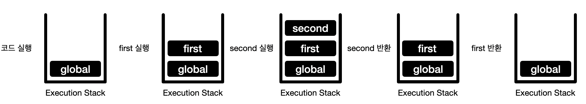

# Execution Context

ECMAScript 스펙에서 실행 컨텍스트(Execution Context)는 **실행 가능한 코드로 형상화하고 구분하는 추상적인 개념**이라고 정의한다.  
즉, **실행 컨텍스트 == 코드가 실행되기 위한 환경** 이라고 할 수 있다.

Scope, Hoisting, This, Closure등 동작 원리를 담고있는 실행 컨텍스트에 대해 알아보자.

<br>

## 코드 실행에 필요한 정보들

자바스크립트 엔진은 코드를 실행하기 위해 다음과 같은 정보들을 알고 있어야 한다.

* 변수(전역, 지역, 매개, 프로퍼티)
* 함수 선언
* 변수의 유효범위(Scope)
* this

이런 정보들을 형상화하기 위해 자바스크립트 엔진은 실행 컨텍스트를 물리적 객체 형태로 저장하여 관리하게 된다.

<br>

## 종류

실행 컨텍스트는 3가지 종류로 나뉘어지는데 다음과 같다.

* Global Execution Context

  > 말 그대로 기본(베이스)가 되는 실행 컨텍스트이다.  
  > 특정 함수안에 있는 코드가 아니라면 전역 컨텍스트에서 실행된다.  
  > 런타임 환경이 브라우저인 경우, Window 객체(전역 객체)를 만들고 전역 컨텍스트의 this를 전역 객체로 설정한다.  
  > 프로그램에서 전역 실행 컨텍스트는 하나만 존재한다.

* Funtional Execution Context

  > 함수가 Call(직접 실행) 혹은 Invoke(간접 실행 ex - call(), apply() ) 될 때 해당 함수에 대한 실행 컨텍스트가 생성된다.  

* Eval Funtion Execution Context

  > Eval 함수 내에서 실행되는 코드 또한 실행 컨텍스트를 생성할 수 있지만, Eval 사용을 지양하고 있다.

<br>

## Execution Stack

실행 스택은 우리가 잘 알고 있는 자바스크립트 엔진 속의 Call Stack과 같은 것이다.  
Call Stack에서 실행 컨텍스트를 사용하기 때문에 실행 스택이라고도 불리우는 것이다.  
이러한 실행 스택은 이름 그대로 스택과 같은 동작을 하게 된다.

자바스크립트 엔진에서는 코드가 시작되면 전역 실행 컨텍스트를 생성하고 실행 스택에 넣는다.  
이후 엔진이 코드에서 함수를 만날 때마다 함수 실행 컨텍스트를 생성하고 실행 스택에 넣고 함수를 실행하며, 반환 되면 이를 뺀다.

```javascript
//코드 실행
const name = 'Jong Nan';

function first(name) {
  //second 실행
  second(name);
  //first 반환
}

function second(name) {
  console.log("내 이름은" + name);
  //second 반환
}

//first 실행
first(name);
```

만약 위와 같은 코드를 만나게 된다면, 다음과 같이 실행 스택에서 생성되고 사라진다.



<br>

## 실행 컨텍스트 생성 과정

> 실행 컨텍스트는 ES3, ES5, ES6마다 개념이 다 다르다. 본 글에서는 ES6에서 정의한 실행 컨텍스트를 살펴 볼 것이다. ES3에서의 실행 컨텍스트는 [여기](https://poiemaweb.com/js-execution-context)를 보면 되고, ES5는 [이 글](http://dmitrysoshnikov.com/ecmascript/es5-chapter-3-2-lexical-environments-ecmascript-implementation/)을 보면 좋을 것 같다.

### Lexical Environment

> *A Lexical Environment is a specification type used to define the association of Identifiers to specific variables and functions based upon the lexical nesting structure of ECMAScript code.* - ES6

ES6에 따르면 다음과 같이 렉시컬 환경을 설명하고 있다.  
쉽게 해석해 보면 렉시컬 환경이란 곳에 선언한 변수 이름(식별자)와 값(변수)를 매핑을 가지고 있는 것이다.

렉시컬 환경은 범위 내에 있는 바인딩 된 식별자들을 기록하는 곳인 **Environment Record**와 **외부 렉시컬 환경을 참조할 수 있는 포인터** 및 **This binding**으로 구성된다.  
이 외부 렉시컬 환경을 참조함으로써 렉시컬 스코핑을 가능하게 한다.  
즉, 외부 렉시컬 환경을 타고 가며 현재 컨텍스트가 아닌 외부 컨텍스트의 변수 혹은 함수에 접근이 가능하다는 것이다.

이러한 렉시컬 환경에는 3가지 종류가 존재하는데 다음과 같다.

* Global Environment

  > 글로벌 환경은 제일 외부에서 생성되는 렉시컬 환경으로 외부 환경을 참조할 수 없다.(`null` 값)   
  > 또한 이 글로벌 환경의 환경 레코드는 식별자 바인딩으로 미리 채워질 수 있으며, this binding 값으로 글로벌 객체를 가리킨다.  
  > 코드가 실행 시 속성이 추가되어 초기 속성이 수정될 수 있다.

* Module Environment

  > 모듈 환경은 모듈의 최상위 선언에 대한 바인딩을 포함하는 렉시컬 환경이다.  
  > 또한 모듈에서 명시적으로 가져온 바인딩도 포함한다.  
  > 이러한 모듈 환경의 외부 환경은 글로벌 환경이다.

* Function Environment

  > 함수 환경은 함수를 호출했을 때 생성되는 렉시컬 환경이다.  
  > 함수 환경의 경우 새로운 this binding을 설정할 수 있으며, `super`메소드 호출을 지원하는데 필요한 상태를 캡쳐한다.

이제 렉시컬 환경 내부에 있는 값들에 대해 더 자세히 살펴보자.

### Evironment Record

환경 레코드는 유효 범위 안에 포함된 식별자를 기록하고 실행하는 영역이다.  
ES3에서 Variable Object와 비슷한 역할을 하고 있다.

환경 레코드에는 **Declarative Environment Record**와 **Object Environment Record**라는 두 가지 주 종류로 나뉠 수 있다.  
Funciton Environment와 Module Environment에서 사용되는 환경 레코드는 Declarative Environment Record이며, Global Environment에서는 특별하게  Declarative Environment Record와 Object Environment Record 둘다 사용한다.

<p align="center"></p>

* Declarative Environment Record

  > 선언적 환경 레코드는 범위 내에 있는 var, const, let, class, function 등에 해당하는 식별자들과 값을 바인딩 한다.     
  > 즉, 변수 혹은 함수를 선언에서 사용되는 식별자 정보를 선언적 환경 레코드에서 찾을 수 있다.

* Object Environment Record

  > 객체 환경 레코드는 외부에 별도로 저장된 객체의 참조에서 데이터를 읽거나 사용하는데, 키와 값을 복사하는 것이 아닌 직접 해당 객체를 `bindObject`의 프로퍼티로 바인드하여 사용한다.
  >
  > 글로벌 환경에서 객체 환경 레코드에는 `bindObject`에 `window` 객체(브라우저의 경우)가 바인드 되어있으며, `Array`, `Object`와 같은 built-in global과 전역 코드에서 함수 선언, 제네레이터 선언, 변수 선언에 의해 생성된 식별자들을 binding object(= 전역 객체 = window 객체)에서 찾을 수 있다.
  >
  > 일반적인 객체 환경 레코드가 생성되는 시기는 `with` 문과 같이 식별자를 어떤 특정 객체에 속성으로 취급 할 때 사용된다.  
  > 이 때, binding object에는 해당 특정 객체를 가리킨다.

### Outer Environment 참조

해당 포인터가 있으므로써 외부 환경에 접근 할 수 있다는 것을 의미하며, 이는 중첩된 환경에서 렉시컬 스코핑을 가능하게 한다.    
즉, 렉시컬 스코프 범위 내에서 원하는 변수 혹은 함수를 찾기 위해 해당 포인터를 사용하는 것이다.  
이는 ES3에서 Scope Chain과 같은 역할을 하고 있지만, Scope Chain은 리스트 형태로 이를 보관하고 여기서는 포인터 형태로 이를 관리한다.

### This Binding

`this` 값이 여기에 저장된다.  
글로벌 실행 컨텍스트에서의 `this`는 글로벌 객체(window 객체)이며, 함수 실행 컨텍스트에서는 함수가 어떻게 호출됬는지에 따라 달라진다.  
만약 객체의 레퍼런스로 호출이 되었다면, `this`는 해당 객체를 가리키고 그렇지 않으면 글로벌 객체 혹은 Strict 모드일 경우에는 `undefined`를 가리킨다.

```javascript
const my = {
	name : 'jongnan',
	age : 28,
	say : function() {
		console.log("안녕 난 " + this.name + "이야!");
	}
}

my.say();			// this : my, out : 안녕 난 jongnan이야!
const sayMyName = my.say;
sayMyname(); 	// this : window, out : 안녕 난 (undefined)이야!
```

### 실행 컨텍스트 컴포넌트

실행 컨텍스트에는 두가지 컴포넌트가 존재하는데, **LexicalEnvironment**와 **VariableEnvironment**이다.
두 컴포넌트 다 항상 위에서 언급한 Lexical Environment로 이루어지며, LexicalEnvironment와 VariableEnvironment는 초기에 같은 값으로 설정 된다.

```javascript
//생성 초기 실행 컨텍스트
ExecutionContext = {
	//LexicalEnvironment 컴포넌트
	LexicalEnvironment : <Lexical Environment> = {
		EnvironmentRecord : {},
  		outer : <>,
    		thisBinding : <>
	},
	//VariableEnvironment 컴포넌트
	VariableEnvironment : <Lexical Environment> = {
  		EnvironmentRecord : {},
  		outer : <>,
    		thisBinding : <>
  	}
}
```

여기서 "**Lexical Environment(실제 변수화 함수들의 식별자가 매핑이 이루어지는 곳)와 LexicalEnvironment(Lexical Environment의 정보를 가리키는 곳)와는 다르다는 것**"을 알아야한다.

한가지의 값을 가리킬 꺼면 하나의 컴포넌트만 만들면 되지 왜 두개의 컴포넌트를 사용할까?  
이 이유는 ES5와 ES6에서 다르다.

ES5에서의 다른점은 `with`문 혹은 `catch` 절을 사용하여 렉시컬 환경을 확장할 때 볼 수 있다.  
확장 환경에서 기존에 있던 식별자와 바인딩 된 값들을 변경하는 경우에 LexicalEnvironment에 이를 기록한다.  
이후, 다시 원래 환경으로 돌아올 때 기존의 값인 VariableEnvironment로 복구를 한다.  

하지만 ES6에서는 `let` 과 `const`를 사용했는가  `var`를 사용했는가를 기준으로 이를 나눈다.  
`let` 과 `const` 를 사용한 변수의 경우 LexicalEnvironment에 이를 기록하고, `var` 를 사용했을 때는 VariableEnvironment에 기록한다.

```javascript
let a = 1;
const b = 2;
var c = 3;
```

다음과 같은 코드가 있을 경우 실행 컨텍스트가 생성되는 과정에서는 다음과 같다.

```javascript
GlobalExecutionContext = {
	LexicalEnvironment : {
    		EnvironmnetRecord : {
      			a : <uninitialized>,
      			b : <uninitialized>
    		},
    		outer : null,
    		thisBinding : window
  	},
  	VariableEnvironment : {
    		EnvironmnetRecord : {
      			c : undefined
    		},
    		outer : null,
    		thisBinding : window
  	}
}
```

코드가 실행되면 해당 값이 바인딩 되고 다음과 같은 환경이 조성된다.

```javascript
GlobalExecutionContext = {
  	LexicalEnvironment : {
    		EnvironmnetRecord : {
      			a : 1,
   			b : 2
    		},
    		outer : null,
    		thisBinding : window
  		},
  	VariableEnvironment : {
    		EnvironmnetRecord : {
      			c : undefined
    		},
    		outer : 3,
    		thisBinding : window
  	}
}
```

---

<br>

<br>

### Reference

* [[JS] 자바스크립트의 The Execution Context (실행 컨텍스트) 와 Hoisting (호이스팅)](https://velog.io/@imacoolgirlyo/JS-자바스크립트의-Hoisting-The-Execution-Context-호이스팅-실행-컨텍스트-6bjsmmlmgy)

* [Understanding Execution Context and Execution Stack in Javascript](https://blog.bitsrc.io/understanding-execution-context-and-execution-stack-in-javascript-1c9ea8642dd0)
* [JavaScript 식별자 찾기 대모험](https://homoefficio.github.io/2016/01/16/JavaScript-식별자-찾기-대모험/)

* [[JS] 모던 자바스크립트 입문 8장 - 자바스크립트 평가와 실행 과정](https://select995.netlify.app/java-script/modern-javascript-08-2)
* [ECMAScript® 2015 Language Specification](http://ecma-international.org/ecma-262/6.0/)
* [자바스크립트 함수(3) - Lexical Environment](https://meetup.toast.com/posts/129)
* [ECMA-262-5 in detail. Chapter 3.2. Lexical environments: ECMAScript implementation](http://dmitrysoshnikov.com/ecmascript/es5-chapter-3-2-lexical-environments-ecmascript-implementation/)
* [실행 컨텍스트와 자바스크립트의 동작 원리](https://poiemaweb.com/js-execution-context)

