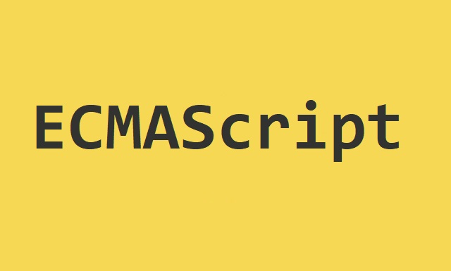

# ECMAScript

Javascript를 공부할 때 ES3, ES5, ES6, ES2015 등 ES라는 것을 많이 들어봤을 것이다.  
ES는 ECMAScript의 줄임말이다.

그렇다면 **ECMAScript**라는 것은 무엇일까?

하나의 기술이 새롭게 등장했을 때 "이 기술은 이러하기 때문에 이렇다!"라는 기준을 정의를 내린다.  
예를들면, 한글에 자음은 ㄱ, ㄴ, ㄷ...들이 있고 모음에는 ㅏ, ㅑ,ㅓ...라는 기준이 있으며, 이 기준을 만족하지 못하는 문자는 한글이라고 할 수 없다.  
이와 같이 ECMAScript는 ECMA 인터네셔널(정보 통신에 대한 표준을 제정하는 비영리 표준화 기구)이라는 기구에서 ECMA-262 기술 규격에 의해 정의된 범용 스크립트 언어이다.  
즉, 표준을 제정할 수 있는 기구에서 **스크립트 언어가 준수해야 할 규칙**들을 모아 놓은 것이 ECMAScript인 것이다.

위에서 언급했던 ES**3**, ES**6** 처럼 뒤에 숫자 혹은 ES**2015**와 같이 년도가 붙은 것들은 몇 번째 표준인가 혹은 언제 제정되었는가를 나타내는 것이다.

---

#### 그렇다면 Script 언어는 무엇인가?

스크립트 언어는 **응용 프로그램에 독립된 특별한 프로그래밍 언어**로 일반적인 언어와는 다르게 해당 응용 프로그램의 동작을 사용자의 요구에 맞게 수행하도록 한다.  
상대적으로 단순한 구문과 의미를 내포하며 명확한 엔트리 포인트가 존재하지 않는다.  
대표적인 예로 Shell Script와 Javascript 등이 존재한다.

