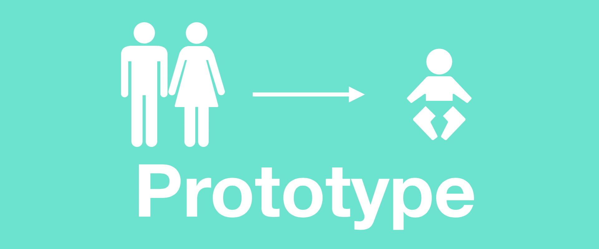

# Prototype

프로토타입을 사전에서 찾아보면 "**원형 또는 시제품**"이라는 뜻으로 해석된다.  
자바스크립트는 프로토타입 기반 언어로 Java, C++ 와 같이 클래스 기반의 언어와는 달리 Class가 존재하지 않았다.  
ES6부터 `class` 키워드를 지원하긴 했지만, 문법 설탕일뿐 프로토타입을 기반으로 만들어진 것이다.  
과연 이 프로토타입은 무엇일까? 그리고 어떻게 `class` 키워드를 지원하는 것인지 알아보도록하자.

---

### 디자인 패턴의 일종

기존 Java 혹은 C, C++와 같이 Class 기반 언어들에 익숙한 우리는 프로토타입이란 것이 굉장히 생소할 수 있다.  
자바스크립트 안에만 존재하는 개념이라고 생각할 수도 있겠지만, 이는 잘못된 생각이다.  
프로토타입 기반으로하는 언어들은 굉장히 많으며 자바스크립트는 그 중 하나인 셈이다.

그렇다면 프로토타입 기반(..?)의 언어란 것은 무엇일까?

우선 프로토타입 패턴을 살펴보아야 한다.  
프로토타입 패턴은 새로운 객체를 생성 할 때 **직접 생성하는 것이 아닌 기존에 존재하는 객체를 복제**해서 만들어 내는 디자인 패턴이다.  
객체를 생성하는데 있어 고비용이 들어갈 경우, 프로토타입 패턴을 이용하여 조금 더 효율적으로 객체를 생성할 수 있다.  
여기서 **고비용이 들어가는 경우란, 생성 될 객체의 수가 엄청 많거나 생성 시에 많은 작업(연산)들이 존재할 경우**이다.  

예를들어 나뭇가지에 달려있는 나뭇잎을 생성한다고 해보자.  
나뭇잎이 몇 십만개가 필요하다고 할 때, 나뭇잎을 일일이 만든다면 만들고 설정해주고 만들고 설정해주고 하는 작업들이 계속해서 반복되게 된다.  
즉, 메모리를 잡고 해당 메모리에 여러가지 설정을 해주고하는 작업이 반복되게 되는 것이다.
반대로 하나의 나뭇잎을 만들고 복제를 할 때는 해당 나뭇잎의 정보가 들어가있는 메모리 값들만 복사하여 새로운 메모리 공간에 넣어주거나 해당 메모리 영역만 참조하기만 해도 가능하다.  
어떠한 것이 더 효율적인 작업을 하는 것처럼 보이는가?

자바스크립트는 이러한 프로토타입 패턴을 사용해서 모든 객체를 생성한다.  
그렇기 때문에 프로토타입 기반 언어라는 것이다.

---

### 객체 생성 방식

위에서 왜 자바스크립트가 프로토타입 기반 언어인지를 살펴보았다.  
그렇다면 어떻게 프로토타입을 사용해서 객체를 생성하는지 알아보자.

#### 객체 리터럴

Class 기반의 언어들은 객체를 생성할 때 클래스를 따로 작성해야되지만, 자바스크립트에서는 다음과 같이 간단하게 객체를 생성할 수 있다.

```javascript
const my = {
	name : 'jongnan',
  age : 28,
  say : function () {
    console.log('안녕!');
  }
}
```

이렇게 객체를 생성하는 방식을 "**객체 리터럴(Literal)**"이라고 한다.
간단하게 블록({})만 사용해서 객체를 생성하는 것처럼 보이지만, 내부적으로는 어떠한 메커니즘에 의해 만들어지고 있는 것이다.

#### 생성자 함수

클래스가 없는 자바스크립트는 어떻게 객체를 만드는 것일까?  
그 답은 **함수(Function)** 에 있다.

자바스크립트에는  `Object()` 이란 내장 함수를 통해 객체를 생성할 수 있다.  
`typeof` 키워드를 통해 `Object` 를 확인 해보면 "function"이라고 뜨는 것을 확인할 수 있다.  
즉, `Object()`는 함수이며 이를 통해 새로운 객체를 생성한다고 말할 수 있다.  

이러한 방식을 생성자를 가진 **생성자(Constructor) 함수**를 통해 만들었다고 한다.

```javascript
const my = new Object({
	name : 'jongnan',
  age : 28,
  say : function () {
    console.log('안녕!');
  }
})

console.log(typeof Object) //"function"
```

앞서 본 객체 리터럴 방식은 위 코드와 같이 `Object`란 생성자 함수로 만들어진 것이다.

---

### 프로토타입 객체

여태까지 알아본 바로는 자바스크립트는 **객체를 생성할 때 함수를 통해 "원본"이 될 만한 것을 복사하여 만든다.** 란 것인데 저 원본이란 것이 무엇일까?

알아보기 위해 간단한 함수로 객체를 생성해보자.

```javascript
function Human() {}				// 자바스크립트에서는 따로 클래스가 없기 때문에 객체를 생성할 목적으로
													// 만든 함수는 구분 짓기위해 UpperCamelCase(= PascalCase)로 쓴다.
const jong = new Human();

console.log(typeof jong) 	// "object"
```

위와 같이 생성된 `jong` 이란 객체를 살펴보면 타입이 `"object"`로 나오는 것을 볼 수 있다.  
만약 함수를 복사했다면, `"function"` 타입으로 나올텐데 `"object"`가 나온다는 것은 어떤 객체를 복사했다는 것이다.  
즉, 내부적으로 함수를 실행하면서 어떤 객체를 만들었다는 것이며 자바스크립트에서는 이것을 **프로토타입 객체**라고 한다.  

더 나아가 우리가 만든 새로운 객체인 `jong` 안을 봐보자.(크롬 개발자 탭을 사용하면 볼 수 있다.)

```javascript
console.log(jong);

Human {
  __proto__ : {
    constructor: f Human(),
    __proto__ : Object  		// 해당 Object를 살펴보면 Object로 생성된 결과와 같은 결과가 나온다.
  }
}

console.log(Human.prototype === jong.__proto__) //true
```

여기서 `__proto__`라는 프로퍼티를 볼 수 있는데 이는 해당 객체의 원본 객체 즉, 프로토타입을 나타낸다.  
그렇기 때문에 해당 프로퍼티를 **프로토타입 링크**라고 한다.

우리가 만든 `jong`이란 객체의 프로토타입 링크를 살펴보면, `Human` 생성자 함수의 프로토타입 객체를 볼 수 있다.  
`Human` 의 프로토타입 객체는 생성자 함수에서 `prototype` 프로퍼티로 접근이 가능하며 프로토타입 객체는 `constructor` 프로퍼티로 생성자 함수로 또한 접근이 가능하다.  

`Human`의 프로토타입 객체의 프로토타입 링크가 있는 것을 보면 해당 객체도 어떠한 객체로부터 복사되어 만들어진 것을 알 수 있다.  
이는 `Object` 함수가 만든 `Object` 프로토타입 객체이며 자바스크립트에서는 모든 객체가 해당 객체로부터 복사가 된다.  
이렇게 프로토타입 객체가 엮여있는 관계를 "**프로토타입 체인**"이라고 한다.

위의 코드로 생성된 객체들을 그림으로 아래와 같다.

<p align="center"></p>


모든 것을 정리해보면 다음과 같은 결론을 낼 수 있다.

* A라는 함수를 통해 객체를 만들면 A에 해당하는 프로토타입 객체가 생성된다.
* 생성시에 생성자 함수(prototype 프로퍼티)와 프로토타입 객체(constructor 프로퍼티)를 서로 연결한다.
* A라는 프로토타입 객체는 `Object`라는 내장 함수로부터 만들어진 객체를 복사하여 만들어졌다.

---

### 프로토타입 체인을 이용한 상속

자바스크립트에서는 상속이라는 개념이 명시적으로 존재하지 않는다.  
객체지향 프로그래밍에 익숙한 개발자들이 상속이란 개념을 사용하기 위해 프로토타입 체인을 이용하여 구현을 하여 사용하고 있다.  
물론 ES6에서부터 `class`키워드 및 `extens` 키워드로 상속을 할 수 있지만, 앞서 설명했듯이 이는 문법 설탕에 지나지 않는다.  
이번 파트에서는 프로토타입 체인을 이용하여 상속하는 방법에 대해 알아보도록 하자.

#### 프로퍼티/메소드 공유

새롭게 생긴 객체에 원본 객체의 프로퍼티 혹은 메소드를 그대로 가져다 사용할 수 있는데 그 방법은 두 가지가 존재한다.  
첫 번째는 **생성자 함수안에서 `this`를 사용하여 선언**하는 방법이 있으며, 두 번째로는 **프로토타입 객체에 선언하는 방법**이 있다.  
선언하는 곳부터 다른 이 두 방법은 과연 똑같은 일을 할까?

#### 생성자 함수 안에 선언

우선 자바스크립트에서도 생성자 함수 내에서 `this`를 사용하여 다른 언어와 비슷한 느낌으로 객체에 프로퍼티나 메소드를 부여할 수 있다.

```javascript
function Human(name) {
  this.name = name;
  this.age = 28;
  this.sayMyName = function () {
    console.log("안녕 난 " + this.name + "이야!");
  }
}	

const jong = new Human('jong');
jong.sayMyName();								// 안녕 난 jong이야!
```

이때 생성자 함수에서 `this`를 통해 선언한 프로퍼티나 메소드는 생성한 객체마다 새로운 값을 가진다.  
이는 두 객체를 생성하면 금방 확인 할 수 있다.

```javascript
const jong = new Human('jong');
const nan = new Human('nan');

console.log(jong.sayMyName === nan.sayMyName) // false
```

이처럼 `jong`과 `nan` 의 `sayMyName` 메소드를 `===`(완전 할당 연산자)를 통해 확인을 해보면 완전 다른 메모리에 메소드들이 있는 것을 볼 수 있다.

#### 프로토타입 객체에 선언

다음으로는 프로토타입 객체에 선언은 보통 `Human.prototype.[프로퍼티/메소드 이름]` 과 같이 할 수 있다.

```javascript
function Human(name) {
	this.name = name;
  this.age = 28;
}
Human.prototype.sayMyAge = function() {
	console.log("난 " + this.age + "살이야.");
}

const jong = new Human('jong');
jong.sayMyAge(); 									// 난 28살이야.
const nan = new Human('nan');
console.log(jong.sayMyAge === nan.sayMyAge);	// true
```

동작은 생성자 함수 안에 선언한것과 비슷하게 동작은 한다.  
하지만, 프로토타입 객체에 선언된 프로퍼티 혹은 메소드는 하나의 **프로퍼티 혹은 메소드로 공유**하고 있다.  

즉, "**프로퍼티 혹은 메소드를 공유를 하는가 안하는가**"라는 큰 차이점이 존재한다.

#### 프로토타입 룩업

그런데, 한 가지 신기한 점이 있다.  
`jong`과 `nan`에는 분명  `sayMyAge` 메소드가 존재하지 않는데 어떻게 실행하는 것일까?

이는 자바스크립트가 객체 내에서 프로퍼티를 찾는 "**프로토타입 룩업**"이라는 방법을 사용하기 때문이다.  
프로토타입 룩업은 다음과 같이 프로퍼티를 찾아낸다.

1. `jong.sayMyAge` 메소드 실행
2. `jong` 내부에서 `sayMyAge`라는 프로퍼티 접근
3. 존재하지 않음
4. 프로토타입 링크를 통해 원본 객체로 이동
5. 원본 객체에서 프로퍼티를 확인
6. 있다면 실행
7. 최상위 프로토타입 객체인 Object.prototype까지 올라가보고 없다면 에러 발생

다음과 같은 동작으로 `jong`에서는 `Object.prototype`에 정의된 `toString`, `hasOwnProperty`와 같은 메소드들을 사용할 수 있는 것이다.

**자바스크립트에서 프로토타입 체인을 이용하여 프로토타입 룩업이란 동작을 할 수 있기에 객체지향 프로그래밍에서의 상속의 개념을 유사하게 구현할 수 있는 것이다.**

#### 상속 사용하기

상속을 하는 대표적인 방법으로는 `Object.create`메소드를 이용하는 것이다.

```javascript
			 			 //인자1:원본 객체	 인자2:새로 생성할 객체의 추가 프로퍼티(객체)
Object.create(proto: Object, properties?: Object)
```

두 번째 인자는 단순하게 객체를 넘기는 것이 아닌 데이터 서술자와 접근 서술자를 지정해줘야 한다.  
자세한 내용은 [MDN](https://developer.mozilla.org/ko/docs/Web/JavaScript/Reference/Global_Objects/Object/create)에서 확인하길 바란다.

이제 상속을 코드로 구현해보자.

```javascript
function ParentsClass(name) {
  this.name = name;
}
ParentsClass.prototype.sayMyName = function() {
  console.log('내 이름은 ' + this.name + '이야');
}

function ChildClass(name) {
  ParentsClass.call(this, name);	//call을 사용한 이유는 새로 생성한 객체(this)를 넘기기 위해서
}																	//(bind, apply 도 가능)

ChildClass.prototype = Object.create(ParentsClass.prototype);
//그대로 복사하기에 ParentsClass를 가리키고 있으므로 변경
ChildClass.prototype.constructor = ChildClass;
```

위와 같은 코드를 사용해서 상속을 구현하면 다음과 같은 관계를 그림으로 그릴 수 있다.

<p align="center"></p>


`Object.create` 메소드는 ES5에 등장한 것으로 이전 버전에서는 사용할 수 없다.  
하지만 폴리필이 존재하기 때문에 이하 버전에서도 돌아갈 수 있기에 안심해도 된다.  
이 방법 말고도 자신만의 방법으로 상속을 구현할 수 있다.(프로토타입의 개념을 잘 알고 있다면!)

---

<br>

<br>

### Reference

* [[JS 프로토타입] 자바스크립트의 프로토타입 훑어보기](https://evan-moon.github.io/2019/10/23/js-prototype/)
* [[JS 프로토타입] 프로토타입을 사용하여 상속하기](https://evan-moon.github.io/2019/10/27/inheritance-with-prototype/)

* [프로토타입 - poiemaweb](https://poiemaweb.com/js-prototype)

* [상속과 프로토타입 - MDN](https://developer.mozilla.org/ko/docs/Web/JavaScript/Guide/Inheritance_and_the_prototype_chain)

