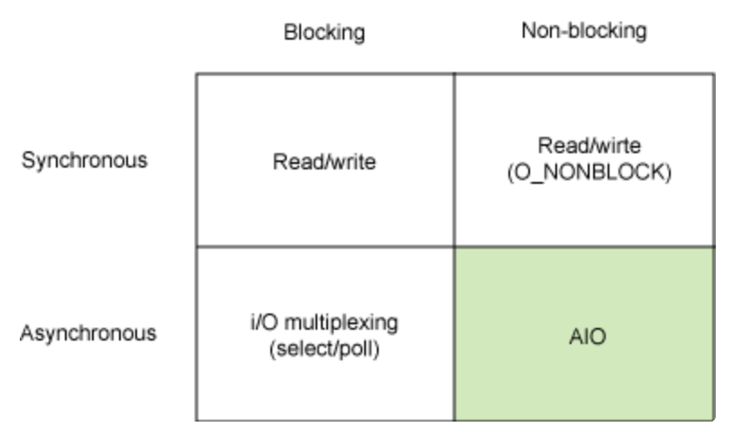
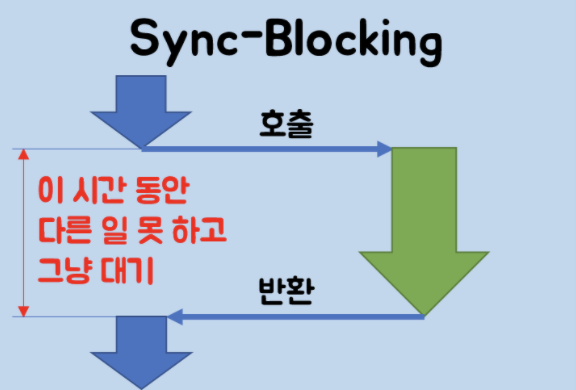

# Sync/Async VS Blocking/Non-Blocking

> 해당 글은 '뒤태지존'님의 [Blocking-NonBlocking-Synchronous-Asynchronous](https://homoefficio.github.io/2017/02/19/Blocking-NonBlocking-Synchronous-Asynchronous/)이란 글을 다시 정리한 것입니다.

Javascript를 접하다보면 비동기, Non-Blocking 등에 대해 들어봤을 것이다.  
필자도 이를 "**코드 실행을 막지 않는다.**"라고 대충만 알고 있어 두 개념이 비슷한 것이다라고 생각했다.

* 둘 다 무언가를 기다리지 않고 바로 다른 작업을 하는 측면에서는 같은것 아닌가?  
* 같은 것이 아니라면 이 둘의 차이점은 뭔가?

라는 두 가지 질문을 면접에서 받은 적이 있는데, 차이점을 설명하지 못해 굉장히 난감한 경험이 있었다.

과연 이 두 개념의 차이점을 알고 있는가?  
정확하게 알고 있다면 뒤로가기 혹은 탭을 종료해도 된다.

이제 개념들에 대해 알아보도록 해보자.

---

### 4가지 개념의 조합

4가지 개념을 2X2 매트리스로 다음과 같이 나타낼 수 있다.

그림이 설명하고 싶은건 서로 다른 축에 존재하므로 분명 뭔가의 차이점이 있으며, 이 4가지 개념을 서로 조합하여 사용이 가능하다는 것이다.  
과연 그 차이는 무엇에 있을까?

---

### 관심사의 차이

두개의 그룹의 차이점은 **서로 다른 관심사**를 가지고 있다는 것이다.

#### Synchronous/Asychronous

동기/비동기의 관심사는 '**호출되는 함수의 완료 여부를 누가 신경을 쓰느냐**'이다.

호출하는 함수가 호출되는 함수의 작업의 반환을 기다리거나 반환을 받아도 작업이 완료가 되었는지 계속해서 여부를 물어보면서 확인하는 것이 "**동기**"이다.

이와 반대로 호출되는 함수의 작업이 완료가 되건 안되건 신경을 쓰지 않으면 "**비동기**"이다.  
그렇다면 비동기에서는 종료를 누가 신경을 쓰는가?  
바로 호출시에 같이 넘기는 Callback 함수이다.  
호출되는 함수에게 Callback을 넘기게 되고 이 작업이 완료되었을 때, Callback이 실행되는 것으로 작업의 완료를 알린다.

#### Blocking/Non-Blocking

Blocking/Non-Blocking의 관심사는 '**호출된 함수가 바로 제어권을 넘겨 주느냐**'이다.

호출된 함수가 자신의 작업을 다 마칠 때까지 호출한 함수에게 제어권을 넘겨주지 않고 대기하게 만들면 "**Blocking**"이다.

그 반대로 호출된 함수가 바로 반환되어 호출한 함수에게 제어권을 넘겨주고 호출한 함수가 다른 일을 할 수 있는 기회를 준다면 "**Non-Blocking**"이다.

---

### 성격이 비슷한 조합

앞서서 필자가 비슷하게 동작을 한다고 느낀 조합들은 대부분 어느정도 알고 있을 것이다.  
그렇다면 쉽게 접근하기 위해 좀 더 익숙한 조합들을 살펴보자.

#### Sync + Blocking

해당 조합은 위 그림을 보면 알겠지만, 호출된 함수에게 제어권을 넘기고 반환 될 때까지 아무런 일도 못하고 기다리기만 한다.

예시로는 파일 읽기 혹은 쓰기 작업 등이 존재한다.

#### Async + Non-Blocking

이 조합 또한 많이 겪어 봤던 조합이다.  
호출된 함수들은 바로 호출한 함수에게 제어권을 넘기고 자신이 완료 되면 Callback을 호출하여 자신이 완료되었다고 알린다.  
그 동안 호출한 함수는 다른 일을 할 수 있기 때문에 한정적 자원에서도 굉장한 효율을 보여줄 수 있다.

Node.js가 대표적인 예라고 할 수 있다.

---

### 정반대 성격을 가진 조합

이번에는 성격이 아에 다른 조합에 대해 알아보자.

#### Sync + Non-Blocking

호출된 함수가 제어권을 바로 넘기기 때문에 호출 한 함수에서 계속해서 다른 작업을 할 수 있다.  
하지만 특이하게 계속해서 호출된 작업을 호출한 함수에서 확인하고 있다.  

#### Async + Blocking

또 다른 이상한 조합이 나왔는데, 비동기임에도 불구하고 제어권이 반환되지 않아 다음 코드를 실행하지 못한다.  
Callback이 호출 되서야 제어권을 넘기게 되고, 이때부터 다시 다음 일을 진행할 수 있다.  
그림으로도 Sync + Blocking 조합과 비슷한 면을 보여준다.

대표적인 예로는 Node.js 와 MySQL의 조합이 있다.  
Node.js에서 비동기로 요청을 처리하는 도중에 DB 관련 작업이 있다면, MySQL 드라이버를 호출 하는데 이가 Blocking 방식으로 DB 작업이 끝날 때까지 대기하게 된다.

