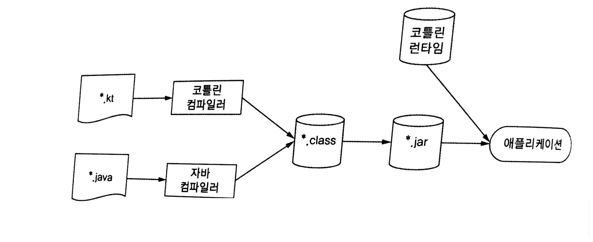

# 1. 코틀린이란 무엇이며, 왜 필요한가?

> 👾  이 글은 "Kotlin In Action"을 공부하며 정리한 내용이며, 문제시 삭제 될 수 있음을 알립니다.

## 1.1 코틀린 맛보기

* https://play.kotlinlang.org/ 에서 간단한 코드를 작성해 볼 수 있음

 

## 1.2 코틀린의 주요 특성

### 1. 대상 플랫폼

* 코틀린은 자바가 사용되고 있는 모든 용도에 적합하면서 더 간결하고 생산적이며 안전한 대체 언어를 제공하는 것이 주목적
* 코틀린을 인텔의 멀티 OS 엔진을 사용하면 iOS 디바이스에서 실행 가능, 자바스크립트로 변환도 가능 등 여러 환경에서 잘 동작

### 2. 정적 타입 지정 언어

* 정적 타입 지정 언어

  > 모든 프로그램 구성 요소의 타입을 컴파일 시점에서 알 수 있고 컴파일러가 알아서 타입 검증을 해줌

* 동적 타입 지정 언어

  > 타임과 관계없이 모든 값을 변수에 넣을 수 있으며, 필드와 메소드에 대한 검증은 실행 시점에 체크. 따라서 코드는 더 간결해지고 유연한 테이터 구조를 가질 수 있음. 하지만 개발자가 실수 했을 때는 컴파일 시에 걸러내지 못함

* 코틀린에서는 모든 변수의 타입을 직접 명시할 필요가 X  
  이는 컴파일러가 문맥을 보고 변수 타입을 자동으로 유추하기 때문  
  이를 **타입 추론**이라고 함

* 정적 타입 지정의 장점

  * 성능

    > 실행시에 어떤 메소드를 호출할지 알아내는 과정이 없으므로 더 빠름

  * 신뢰성

    > 컴파일러가 정확성을 검증하기 때문에 실행 시에 오류로 중단될 가능성이 적음

  * 유지 보수성

    > 해당 변수가 어떤 타입인지 알 수 있기 때문에 처음 보는 코드를 다룰 때 더 쉬움

  * 도구 지원

    > 더 안전한 리팩토링과 더 정확한 코드 완성 기능 제공

* 코틀린에서는 null이 될 수 있는 타입을 지원  
  따라서 컴파일 시점에 null  포인터 예외가 발생할 수 있는지를 검사할 수 있어 신뢰성을 높힘

### 3. 함수형 프로그래밍과 객체지향 프로그래밍

* 함수형 프로그래밍의 핵심

  * 일급 시민(First-Class)인 함수

    * 함수를 변수에 저장할 수 있으며, 인자로 다른 함수에 전달 및 반환할 수 있음

  * 불변성(Immutability)

    * 내부 상태가 절대로 바뀌지 않는 불변 객체를 사용해 프로그램 작성

  * 부수 효과(Side effect)가 없음

    * 순수 함수 사용으로 인해 다른 부수 효과가 없음

      #### 순수함수

      > * 같은 입력시에 항상 같은 출력
      > * 다른 객체의 상태를 변경 X
      > * 함수 외부나 다른 바깥 환경과 상호작용 X

* 함수형 프로그래밍 장점

  * 간결성
    * 함수를 값처럼 사용하기에 더 강력한 추상화, 이에 따른 코드 중복을 막음
  * Thread Safe
    * 불변 데이터 구조를 사용하고 순수 함수를 해당 데이터 구조에 적용하면 다중 스레드 환경에서도 같은 데이터를 변경 불가
    * 복잡한 동기화 필요 없음
  * 쉬운 테스트
    * 일반 함수는 실행할 때 전체 환경을 구성하는 준비 코드가 필요한 반면 순수 함수는 준비 코드 없이 독립적으로 테스트 가능

### 4. 무료 오픈 소스

* 코틀린과 관련된 모든 도구는 오픈소스, 어떤 목적에든 무료로 사용 가능(Apache 2 라이센스)

 

## 1.3 코틀린 응용

### 1. 서버 프로그래밍

* 자바 코드와 매끄럽게 상호운용이 가능한 것이 가장 큰 장점
* 자바 클래스를 코틀린으로 확장해도 아무런 문제가 없으며, 코틀린 클래스 안에 자바 어노테이션을 붙히는 경우도 문제 X
* 시스템 코드는 더 간결, 더 신뢰성 높힘, 더 유지보수가 쉬움(예 - 빌더 패턴)

### 2. 안드로이드 프로그래밍

* 애플리케이션의 신뢰성을 더 높힐 수 있음  
  null 값을 추적하기 때문에 안드로이드 애플리케이션에서 '프로세스 중단 됨' 현상을 줄일 수 있음
* 자바에서 NullPointException을 일으키는 유형의 코드는 대부분 컴파일 X
* 성능 측면에서도 컴파일러가 생성한 바이트코드는 일반적인 자바 코드와 똑같이 효율적으로 실행
* 런타임 시스템이 상당히 작으므로 컴파일 후 패키징한 애플리케이션 크기도 자바에 비해 그리 많이 늘지 않음
* 대부분의 코틀린 표준 함수는 인자로 받은 람다 함수를 인라이닝, 따라서 람다를 사용해도 새로운 객체가 만들어지지 않으므로 객체 증가로 인한 GC가 일어나 자주 멈추지 않음

 

## 1.4 코틀린의 철학

### 1. 실용성

* **코틀린은 연구를 위한 언어가 아님**
* 다른 프로그래밍 언어가 채택한 성공적으로 검증된 해법과 기능에 의존
* 특정 프로그래밍 스타일이나 패러다임을 사용할 것을 강제로 요구하지 않음
* 도구를 강조, 따라서 더 간결한 구조로 바꿀 수 있는 코드 패턴을 도구가 감지하여 수정 제안

### 2. 간결성

* 언어가 간결하다 == 읽을 때 의도를 쉽게 파악할 수 있는 구문 구조 제공, 이해에 방해가 되는 부가적인 준비 코드가 적음  
  (코틀린에서는 게터, 세터등 여러가지 준비 코드를 묵시적으로 제공)
* 간결하다고 해서 무조건적으로 코드를 짧게 만드는 것은 아님
* 간결하면 쓰는 시간 ↓ , 읽는 시간 ↓

### 3. 안전성

* 안전하다 == 프로그램에서 발생할 수 있는 오류 중 일부(오류를 방지하는데 대가가 따르기 때문)를 원천적으로 방지
* 더 큰 안전성을 얻기 위해서는 프로그램에 더 많은 정보를 작성하므로 생산성 하락(안전성과 생산성 사이에는 트레이드오프 관계 성립)
* JVM에서 실행한다는 것은 이미 상당한 안전성을 보장 (메모리 안전성, 버퍼 오버플로 방지, 동적 메모리를 잘못 사용함으로 발생할 수 있는 문제 방지)
* 실행 시점에 오류를 발생시키지만, 컴파일 시점에 검사를 통해 오류를 더 많이 방지
* 타입 검사와 캐스트가 한 연산자에 의해 이루어지므로 해당 타입일 시 별도의 캐스트없이 메소드나 필드를 사용 가능

### 4. 상호운용성

* 라이브러리가 어떤 API를 제공하던간 코틀린에서는 해당 API를 활용 가능(자바 메소드 호출, 자바 클래스 상속 혹은 인터페이스 구현 등)
* 자바 코드에서 코틀린 코드를 호출할 때도 아무런 노력 필요 없음, 따라서 자바와 코틀린 코드를 프로젝트에서 원하는 대로 섞어 쓸 수 있음
* 기존 자바 라이브러리를 가능한 최대한 활용하기에 자바 표준 라이브러리 클래스에 의존하며, 기존 라이브러리에 몇 가지 기능을 더할 뿐

 

## 1.5 코틀린 도구 사용

### 1. 코틀린 코드 컴파일

* 코틀린 컴파일러는 자바 컴파일러가 .class 파일을 만들듯 똑같이 동작

  

* 코틀린 컴파일러로 컴파일한 코드는 코틀린 런타임 라이브러리에 의존  
  런타임 라이브러리에는 코틀린 자체 표준 라이브러리 클래스와 코틀린에서 자바 API의 기능을 확장한 내용 포함

* 애플리케이션 배포시 런타임 라이브러리도 같이 배포(메이븐과 그레이들은 패키징할 때 알아서 포함)

### 2. Intellij IDE, 안드로이드 스튜디오의 코틀린 플러그인

> 생략

### 3. 대화형 셸

> 생략

### 4. 이클립스 플러그인

> 생략

### 5. 온라인 놀이터

> 생략

### 6. 자바-코틀린 변환기

> 생략