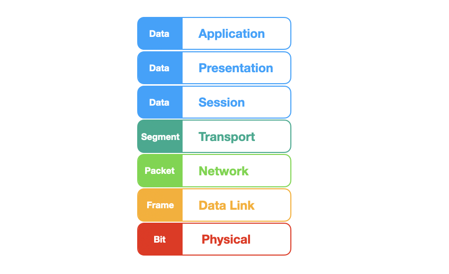

# OSI 7계층

OSI(Open System Interconnection) 7 계층은 다음 그림 같이 네트워크 통신이 일어나는 과정을 7개의 계층 모델로 만들어 설명한 것이다.  

</>

즉, 우리가 웹 서핑을 하거나 다른 사람들과 온라인으로 게임을 하는 등 네트워크를 통해 하는 작업들은 이 과정을 그대로 한다는 것이다.  

그림에서 왼쪽 부분은 해당 레이어에서 사용되는 Data 단위의 이름이며, 그 단위대로 색상을 구별해 놓았다.

이제 왜 이러한 계층을 만들게 되었고, 각 계층에서는 어떤 일이 일어나는지 알아보자.

---

### 계층을 나눈 이유

계층을 나눈 이유는 **흐름 파악, 유지 보수**를 말할 수 있다.

일단 하는 역할별로 계층을 나누게 되면 엄청 복잡한 통신 과정을 한눈에 이해하기 쉽고, 특정 계층에서 에러가 발생시에 찾아내기도 편리하다라는 장점을 가지고 있다.  
프로그래밍에서 모듈 간의 결합성을 줄이고 명확한 역할을 부여하여 유지보수가 쉽도록 만드는것과 비슷한 이유이다.

---

### 계층별 역할

OSI 7계층 모델은 밑에서부터 1계층, 2계층 ... 7계층 순으로 나타낸다.  
1계층부터 차근차근 알아보도록하자.

#### 1계층 - 물리(Physical)

해당 계층에서는 이름에서 보이는 것처럼 통신 케이블을 통해 데이터를 직접 전송하는 계층이다.

사용되는 통신 단위는 **Bit**이며 알다싶이 0과 1로 이루어져 있다.

아무런 기능이 없으며 단지 전기적 신호로 변환하여 데이터를 주고 받는 일만 할 뿐이다.

#### 2계층 - 테이터 링크(Data Link)

해당 계층은 데이터를 네트워크 전송 방식에 맞게 단위화하여 그 단위를 전송하는 역할을 한다.

이더넷 프로토콜을 사용하며 이더넷 장치를 위한 표준 주소 지정 시스템을 제공하는데 이가 바로  **MAC(Media Access Control) 주소**(기기별로 부여되는 식별 번호, 6Byte, 유일한 주소)이다. 

전송되는 데이터의 단위는 **Frame**이라고 하고 대표적인 장비로 **브릿지**, **스위치**가 존재한다.

데이터를 전송함에 있어 데이터 링크 계층은 3가지 기능을 제공하고 있다.

1. Frameing

   현재 노드(= 송신자, 수신자, 중간 라우터, 스위치들)에서 다음 노드로 데이터를 보낼 때, 3계층(네트워크)에서 받은 데이터를 데이터 배열에 Header, Trailer등을 추가로 넣어 **캡슐화시키는 작업**을 말한다.

2. 흐름제어

   송신측과 수신측의 데이터 처리 속도가 다를시에 수신측의 버퍼가 계속해서 길어져 가득 차게 되면 데이터의 유실이 나게 된다.  
   이때, 송신측에 **속도를 맞추라는 피드백**을 보낼 수 있는데 이를 흐름제어라고 한다.

3. 에러제어

   물리 계층에서 전기적 신호로 보낸 데이터들에서 혹시모를 에러가 발생하여 데이터의 유실이 있을 수 있다.  
   이는 수신측에서 데이터를 보고 에러를 검출해낼 수 있는데, 방법은 굉장히 많다.  
   만약 에러가 발생 시에 수신측에서는 에러를 직접 수정하거나, 수신 받았던 데이터를 폐기하고 다시 재요청을 하는 식으로 제어를 하게 된다.

직접 데이터를 보낼 수 없기 때문에 송신측과 수신측 그리고 그 중간에 많은 서버와 라우터들을 통해 데이터를 보내야 한다.  
물리 계층에서는 단순히 MAC주소를 보고 데이터를 보내기에 중간마다 만나는 노드들의 MAC 주소가 필요하게 된다.  
이 때, 이 MAC 주소를 알 수 있는 방법은 **ARP(Address Resolution Protocol)** 을 사용하는 것이다.

ARP는 네트워크 상에서 IP 주소를 물리적 네트워크로 대응시키기 위해 사용되는 프로토콜이다.  
즉, 목적지의 IP주소는 알지만 MAC 주소를 알 수 없을 때 사용하는 것이다.  
현재 노드에 연결되어 있는 모든 노드에(브로드캐스팅) 해당 IP 주소와 ARP 패킷을 보내게 되고 해당 IP를 가지고 있는 노드의 MAC 주소를 응답하는 방식으로 목적지까지 데이터를 보낸다.  
ARP를 통해 알게된 주소들은 캐싱을 해놓아 다음에 전송시에 빠르게 보낼 수 있도록 한다.

이와 반대로 MAC 주소는 알지만 IP 주소를 알지 못할 때는 **RARP(Reverse Address Resolution Protocol)** 를 사용하게 된다.

#### 3계층 - 네트워크(Network)

네트워크 계층에서 중요한 기능은 **데이터를 목적지까지 안전하고 빠르게 전달하는 기능**이다.  
이를 **라우팅**이라고 하며, 최적의 경로를 선택하고 주소를 결정하여 **Packet**을 전달하는 것이다.

대표적인 장비로는 **라우터**가 존재한다.

네트워크 계층에서 제공되는 기능은 다음과 같다.

1. 라우팅

   얽히고 설킨 네트워크 상에서 **어느 경로로 데이터를 보낼지 결정하는 과정**을 말한다.  
   라우팅 기법은 정적 라우팅, 동적 라우팅, 디폴트 라우팅으로 나뉘며 그 외에도 많은 기법들이 존재한다.

2. 혼잡제어

   **송신측의 데이터 전달과 네트워크 처리속도의 차이를 해결하기 위한 기법**이다.  
   네트워크는 개인이서 사용하는 것이 아닌 여러명이서 사용하기에 사용량이 몰려 오버플로우나 데이터 손실을 발생시킬 수 있다.  
   이를 방지하기 위해 송신측에서 보내는 데이터의 전송 속도를 강제로 줄일 수 있다.

3. Internetworking

   말 그대로 독립적인 네트워크를 연결을 의미하며 한쪽에서 다른쪽으로 통신을 가능하게 하는 것이다.

이런 네트워크 계층의 대표적인 프로토콜로는 **IP(Internet Protocol)** 과 **ICMP(Internet Control Message Protocol)** 등이 존재한다.

* IP(Internet Protocol)

  인터넷 프로토콜은 송신측과 수신측이 정보를 주고받는데 있어 사용하는 약속이다.

  주요 기능으로는 **라우팅**과 **주소 지정**이 있다.  
  여기서 사용되는 주소는 우리가 잘 알고 있는 **IP 주소**이다.

  인터넷 프로토콜은 **비신뢰성**, **비연결성**이라는 특징을 가지고 있다.  
  이 말은 송신측에서 보낸 데이터가 제대로 갔는지 보장하지 못한다는 뜻과 같다.  
  그렇기 때문에 데이터가 뒤죽박죽이 될 수 있고, 같은 패킷이 여러번 전송될 수도 사라질 수도 있다는 것이다.  
  이를 방지하기 위해서는 전송 계층에 있는 TCP 프로토콜과 같은 상위 프로토콜을 이용해야한다.

* ICMP(Internet Control Message Protocol)

  이 프로토콜은 메시징과 네트워크 진단에 사용된다.  
  IP 패킷을 보낼 때, 실제로 수신측에 도착을 했는지 확신을 할 수 없는데 만약 도착하지 않았다면 ICMP 패킷을 반환한다.

#### 4계층 - 전송(Transport)

전송 계층은 양 끝단에 있는 송신측과 수신측이 데이터를 주고 받을 때, 신뢰성있는 연결을 할 수 있게 도와주며 데이터들을 수집하여 상위 계층으로 넘겨준다.

여기서 사용되는 데이터 단위는 **Segment**로 오류 및 흐름, 혼잡 제어, 다중화/역다중화 같은 작업을 수행한다.

1. 오류제어

   하위 계층인 네트워크 계층에서 신뢰성을 제공하지 않기 때문에 전송 계층에서 제공을 한다.  
   재전송이 필요한 데이터를 알기 위해 **순서 번호(Sequence Number)** 를 부여하며, 중복 수신 및 순서를 파악할 수 있다.  
   또한, 수신측에서는 **확인 응답(ACK)** 를 보내게 되는데 오류가 없는 데이터에 한에서만 해당 응답을 보낸다.  
   수신측에선 오류가 발생한 데이터는 버리기 때문에 송신측으로 응답이 오지 않을 수 있다.  
   이 때는 송신측에서는 자연스럽게 에러가 발생했거나 유실이 났을 것이라 판단하고 해당 데이터를 재전송한다.

2. 흐름제어

   송신측과 수신측의 데이터 처리 속도를 맞추기 위해 사용되는데 대부분 수신측을 기준으로 진행한다.  
   버퍼를 통해 이를 제어하며 이는 송신측, 수신측 둘다 존재하여 흐름을 맞추게 된다.

   오류제어와 흐름제어를 결합한 결과로 **슬라이딩 윈도우(버퍼)** 를 사용하게 된다.
   양 끝간에 슬라이딩 윈도우가 있으며, 해당 크기 만큼 데이터를 전송한다.  
   수신측에서 해당 데이터가 왔다면 응답을 보내고 해당 데이터 번호를 슬라이딩 윈도우에서 제거하고 새로운 데이터 번호를 추가한다.  
   송신측에서는 해당 응답을 받고 똑같이 슬라이딩 윈도우를 움직이고 새로운 데이터를 보내게 된다.

3. 혼잡제어

   네트워크 계층에서 설명한 혼잡제어와 같이 송신측의 데이터 전달과 네트워크 처리속도의 차이를 해결하기 위한 기법이다.

4. 다중화/역다중화

   하나의 프로그램(어플리케이션)은 하나 이상의 소켓(전송 계층과 연결된 문이라고 생각하면 쉽다.)을 가질 수 있는데, 이러한 소켓을 구분 짓기 위해 **port**라는 것을 사용한다.  
   이러한 **포트를 보고 해당 포트에 전송된 데이터를 전달하는 작업을 역다중화**라고 하고, 반대로 **해당 소켓에서 부여 받은 포트 번호와 데이터를 캡슐화 하는 작업을 다중화**라고 한다.

이렇게 안정적인 데이터 전송을 위해 상호간의 연결을 맺어 교류하는 방식을 **연결형 서비스**라고 하며 이를 사용하는 프로토콜이 많이 알려진 **TCP 프로토콜**이다.  
이와 반대로 IP 프로토콜과 같이 오류, 흐름 제어등을 사용하지 않고 연결을 하지 않는 방식을 **비연결형 서비스**라고 하며 대표적으로 **UDP 프로토콜**이 존재한다.

* **TCP(Transmission Control Protocol)**

  통신하는 양 끝점의 호스트 내의 프로세스 간에 **신뢰적인 연결지향성 서비스를 제공하는 프로토콜**이다. 
  **상호간 연결을 맺을 때는 3 Way-handshake를 하며, 4 Way-Handshake를 통해 연결을 끊는다**.

  인터넷 프로토콜에서 신뢰성있는 통신을하기 위해 많이 사용되기에 **TCP/IP**라고 불리운다.  
  신뢰성을 위해 위에 설명한 기능들을 제공하므로 UDP 프로토콜에 비해 느리다.

* **UDP(User Datagram Protocol)**

  **연결성과 신뢰성이 없는 프로토콜**로 위의 기능들을 제공하지 않는다.  
  그렇기 때문에 이를 사용하는 프로그램 내에서 위 기능들을 스스로 갖추어야 한다.

  하지만 연결을 하지 않고 여러 제어들을 하지 않는 탓에 속도가 빠르며, 많은 정보가 필요없으므로 헤더의 크기도 작다.  
  이런 특징 때문에 실시간으로 처리해야할 스트리밍 혹은 게임등에서 많이 사용한다.

#### 5계층 - 세션(Session)

4계층에서 직접적인(물리적) 연결을 맺고 끊었다면, 세션 계층에서는 **간접적인(논리적) 연결을 맺어 안정된 통신을 할 수 있도록 유지 관리하는 계층**이라고 보면된다.  
예를들면, 웹 서핑을 하다 인터넷을 종료했음에도 불구하고 로그인이 계속해서 되어있는 것을 볼 수 있다.  
물리적으로 연결을 끊는 행동(인터넷 종료)을 해도 논리적으로 연결되어 있기 때문에 새로운 연결 이전 상태를 알 수 있는 것이다.

세션 계층에서 접속 설정 및 해제 말고도 다중화, 에러 복구, 대화 관리과 같은 기능을 제공한다.

1. 다중화

   여러개의 세션들이 **효율을 높이기 위해 1개의 전송 계층 접속을 사용**하거나, 그 반대로 **1개의 세션이 속도 향상을 위해 다수의 전송 계층을 사용**할 수 있는 것을 말한다.  
   이는 전송 계층에서의 다중화/역다중화와 같은 역할이다.

2. 에러 복구

   세션 계층에서는 데이터를 전송시 **동기점(메시지가 완료된 지점)을 넣으므로써 메시지를 연결 단위로 그룹화**한다.  
   이때, 에러가 발생하면 이전 동기점을 찾고 그 동기점부터 다시 전송을 한다.

3. 대화 관리

   **토큰**을 사용함으로 연결들을 분류하고 관리할 수 있게 한다.

#### 6계층 - 표현(Presentation)

네트워크 상에는 여러 종류의 시스템이 존재하며 이마다 데이터를 표현하는 방식이 다르다.  
그렇기 때문에 표현 계층에서는 **두 응용 프로그램간 똑같은 데이터 표현을 위해 데이터를 변형/번역 하는 역할**을 한다.  
즉, 다른 나라 사람들이 대화를 하기 위해 통역사를 고용한 것과 같은 것이다.

주요 기능으로는 다양한 표현 양식을 공통으로 변경하거나, 암호화, 압축 등이 존재한다.

#### 7계층 - 응용(Application)

우리가 사용하는 소프트웨어 자체로 **여러가지 프로토콜을 통해 사용자에게 편리한 기능들을 제공해주는 역할**을 한다.  
많이 사용하는 브라우저, 메일 프로그램등이 존재한다.

대표적인 프로토콜로는 FTP, SMTP, HTTP, TELNET 등이 존재한다.

---

 

 

### Reference

* [다중화와 역다중화](https://donghoson.tistory.com/37)
* [전송 계층 - SKKU CE Study](https://trpark.tistory.com/entry/3-전송-계층)
* [[네트워킹] 데이터링크 계층 (DATA-LINK LAYER)](https://tyeolrik.github.io/network/2017/02/14/Networking-4-Data-Link-Layer.html)
* [정보통신기술용어해설 - 7계층 모델](http://www.ktword.co.kr/abbr_view.php?nav=2&id=747)
* [OSI 7 계층이란?, OSI 7 계층을 나눈 이유](https://shlee0882.tistory.com/110)

