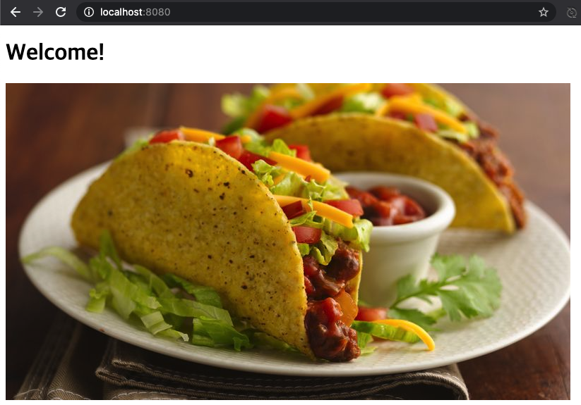
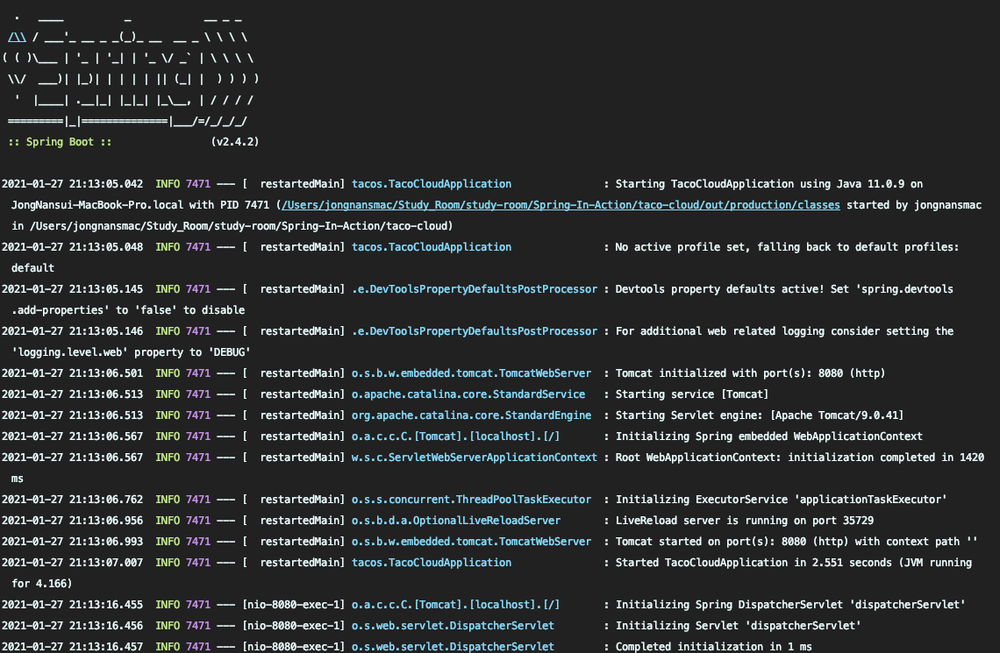
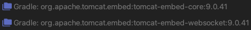

# 1장. 스프링 시작하기

> 해당 글은 크레이그 월즈님이 쓰고, 심재철님이 옮긴 Spring in Action 제 5판을 정리한 내용임을 미리 알립니다.

### 배우는 내용

* 스프링과 스프링 부트의 핵심 사항
* 스프링 프로젝트 생성하기
* 스프링 개요

## 1.1 스프링이란?

스프링은 **스프링 애플리케이션 컨텍스트(Spring application context)** 라는 컨테이너를 제공하는데 이는 애플리케이션 컴포넌트(Bean, 빈)들을 생성하고 관리한다. 이러한 컴포넌트(빈)은 하나의 애플리케이션을 만들기 위해 서로 연결되는데 스프링에서는 **의존성 주입(Dependency Injection, DI)** 이라는 패턴을 기반으로 연결을 맺는다.

지금까지 스프링 버전에서는 컴포넌트들의 관계를 XML파일에 정의하여 사용했으나, 최근에는 자바 기반의 구성이 타입 안전성, 리팩토링 등 여러 측면에서 우수하므로 더 많이 사용된다.

*  XML 파일 기반 설정

  ```xml
  <bean id="inventoryService" class="com.example.InventoryService" />
  <bean id="productService" class="com.example.ProductService" >
    <constructor-arg ref="inventoryService" />
  </bean>
  ```

* Java 기반 설정

  ```java
  @Configuration // 각 빈을 스프링 애플리케이션 컨텍스트에 제공하는 구성 클래스란 것을 스프링에게 알림
  public class ServiceConfiguration {
    @Bean	// 메서드에서 반환되는 객체가 애플리케이션 컨텍스트의 빈으로 추가되어야 함을 알림
    public InvetoryService invetoryService() {
      return new InventoryService();
    }
    @Bean
    public ProductService productService() {
      return new ProductService(inventoryService());
    }
  }
  ```

하지만, 스프링에서는 **자동-구성**이라는 기능이 존재하기 때문에 위 구성이 필요없을 수 있다. 자동-구성은 **자동연결(Autowiring)** 과 **컴포넌트 검색(Component Scanning)** 이라는 기법을 기반한다.

* 자동 연결

  > 의존 관계가 있는 컴포넌트를 자동으로 다른 빈에 주입

* 컴포넌트 검색

  > 자동으로 애플리케이션의 classpath에 지정된 컴포넌트들을 찾고 빈으로 생성

스프링에서 생상성을 향상을 위해 제공되는 스프링 부트(Spring Boot)는 자동-구성 기능이 더욱 향상되어 몇줄 안되는 코드로 애플리케이션을 실행할 수 있다.

<br>

## 1.2 스프링 애플리케이션 초기 설정

초기 설정을 직접 하나하나 만들어도 되지만, 이는 시간 낭비이므로 스프링 Initializr(REST API를 사용하는 웹 기반 애플리케이션)를 사용하는 편이 좋다. 또한, 이 해당 책에서도 이니셜라이저를 통해 만들어 나간다. 이니셜라이저를 사용하는 방법은 여러가지가 존재한다.

* https://start.spring.io 사용
* 터미널에서 curl 사용
* 터미널에서 스프링 부트 CLI를 사용
* Spring Tool Suite IDE(이클립스 기반 IDE)를 사용하여 새로운 프로젝트 생성
* Intellij IDEA IDE를 사용하여 새로운 프로젝트 생성
* NetBean IDE를 사용해서 새로운 프로젝트 생성

> 해당 책에선 Spring Tool Suite IDE를 사용하며 Maven을 빌드 도구로 하여 프로젝트를 생성하고 있다. 이는 자신의 선택이며 필자는 Intellij IDEA IDE에서 Initializr를 통해 생성할 것이며, 빌드 도구는 Gradle을 사용할 것이다. 또, 프로젝트를 생성하는 자세한 방법은 책을 참고하길 바란다.

기존의 자바 웹 애플리케이션의 경우 WAR 파일로 패키징을 했으나, 이니셜라이저에서는 JAR를 기본 패키징으로 잡고 있다. 이는 클라우드를 염두해 둔 선택이기 때문이라고 한다. 이는 2장에서 자세하게 다루도록 한다.

### 빌드 명세 살펴보기

```java
plugins {
    id 'org.springframework.boot' version '2.4.2'
    id 'io.spring.dependency-management' version '1.0.11.RELEASE'
    id 'java'
}

group = 'com.jongnan'
version = '0.0.1-SNAPSHOT'
sourceCompatibility = '11'

configurations {
    compileOnly {
        extendsFrom annotationProcessor
    }
}

repositories {
    mavenCentral()
}

dependencies {
    implementation 'org.springframework.boot:spring-boot-starter-thymeleaf'
    implementation 'org.springframework.boot:spring-boot-starter-web'
    compileOnly 'org.projectlombok:lombok'
    developmentOnly 'org.springframework.boot:spring-boot-devtools'
    annotationProcessor 'org.projectlombok:lombok'
    testImplementation 'org.springframework.boot:spring-boot-starter-test'
}

test {
    useJUnitPlatform()
}
```

위 그래이들 빌드 명세를 보게 되면 최 상단에 스프링 부트 플러그인이 존재한다.(메이븐 - pom.xml에서는 최하단) 이러한 플러그인의 주요 기능은 다음과 같다.

* 그래이들을 사용하는 애플리케이션을 실행한다.
* 의존성에 지정된 라이브러리가  JAR 파일에 포함되어 있는지, 런타임 시 classpath에서 찾을 수 있는지 확인
* 부트스트랩 클래스를 나타내는 매니페스트 파일을 JAR 파일의 메인 클래스로 생성

이번에는 dependecies(의존성)을 살펴보자. 추가한 의존성(thymeleaf, web, test) 이름에 **"starter"** 라는 단어를 포함하고 있는 것을 볼 수 있다. 이는 스프링 부트 스타터 의존성을 나타내며, 자체적으로 라이브러리 코드를 가지고 있는 것이 아닌 다른 라이브러리의 것을 사용한다. 이런 스타터 의존성의 경우 다음과 같은 장점이 있다.

1. 모든 라이브러리의 의존성을 선언하지 않아도 되므로 빌트 파일이 훨씬 작아지고 관리가 용이함
2. 기능적의 관점으로 하나의 스타터만 사용해도 쉽게 애플리케이션을 만듬
3. 버전 걱정 X

### 부트스트랩(구동) 클래스

JAR 파일에서 애플리케이션을 구동하기 위해서 부트스트랩 클래스가 있어야 하며, 부트스트랩 하기위한 최소한의 스프링 구성도 존재해야 한다. 이니셜라이저로 프로젝트를 생성하고 `src/main/java/{package}` 안에 `OOOApplication.java`가 바로 부트스트랩 클래스이다.

```java
@SpringBootApplication  // 스프링 부트 애플리케이션
public class TacoCloudApplication {

    public static void main(String[] args) {
        // 애플리케이션 실행
        SpringApplication.run(TacoCloudApplication.class, args);
    }
}
```

간단해 보이는 코드이지만, 강력한 효과가 있다. `@SrpingBootApplication` 애노테이션의 경우, 해당 코드가 스프링 부트 애플리케이션임을 나타내면서 3개의 애노테이션이 결합되었다.

* @SpringBootConfiguration

  > 현재 클래스를 구성 클래스로 지정, @Configuration 의 특화된 형태

* @EnableAutoConfiguration

  > 자동-구성을 활성화

* @ComponentScan

  > @Component, @Controller, @Service 등과 같은 애노테이션을 자동으로 찾아 컴포넌트로 등록

<br>

## 1.3 스프링 애플리케이션 작성하기

### 웹 요청 처리

스프링에서는 스프링 MVC라는 강력한 웹 프레임워크를 가지고 있다. 이 중심에는 **컨트롤러**가 있고 이는 웹의 요청과 응답을 처리하는 컴포넌트이다.

```java
@Controller
public class HomeController {
    @GetMapping("/")
    public String home() {
        return "home";
    }
}
```

`@Cotroller` 애노테이션의 경우 많은 일은 하지 않는다. 해당 클래스가 컴포넌트라는 것을 식별하는 것이 주 목적이기 때문이다.

home 메서드에는 `@GetMapping` 애노테이션이 지정되어 있는데, 이는 `/` 경로로 HTTP GET 요청이 수신되면 해당 메서드가 실행된다. home 메서드는 단순히 String 값("home")을 반환하고 있는데 이는 뷰의 논리적인 이름이다.(home.html과 매칭)

home.html을 만들고 애플리케이션을 실행 시켜보면 컨트롤러가 잘 작동하는지 알 수 있다.

* 콘솔창

  

* `localhost:8080/` 에 접속 화면

  

기존 스프링의 경우 톰캣을 설치하고 IDE에서 이를 연결하여 사용하였다. 하지만, 스프링 부트에서는 이 과정이 생략된 것을 알 수 있다. 또, 추가된 라이브러리를 살펴보면 내장형 톰캣 라이브러리가 존재하는 것을 알 수 있다.



그래이들에 톰캣 관련 의존성을 넣지 않았는데도 어떻게 이 처럼 될 수 있을까? 차근차근 찾아 가보자.

빌드 명세에 의존성 관련하여 위에 코드를 보면, `spring-boot-starter-web`를 넣어준 것이 보일 것이다. 이는 웹 애플리케이션을 만들기 위해 넣어준 것으로 그 안을 살펴보면 다음과 같이 나와있다.

```java
plugins {
	id "org.springframework.boot.starter"
}

description = "Starter for building web, including RESTful, applications using Spring MVC. Uses Tomcat as the default embedded container"

dependencies {
	api(project(":spring-boot-project:spring-boot-starters:spring-boot-starter"))
	api(project(":spring-boot-project:spring-boot-starters:spring-boot-starter-json"))
	api(project(":spring-boot-project:spring-boot-starters:spring-boot-starter-tomcat"))
	api("org.springframework:spring-web")
	api("org.springframework:spring-webmvc")
}
```

Web 스타터 안에 또 다시 빌드 명세가 존재하고 또 다른 스타터가 의존성으로 들어가 있다. 드디어 우리가 알고 싶어했던 톰캣 스타터가 나온것을 볼 수 있다. 이 또한 자세하게 살펴보도록 하자.

```java
plugins {
	id "org.springframework.boot.starter"
}

description = "Starter for using Tomcat as the embedded servlet container. Default servlet container starter used by spring-boot-starter-web"

dependencies {
    api("jakarta.annotation:jakarta.annotation-api")
	api("org.apache.tomcat.embed:tomcat-embed-core") {
		exclude group: "org.apache.tomcat", module: "tomcat-annotations-api"
	}
	api("org.apache.tomcat.embed:tomcat-embed-el")
	api("org.apache.tomcat.embed:tomcat-embed-websocket") {
		exclude group: "org.apache.tomcat", module: "tomcat-annotations-api"
	}
}
```

드디어 내장 톰캣 라이브러리를 불러오는 코드를 볼 수 있다.

이처럼 다른 라이브러리들 또한 같은 방식으로 불러오며, 스프링 부트의 자동-구성 기능으로 라이브러리들을 감지하여 자동으로 컨텍스트에 구성하게 된다.

<br>

## 1.4 스프링 간략히 살펴보기

스프링에는 굉장히 많은 의존성이 존재하지만, 간단하게 중요한것들 몇개만 살펴보고 넘어가도록 하겠다.

### 핵심 스프링 프레임워크

스프링 프레임워크는 핵심 컨테이너와 의존성 주입 프레임워크 등 여러가지 기능을 제공한다. 그중 하나가 웹 프레임워크인 스프링 MVC다. 또 템플릿 기반의 JDBC 지원(JdbcTemplate)을 포함하여 기본적인 퍼시스턴스 지원도 제공한다.

### 스프링 부트

앞서 본 스타터 의존성과 자동-구성 외에도 다음과 같은 편리한 기능을 제공한다.

* 액추에이터(Actuator)는 애플리케이션의 내부 작동을 런타임 시에 살펴보는 기능 제공
  (메트릭(metric), 스레드 덤프 정보, 애플리케이션 상태, 환경 속성 포함)
* 환경 속성의 명세
* 핵심 프레임워크에 추가되는 테스트 지원
* 스프링 부트 CLI 제공(애플리케이션 전체를 그루비 스크립트들로 작성하여 명령행에서 실행 가능)

### 스프링 데이터

간단한 자바 인터페이스로 애플리케이션의 데이터 리퍼지터리를 정의할 수 있다.

### 스프링 시큐리티

인증, 허가, API 보안을 포함하는 폭넓은 범뮈의 애플리케이션 보안 요구를 다룬다.

### 스프링 통합과 배치

* 스프링 통합

  > 데이터가 사용 가능한 즉시 처리되는 실시간으로 통합

* 스프링 배치

  > 다량의 데이터가 처리되는 시점을 트리거가 알려줄 때 데이터가 수집 처리되는 배치 통합 처리

### 스프링 클라우드

여러개의 애플리케이션을 거대한 하나의 단일체로 개발하는 **마이크로서비스**를 구성하기 위해 사용

