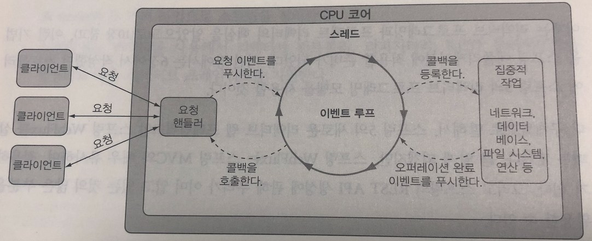
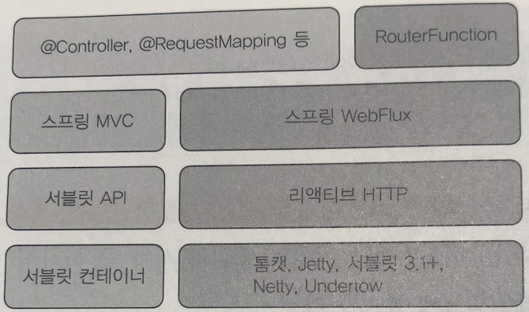

# 11장. 리액티브 API 개발하기

### 🏗배우는 내용

* 스프링 WebFlux 사용하기
* 리액티브 컨트롤러와 클라이언트 작성하고 테스트하기
* REST API 소비하기
* 리액티브 웹 애플리케이션의 보안

<br>

## 11.1 스프링 WebFlux 사용하기

* 전형적인 서블릿 기반의 웹 프레임워크(Spring MVC..)는 스레드 블로킹이 발생 가능성이 존재, 다중 스레드로 수행

* **스레드 풀** 이라는 작업 스레드의 모음에서 요청을 받을 때마다 하나씩 가져와 사용하는 것, 이 때 요청 스레드의 경우 작업을 마치기 전까지는 블로킹

* 따라서 서블릿 기반의 웹 프레임워크는 확장성이 크게 떨어짐

* 이해 반해서 비동기 웹 프레임워크의 경우 더 적은 수의 스레드로 더 높은 확장성을 성취

* 여기서 **이벤트 루핑** 이라는 기법을 사용(Node.JS, NginX가 대표적인 사례)

  

  * 이벤트 루프는 비용이 들만한 작업들을 콜백으로 등록하여 병행으로 수행, 다음 이벤트로 넘어가고 이를 반복
  * 따라서 소수의 스레드로 더 많은 작업들을 할 수 있고 스레드의 관리 부담이 줄어드며 확장이 용이

* 스프링 5에서 비동기(프로젝트 리액터 기반) 웹 프레임워크(Spring WebFlux)가 소개

### 개요

* 많은 것을 Spring MVC에서 가져와 별도의 리액티브 웹 프레임워크로 만듦, Spring WebFlux가 그 산물

* Spring MVC vs Spring WebFlux

  

  * Spring WebFlux에서는 Netty, 톰캣, Jetty 등 다양한 논블러킹 웹 컨테이너에서 실행 가능
  * 왼쪽 맨 위에 Spring MVC에서 사용되는 컴포넌트들을 Spring WebFlux에서도 사용이 가능(주로 컨트롤러를 정의하는 데 사용되는 애노테이션들)
  * RouterFunction의 경우, 애노테이션을 대신하여 함수형 프로그래밍 패러다임으로 컨트롤러를 정의 가능

* `spring-boot-starter-webflux` 라는 스타터가 존재하며 기본 내장 서버는 톰캣이 아닌 Netty
* WebFlux의 컨트롤러 메서드는 Mono, Flux 같은 리액티브 타입을 인자로 받거나 반환, RxJava 타입도 처리 가능
* Spring MVC에서도 리액티브 타입이 사용 가능하지만 진정으로 리액티브하게 동작하지는 않음

### 컨트롤러 작성하기

* 기존 RestController

  ```java
  @GetMapping("/recent")
  public Iterable<Taco> recentTacos() {
      PageRequest page = PageRequest.of(
         	0, 12, Sort.by("createdAt").descending());
      return tacoRepo.findAll(page).getContent();
  }
  ```

* 리액티브 타입 사용

  ```java
  @GetMapping("/recent")
  public Flux<Taco> recentTacos() {
      return tacoRepo.findAll().take(12);
  }
  
  // TacoRepository
  public interface TacoRepository extends ReactiveCrudRepository<Taco, Long> {}
  ```

  * 레포지터리에서 리액티브 타입을 받을 때 `subscribe()` 는 프레임워크에서 알아서 호출

* RxJava 타입 사용

  ```java
  @GetMapping("/recent")
  public Observable<Taco> recentTacos() {
      return tacoService.getRecentTacos();
  }
  ```

* 리액티브한 입력 처리

  ```java
  @PostMapping(consumes="application/json")
  @ResponseStatus(HttpStatus.CREATED)
  // 메서드 진입시 블로킹(요청 페이로드가 분석되어 Taco 객체를 생성해야 사용가능하기 때문)
  public Taco postTaco(@RequestBody Taco taco) {
      // 다른 메서드를 호출시 블로킹(다른 메서드가 끝나야지만 다시 postTaco가 실행이 가능하기 때문)
      return tacoRepo.save(taco);
  }
  ```

  * 총 두번의 블로킹이 걸리므로 리액티브하지 않으므로 다음과 같이 리액티브하게 만들 수 있음

  ```java
  @PostMapping(consumes="application/json")
  @ResponseStatus(HttpStatus.CREATED)
  public Mono<Taco> postTaco(@RequestBody Mono<Taco> taco) {
      return tacoRepo.saveAll(tacoMono).next();
  }
  ```

<br>

## 11.2 함수형 요청 핸들러 정의하기

* 애노테이션의 경우 애노테이션 자체는 '무엇'을 정의하고 있지만 '어떻게'는 프레임워크 내부에서 정의하므로 괴리가 존재  
  따라서 디버깅도 힘듦(중단점을 설정할 수 없기 때문)  
  또한, 스프링이 처음인 사람들에게는 애노테이션 기반은 프로그래밍은 기본 프로그래밍과는 사뭇 다름

* 따라서, **스프링 5에서는 새로운 함수형 프로그래밍 모델이 소개** 

  새로운 프로그래밍 모델은 프레임워크보다는 라이브러리 형태로 사용, 애노테이션을 사용하지 않고 요청을 핸들러에 매핑  
  API 작성시에는 4가지 기본 타입이 수반

  1. RequestPredicate : 처리될 요청의 종류 선언
  2. RouterFunction : 일치하는 요청이 어떻게 핸들러에게 전달되어야 하는지를 선언
  3. ServerRequest : HTTP 요청 의미, 헤더와 몸체 정보 사용 가능
  4. ServerResponse : HTTP 응답 의미, 헤더와 몸체 정보 포함

  ```java
  @Configuration
  public class RouterFunctionConfig {
      
      @Bean
      public RouterFunction<?> helloRouterFun() {
          return route(
              GET("/hello"), // RequestPredicate 객체
              request -> ok().body(just("Hello!"), String.class) // 요청 처리 함수
          );
  	}
  }
  ```

  * 여러개의 요청을 처리할 때는 `addRoute()` 메서드를 통해 체이닝이 가능

<br>

## 11.3 리액티브 컨트롤러 테스트하기

* WebTestClient라는 테스트 유틸리티가 존재
* GET, POST, PUT, PATCH, DELETE, HEAD 요청 가능
* 실행 중이 서버로도 테스트가 가능하며, `@RunWith` 와 `@SpringBootTest` 애노테이션을 지정하는 것부터 시작  
  예시에서는 `WebEnvironment.RANDOM_PORT` 를 사용하여 포트를 지정하지만, 이는 포트의 크래쉬 위험이 발생할 수 있으므로 권장 X

<br>

## 11.4 REST API를 리액티브하게 사용하기

* REST API에 요청을 하는 방식으로 기존에는 RestTemplate을 사용했지만 이는 리액티브 타입을 처리 할 수 없음
* RestTemplate의 대안으로 WebClient를 제공, 전송과 수신 모두 함
* WebClient의 사용하는 방법은 다음과 같음
  1. WebClient 인스턴스 생성(혹은 빈 주입)
  2. 요청을 전송할 HTTP 메서드 지정
  3. 요청에 필요한 URI와 헤더 지정
  4. 요청 제출(빌더 방식의 인터페이스 사용)
  5. 응답 소비

### 리소스 얻기(GET)

```java
Mono<Ingredient> ingredient = WebClient.create()	//인스턴스 생성
    .get()	// GET 요청(메서드 지정)
    .uri("http://localhost:8080/ingredients/{id}", ingredientId)	// URI 지정
    .retrieve()	// 요청 실행
    .bodyToMono(Ingredient.class);	// 응답의 바디를 Mono로 추출

// 요청이 마무리 되기 위해선 구독이 되어야하므로 subscribe 메서드는 마지막에 호출
// 추가적인 오퍼레이션(filter, map...)은 subscribe 이전에 호출
ingredient
    .map(i -> {
        ...
    })
    .subscribe(i -> {
    ...
    });
```

### 기본 URI로 요청

```java
// 등록
@Bean
public WebClient webClient() {
    return WebClient.create("http://localhost:8080");
}

// 사용
@Autowired
WebClient webClient;

public Mono<Ingredient> getIngredientById(String id) {
    Mono<Ingredient> ingredient = webClient
        .get()
        .uri("/ingredients/{id}", id)
        .retrieve()
        .bodyToMono(Ingredient.class);
    ingredient.subscribe(i -> {...});
}
```

* 다음과 같이 기본적으로 호출하는 URI을 빈으로 등록하고 사용할 수 있음

### 리소스 전송하기

* 데이터를 수신하는 것과 많이 다르지 않음
* `body()` 메서드를 통해 보내고 싶은 리액티브 객체를 넣기만 하면 됨

```java
Mono<Ingredient> ingredientMono = ...;
Mono<Ingredient> result = webClinet
    .post()
    .uri("/ingredients")
    .body(ingredientMono, Ingredient.class)
    .retrieve()
    .bodyToMono(Ingredient.class);
result.subscribe(i -> {...});
```

* 만약 리액티브 타입이 아닌 일반 도메인 객체일 경우 `syncBody()` 메서드를 사용 가능

### 리소스 삭제하기

* DELETE 혹은 PUT과 같은 메서드는 응답 페이로드를 가지고 있지 않기 때문에 `bodyToOOO()` 에는 `Void` 타입을 넣어야 하며, `subscribe()` 로 구독

```java
Mono<Void> result = webClinet
    .delete
    .uri("/ingredients/{id}", id)
    .syncBody(ingredient)
    .retrieve()
    .bodyToMono(Void.class)
    .subscribe();
```

### 에러 처리하기

* 에러 처리시에는 `onStatus()` 메서드를 호출, HTTP 상태 코드를 지정 가능
* `onStatus()` 메서드는 **처리해야 할 HTTP 상태와 일치시키는데 사용되는 조건 함수**, **`Mono<Throwable>` 을 반환하는 함수** 를 인자로 가짐

```java
Mono<Ingredient> ingredient = WebClient
    .get()
    .uri("http://localhost:8080/ingredients/{id}", ingredientId)
    .retrieve()
    .onStatus(status -> status == HttpStatus.NOT_FOUND,
				response -> Mono.just(new UnkownIngredientException()))
    .bodyToMono(Ingredient.class);
```

* `subscribe()` 메서드에서도 이를 처리가 가능

  ```java
  ingredientMono.subscribe(
      ingredient -> {
          // 식자제 데이터 처리
      },
      error -> {
          // 에러 처리
      }
  );
  ```

* ID와 동일한 데이터를 찾았을 시에는 1번째 인자에 있는 함수 실행, 찾지 못하면 404 상태 코드를 갖게 되고 2번째 인자로 전달된 함수가 실행되어 기본적으로 `WebClientResponseException` 을 발생

* `WebClientResponseException` 의 경우 어떠한 원인으로 발생했는지를 모름

* 따라서 `onStatus()` 사용하는것이 좋음

### 요청 교환하기

* `retrieve()` 메서드를 사용하여 요청을 전송, `retrieve()` 메서드는 `ResponseSpec` 타입의 객체를 반환  
  이를 통해 `onStatus()`, `bodyToFlux()` 등과 같은 여러가지 메서드들을 호출
* 간단한 상황에서는 `retrieve()` 가 좋지만 응답의 헤더나 쿠키값을 사용하지 못함
* 이럴 때는 `exchange()`를 호출하며 이는 `ClientResponse` 타입의 `Mono` 를 반환
* 따라서 리액티브 오퍼레이션을 모두 적용 가능하며 응답의 모든 부분(쿠키, 헤더, 페이로드 등) 사용 가능

<br>

## 11.5 리액티브 웹 API 보안

* 스프링 시큐리티와 같은 웹 보안 모델의 경우 서블릿 필터를 중심으로 만들어짐
* 서블릿 컨테이너를 사용하지 않는 WebFlux에서는 해당 방법은 곤란(서블릿이 개입된다는 보장 X)
* 대신 WebFilter가 이를 해줌
* 이는 스프링 시큐리티와 거의 다를바가 없으며, 같은 스타터 안에 존재

### 웹 보안 구성하기

* 기존 시큐리티 설정

  ```java
  @Configuration
  @EnableWebSecurity
  public class SecurityConfig extends WebSecurityConfigurerAdapter {
  	@Override
      protected void configure(HttpSecurity http) throws Exception {
          http.authorizeRequests()
              .antMatchers("/design","/orders").hasRole("USER")
              .antMatchers("/", "/**").permitAll();
      }
  }
  ```

  * `@EnableWebSecurity` 애노테이션 사용
  * `WebSecurityConfigurerAdapter` 상속 및 `configure()` 오버라이딩

* WebFlux의 시큐리티 설정

  ```java
  @Configuration
  @EnableWebFluxSecurity
  public class SecurityConfig {
  	@Bean
      public SecurityWebFilterChain securityWebFilterChain(
          ServerHttpSecurity http
      ) {
          return http.authorizeExchange()
              .pathMatchers("/design","/orders").hasAuthority("USER")
  			.anyExchange().permitAll()
              .and()
              .build();
      }
  }
  ```

  * `@EnableWebFluxSecurity` 애노테이션 사용
  * `SecurityWebFilterChain` 타입의 빈을 선언
  * `ServerHttpSecurity` 객체 사용
  * 반드시 `build()` 메서드를 호출하여 `SecurityWebFilterChain` 타입으로 조립하고 반환

### 사용자 명세 서비스 구성하기

* 기존 시큐리티 설정의 경우 `WebSecurityConfigurerAdapter` 의 다른 `configure()` 를 오버라이딩 하여 `UserDetails` 객체로 정의하는 인증 로직 구성

* WebFlux에서는 `ReactiveUserDetailsService`이란 빈을 선언, 하나의 메서드만 구현하면 사용 가능

  ```java
  @Service
  public ReactiveUserDetailService userDetailsService(
      UserRepository userRepo) {	// 리액티브 스프링 데이터 레포지터리
      return new ReactiveUserDetailsService() {
          @Override
          public Mono<UserDetails> findByUserName(String name) {
              return userRepo.findByUsername(name)
                  .map(user -> {
                      return user.toUserDetails();
                  })
          }
      }
  }
  ```