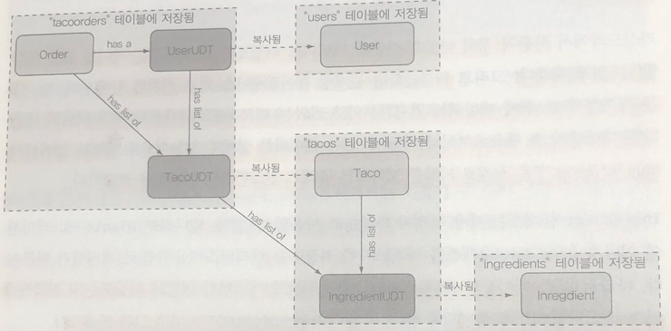

# 12장. 리액티브 데이터 퍼시스턴스

### 🚁배우는 내용

* 스프링 데이터의 리액티브 레포지토리
* 카산드라와 몽고DB의 리액티브 레포지토리 작성하기
* 리액티브가 아닌 레포지토리를 리액티브 사용에 맞추어 조정하기
* 카산드라를 사용한 데이터 모델링

<br>

## 서론

* 교통체중과 같이 본인의 의지와는 상관없이 멈춰야(블록킹) 할 수 있음
* 컨트롤러에서만 리액티브하지 않고 데이터를 가져오는 부분 모두 리액티브해야 진정한 리액티브한 애플리케이션이 됨

<br>

## 12.1 스프링 데이터의 리액티브 개념 이해하기

* 스프링 데이터 Kay 릴리즈 트레인부터 리액티브 리퍼지터리의 지원을 제공 시작  
  카산드라(Cassandra), 몽고DB(MongoDB), 카우치베이스(Couchbase), 레디스(Redis)에 데이터 저장 시 리액티브 프로그래밍 모델 지원
* 관계형 데이터베이스 혹은 JPA의 경우 현재까지도 리액티브 리퍼지터리가 지원되지 않음(필자는 가까운 미래에는 가능하지 않을까라는 생각)

### 스프링 데이터 리액티브 개요

* 리액티브 리퍼지터리는 도메인 타입 혹은 컬렉션 대신 Mono, Flux를 인자로 받거나 반환하는 메서드를 가짐을 의미

  ```java
  Flux<Ingredient> findByType(Ingredient.Type type);
  ```

* 스프링 데이터의 리액티브 리퍼지터리는 기본의 리퍼지토리와 거의 동일한 프로그래밍 모델을 공유(인자 혹은 반환 타입만 다름)

### 타입 간의 변환

* 리액티브 리퍼지토리를 지원하지 않는 데이터베이스의 경우에 완전하지 않지만 최대한 리액티브한 프로그래밍을 할 수 있음(상위 컴포넌트에서는 리액티브 사용)

* Mono의 `just()` 메서드나 Flux의 `fromIterable()`, `fromArray()`, `fromStream()` 과 같은 메서드를 사용하면 리퍼지터리의 리액티브가 아닌 블로킹 코드를 격리

  ```java
  List<Order> orders = repo.findByUser(someUser);
  Flux<Order> orderFlux = Flux.fromIterable(orders);
  
  Order order = repo.findById(id);
  Mono<Order> orderMono = Mono.just(order);
  ```

* 이 반대로 리액티브 타입에서 일반 타입으로의 변환은 Mono의 `block()` 메서드 혹은 Flux의 `toIterable()`과 같은 메서드를 사용해서 변환

  ```java
  Taco taco = tacoMono.block();
  tacoRepo.save(taco);
  
  Iterable<Taco> tacos = tacoFlux.toIterable();
  tocoRepo.saveAll(tacos);
  ```

  다음과 같은 작업들의 경우 블로킹이 되므로 가급적 적게하는 것이 좋음

* 이보다 더 좋은 방법은 Mono 혹은 Flux를 구독하면서 발행되는 요소 각각에 대해 원하는 오퍼레이션을 수행하는 것

  ```java
  tacoFlux.subscribe(taco -> {
     tacoRepo.save(taco); 
  });
  ```

  일괄 처리보다는 이 방법이 더 바람직

<br>

## 12.2 리액티브 카산드라 리퍼지토리 사용하기

* 카산드라의 경우 분산처리, 고성능, 상시 가용, 궁극적인 일관성을 갖는 NoSQL 데이터베이스
* 데이터를 테이블의 행(Row)으로 처리, 각 행은 일 : 다 관계의 많은 분산 노드에 걸쳐 분할 저장  
  즉, 한 노드가 모든 데이터를 갖고 있진 않지만, 특정 행은 여러 노드에 걸쳐서 저장되어질 수 있음  
  따라서 한 노드에서 문제가 생겨도 전체가 사용 불가능하게 변하지는 않음
* 스프링 데이터 카산드라는 자동화된 리퍼지터리 지원, 도메인 타입을 데이터베이스 구조에 매핑하는 애노테이션 제공

* 사용하기 앞서서 리퍼지터리가 운용되는 키 공간(Key space)의 이름을 구성해야 함  
  이는 자동으로 구성할 수 있지만, 수동이 더욱 쉬움

  ```cassandra
  create keyspace tacocloud
  ... with replication={'class':'SimpleStrategy', 'replication_factor':1}
  ... and durable_writes=true;
  ```

  * tacocloud라는 Key Space 생성

  * 복제 처리의 경우 SimpleStrategy 전략과 데이터의 수는 1로 복제본을 따로 만들지 않음

  * 복제본 배치 전략

    * SimpleStrategy

      > 기존 RackUnawareStrategy의 새로운 이름, 기본값으로 복제본을 시계방향으로 다음 노드에 배치  
      > 1개의 데이터 센터에 1개의 랙에 노드가 존재할 때 사용하는 것이 가장 베스트

    * LocalStrategy

      > RackAwareStrategy → OldNetworkTopology → LocalStrategy로 변경  
      > 2개의 데이터 센터와 3개의 복제본 설정에 최적화된 지원 따라서 NetworkTopology를 사용하는 것이 좋음

    * NetworkTopology

      > 0.7부터 지원된 전략, 데이터 센터와 랙 그리고 노드에 대한 배치 정보를 알고 있거나, 클러스터가 여러 데이터 센터에 걸쳐 배치되어 있을 때 사용자 설정에 의해 복제본이 어디에 위치해 있을지를 정할 수 있음

  * durable_writes 속성은 전원이 오프되도 영구적으로 유지할 것인가에 대한 설정

* 카산드라의 데이터 구조는 다음과 같음

  * Key/Value → Row → Column → Key Space → Cluster (데이터 모델)

  * Node → Rack → Data Center → Cluster / Ring (물리적 장치)

* 로컬로 실행하면 9092 포트를 리스닝

* Key의 종류

  * primary key

    > DB의 PK와 비슷, row를 구별하게 해주는 key  
    > 1개 이상의 partition key와 0개 이상의 clustering key로 구성

  * composite key

    > primary key에서 key의 종류가 2개 이상인 키

  * partition key

    > partition key를 해시 알고리즘에 의해 토큰을 만들고 이를 기준으로 클러스터 내부의 특정 노드에 위치  
    > 같은 partition key를 가진 row는 같은 디스크에 저장

  * clustering key

    > 하나의 파티션은 clustering key에 의해 정렬된 상태로 연속적으로 저장

### 도메인 타입 매핑

```java
@Data
@RestResource(rel = "tacos", path = "tacos")
@Table("tacos")	//@Entity 대신 @Table 사용
public class Taco {

  @PrimaryKeyColumn(type=PrimaryKeyType.PARTITIONED) // partition key 지정
  private UUID id = UUIDs.timeBased();
  
  @NotNull
  @Size(min = 5, message = "Name must be at least 5 characters long")
  private String name;
  
  @PrimaryKeyColumn(type=PrimaryKeyType.CLUSTERED,	// clustring key 지정 및 
                    ordering=Ordering.DESCENDING)	// 순서는 descending
  private Date createdAt = new Date();
  
  @Size(min=1, message="You must choose at least 1 ingredient")
  @Column("ingredients")
  private List<IngredientUDT> ingredients;
}
```

* 위 코드에서 눈여겨 볼만한 것은 `IngredientUDT` 라는 것으로 UDT는 사용자 정의 타입(User Defined Type, UDT)의 줄임말로 카산드라에서는 데이터의 컬렉션은 원시 타입 혹은 UDT로만 가능

* `IngredientUDT` 처럼 사용자 정의 타입은 관계형 데이터베이스에서 외부 키 처럼 동작

* 여기서 들 수 있는 의문은 `Ingredient` 타입을 그대로 사용할 수 없는 것인가?  
  이미 해당 클래스는 `@Table`로 만들어져야 하므로 새로운 클래스를 정의해야 함

* UDT 클래스는 `@UserDefinedType` 애노테이션을 사용하여 지정

  ```java
  @Data
  @RequiredArgsConstructor
  @NoArgsConstructor(access = AccessLevel.PRIVATE, force = true)
  @UserDefinedType("ingredient")
  public class IngredientUDT {
    private final String name;
    private final Ingredient.Type type;
  }
  ```

  그리고 원래 클래스와 속성이 다 같을 필요는 없음

* 아래 이미지는 taco-cloud의 데이터베이스 전체 모델

  

### 리퍼지터리 작성

* 기존 리퍼지터리를 작성하는것과 거의 다를 바가 없음, 차이점은 다른 종류의 리퍼지터리 인터페이스를 상속하는 것 뿐
* `ReactiveCassandraRepository` 혹은 `ReactiveCrudRepository` 선택  
  전자의 경우 새 객체가 저장될 때 사용하는 `insert()` 메서드의 몇가지 변형 버전이 제공, 많은 데이터를 추가시 좋음  
  후자의 경우는 모든 리액티브 리퍼지터리에서 사용이 가능하므로 종속적이지 않은 곳에서 사용 가능

<br>

## 12.3 리액티브 몽고DB 리퍼지터리 작성하기

* 몽고DB는 잘 알려진 NoSQL 데이터베이스 중 하나
* 문서형 데이터베이스로 BSON(Binary JSON) 형식으로 데이터를 저장, 다른 데이터베이스와 비슷한 방법으로 문서를 쿼리할 수 있음
* Scale-Out이 자체적으로 지원
* Join과 Transaction은 존재하지 않음
* RDB에서 제공되는 index를 지원하며 지원하는 목록은 다음과 같음
  * Single Field Indexes
  * Compound Indexes
  * Multikey Indexes
  * Geospatial Indexes and Queries
  * Text Indexes
  * Hashed Indexes
* 데이터 구조는 다음과 같음
  * Key/Value → Document → Collection → Database
* 로컬에서는 27017 포트를 리스닝
* 테스트와 개발에 편리하도록 Flapdoodle 내장 몽고 DB를 사용할 수 있음(인메모리 기반으로 H2와 비슷)

### 도메인 타입 매핑

```java
@Data
@RestResource(rel = "tacos", path = "tacos")
@Document	// 도메인 타입을 몽고DB에 저장되는 문서로 선언, collection 속성을 통해 이름 변경 가능
public class Taco {

  // Long, String 포함 Serializable 타입 속성 전부 다 가능
  // String 타입 사용시 저장될 때 자동으로 ID 값 지정(null일 경우)
  @Id	// 지정된 속성을 문서 ID로 지정
  private String id;
  
  @NotNull
  @Size(min = 5, message = "Name must be at least 5 characters long")
  private String name;
  
  private Date createdAt = new Date();
  
  @Field("ingredients")	// 몽고DB의 문서에 속성을 저장하기 위해 필드 이름을 지정
  @Size(min=1, message="You must choose at least 1 ingredient")
  private List<Ingredient> ingredients;
}
```

### 리퍼지터리 작성

* 카산드라와 거의 동일

* `ReactiveMongoRepository` 혹은 `ReactiveCrudRepository` 를 선택 가능  
  전자의 경우 문서 저장에 최적화된 소수의 특별한 `insert()` 메서드를 제공하므로 저장이 많을 시에 적합  
  하지만 몽고DB에 특화되어 있으므로 다른 데이터베이스에서 사용시에는 후자가 더 적절

* 기본 리퍼지터리에서 메서드를 만들어 사용하는 것처럼 비슷하게 커스텀 쿼리 메서드를 만들어서 사용 가능

  ```java
  Flux<Taco> findByOrderByCreatedAtDesc();
  ```

  위 예제는 최근 생성된 순서대로 타코를 가져오는 커스텀 쿼리 메서드