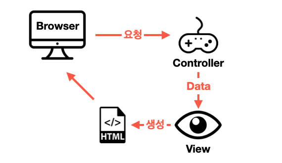

# 2장. 웹 애플리케이션 개발하기

> 해당 글은 크레이그 월즈님이 쓰고, 심재철님이 옮긴 Spring in Action 제 5판을 정리한 내용임을 미리 알립니다.

### 📖 배우는 내용

* 모델 데이터 브라우저에서 보여주기
* 폼 입력 처리하고 검사하기
* 뷰 템플릿 라이브러리 선택하기

## 2.1 정보 보여주기

1장에서 컨트롤러의 역할을 대략적으로 알아보았다. 다시한번 상기 시켜보자면, 스프링 웹 애플리케이션에서 컨트롤러는 요청을 받아 데이터를 가져오고 이를 처리하여 뷰에게 데이터를 넘기게 된다. 이후 뷰에서는 전달 받은 데이터로 화면을 구성한다. 이 흐름을 보기 쉽게 나타내면 다음과 같은 그림으로 나타낼 수 있다.

<p align="center"></p>

### 도메인 설정

책에서 도메인을 **해당 애플리케이션의 이해에 필요한 개념을 다루는 영역**이라고 설명하고 있다.  또한 주석으로 자세한 내용은 **도메인 주도 설계**를 참고 하라고 적혀있다. 간단하게 DDD(Domain-Driven Design)에 대해 알아보고 가자.

DDD에서의 도메인은 **사용자가 사용하는 모든 것**을 지칭한다. 예를들어 책에서 다루고 있는 타코, 타코를 만들기 위한 식재료, 타코를 주문하는 사람의 정보 등 사용자가 해당 애플리케이션에 들어와 사용하는 것들을 도메인이라고 한다.([참고 - 도메인 주도 설계(Domain-Driven Design) in Real Project — 도메인](https://medium.com/react-native-seoul/%EB%8F%84%EB%A9%94%EC%9D%B8-%EC%A3%BC%EB%8F%84-%EC%84%A4%EA%B3%84-domain-driven-design-in-real-project-1-%EB%8F%84%EB%A9%94%EC%9D%B8-83a5e31c5e45))

그렇다면 간단하게 타코에 들어가는 식자재를 정의해 보자.

````java
// 식자재
@Data
public class Ingredient {
    private final String id;
    private final String name;
    private final Type type;

    public static enum Type {
        WRAP, PROTEIN, VEGGIES, CHEESE, SAUCE
    }
}
````

식자재 마다의 특별한 id, 이름, 타입이 존재할 것이다. 이외에도 여러가지 추가할 것들도 있겠지만, 중요한 것은 `@Data` 애노테이션이다. 해당 애노테이션은 Lombok이란 라이브러리에서 제공하는 것으로, 1장에서 의존성에 추가했었다. 이러한 롬복은 저 하나의 애노테이션으로 게터, 세터, toString 메소드등 필요한 메서드를 자동으로 추가해준다.

```java
// Ingredient.class
public class Ingredient {
    private final String id;
    private final String name;
    private final Ingredient.Type type;

    public Ingredient(String id, String name, Ingredient.Type type) {
        this.id = id;
        this.name = name;
        this.type = type;
    }

    public String getId() {
        return this.id;
    }

    public String getName() {
        return this.name;
    }

    public Ingredient.Type getType() {
        return this.type;
    }

    public boolean equals(Object o) {
        ...
    }

    protected boolean canEqual(Object other) {
        return other instanceof Ingredient;
    }

    public int hashCode() {
        ...
    }

    public String toString() {
        ...
    }

    public static enum Type {
        WRAP,
        PROTEIN,
        VEGGIES,
        CHEESE,
        SAUCE;

        private Type() {
        }
    }
}

```

컴파일 된 바이트 코드를 IDE를 통해 코드로 살펴보면 다음과 같이 실제로 정의하지 않은 메서드들이 나타나게 된다. 참고로 여기서 세터가 만들어지지 않은 것은 변수 선언에 final 키워드를 사용했기 때문이다. 이렇게 롬복은 런타임 시에 원하는 메서드를 자동으로 생성해주기 때문에 가독성과 생산성을 높힐 수 있다.

하지만, 돌 다리도 두들겨 보고 넘어가란 말이 있듯 어느 라이브러리나 잘 알아보고 사용해야 된다. 롬복 또한 마찬가지로 잘 알아보고 사용해야 한다. 대표적인 예로 위에서 사용했던 `@Data` 애노테이션 혹은 `@ToString` 애노테이션으로 toString 메서드를 생성했을 때, 순환 참조 문제로 인해 에러가 발생할 수 있다. 그래서 `@Data` 같이 한번에 여러가지를 뚝딱 만들어주는 애노테이션은 지양한다고 한다. 이외에도 여러가지 생각할 점들이 있기 때문에 참고하여 잘 사용해보자.([참고 - 실무에서 Lombok 사용법](https://www.popit.kr/%EC%8B%A4%EB%AC%B4%EC%97%90%EC%84%9C-lombok-%EC%82%AC%EC%9A%A9%EB%B2%95/))

### 요청 처리

어떠한 컨트롤러에 URL을 맵핑하는 `@RequestMapping` 애노테이션을 잘 알고 있을 것이다. 이는 스프링 4.3버전 이전에서 사용되는 것으로 GET 혹은 POST 요청을 처리하기 위해서는 method 속성을 설정해 주어야 한다.

```java
@RequestMapping(value="/" mehtod=RequestMehod.GET)
```

스프링 4.3부터는 각 요청 메소드에 특화된 애노테이션들이 등장하게 되었다.

| 애노테이션      | 설명                   |
| --------------- | ---------------------- |
| @RequestMapping | 다목적으로 요청을 처리 |
| @GetMapping     | HTTP GET 요청 처리     |
| @PostMapping    | HTTP POST요청 처리     |
| @PutMapping     | HTTP PUT 요청 처리     |
| @DeleteMapping  | HTTP DELETE 요청 처리  |
| @PatchMapping   | HTTP PATCH 요청 처리   |

<br>

## 2.2 폼 제출 처리하기

폼 태그의 경우, method 속성이 POST로 설정해도 action 속성이 선언되지 않았다면, GET 요청과 같은 경로로 서버에 POST 요청을 보내게 된다.

```html
<!-- localhost:8080/example -->
<form method="POST">
  <!-- /example 으로 POST 요청 -->
</form>

<form method="GET">
  <!-- /example 으로 GET 요청 -->
</form>
```

### 리다이렉션

앞서서 컨트롤러들을 만들었을 때 리턴 값으로 뷰의 이름을 지정했다. 이때 아래와 같이 `"redirection:"`을 사용하여 변경된 경로로 재접속할 수 있도록 유도 할 수 있다.

```java
@PostMapping
public String redirectMethod() {
  return "redirection:/dest";
}
```

<br>

## 2.3 폼 입력 유효성 검사하기

만약 사용자가 폼에 정보를 입력하다 조건에 맞지 않는 내용을 작성하거나, 아에 입력하지 않은 부분은 어떻게 처리해야 될까? 프론트 단에서 먼저 유효성 검사를 하여 전송을 막을 수도 있고, 서버 단에서 저장이 되지 않도록 할 수도 있다. 스프링을 사용하고 있는 우리는 서버 단에서 이를 어떻게 검사할지 알아보자.

스프링에서는 자바의 빈 유효성 검사 API를 지원하기에 if/else 블록들을 사용하지 않고도 쉽게 유효성 검사를 할 수 있다. 이를 사용하기 위해서는 `spring-boot-starter-validation` 의존성을 추가해주도록 한다(구현체로 Hibernate Validator 사용). 책에서는 해당 의존성을 추가하지 않는다. 이는 2.2.X 버전에서는 `spring-boot-starter-validation` 가 존재하였지만, 2.3.X 부터는 포함되어 있지 않기 때문이다.

| 애노테이션                   | 기능                                                 |
| ---------------------------- | ---------------------------------------------------- |
| @AssertFalse                 | flase 값 체크                                        |
| @AssertTrue                  | true 값 체크                                         |
| @DecimalMax(value=)          | 지정된 값 이하의 실수만                              |
| @DecimalMin(value=)          | 지정된 값 이상의 실수만                              |
| @Digits(integer=, fraction=) | 지정된 정수와 소수 자리수보다 작을 경우              |
| @Future                      | 대상 날짜가 현재보다 미래일 경우만                   |
| @Past                        | 대상 날짜가 현재보다 과거일 경우만                   |
| @Max(value=)                 | 지정된 값보다 작을 경우                              |
| @Min(value=)                 | 지정된 값보다 클 경우                                |
| @NotNull                     | null 값이 아닐 경우                                  |
| @Null                        | null일 경우                                          |
| @Pattern(regex=, flag=)      | 해당 정규식을 만족하는 경우                          |
| @Size(min=, max=)            | 문자열 또는 배열이 min과 max 사이일 경우             |
| @Valid                       | 대상 객체의 확인 조건을 만족할 경우 통과             |
| @NotBlank                    | 문자열이나 배열이 null이 아니고 길이가 0이 아닐 경우 |
| @Email                       | 이메일 형식 체크                                     |
| @CreditCardNumber            | Luhn(룬) 알고리즘에 의한 신용카드 번호 체크          |

<br>

## 2.4 뷰 컨트롤러로 작업하기

```java
@Controller
@RequestMapping("/simple")
public class SimpleController {
  @GetMapping
  public String simple() {
    return "simple";
  }
}
```

위와 같이 모델 데이터 혹은 사용자의 입력이 필요없는 간단한 컨트롤러의 경우, 아래의 코드와 같이 **뷰 컨트롤러**(뷰에 요청 전달만 하는 역할)로 정의가 가능하다. 

```java
@Configuration
public class webCofig implements WebMvcConfigurer {
  @Override
  public void addViewController(ViewControllerRegistry registry) {
    registry.addViewController("/simple").setViewName("simple");
  }
}
```

`WebMvcConfigurer` 인터페이스를 살펴보면 여러가지 메서드들이 default로 선언되어있는 것을 볼 수 있다. 따라서 원하는 설정을 하기 위해 해당 메서드만 오버라이드하여 사용하면 된다.

<br>

## 2.5 뷰 템플릿 라이브러리 선택하기

스프링 부트에서 자동-구성 지원되는 템플릿은 다음과 같다.

| 템플릿                 | 스타터 의존성                        |
| ---------------------- | ------------------------------------ |
| FreeMarker             | spring-boot-starter-freemarker       |
| Groovy                 | spring-boot-starter-groovy-templates |
| Java Server Pages(JSP) | 없음                                 |
| Mustache               | spring-boot-starter-mustache         |
| Thymeleaf              | spring-boot-starter-thymeleaf        |

템플릿중에서 JSP는 의존성을 지정하지 않아도 된다. 그 이유는 **서블릿 컨테이너에서 JSP 명세를 구현하고 있기 때문에 따로 지정할 필요가 없는 것**이다. 하지만 JSP를 사용하려면 고려할 사항이 생긴다. 서블릿 컨테이너는 기본적으로 /WEB-INF 하위에서 JSP 코드를 찾게 되는데, JAR 파일로 생성했을 경우 이가 없다. 따라서 WAR 파일로 패키징하는 프로젝트에서 JSP를 사용하거나, 다른 템플릿 라이브러리를 사용하는것이 좋다.