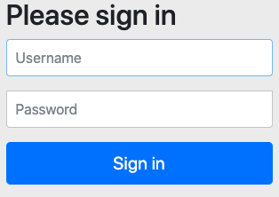
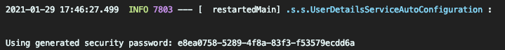

# 4장. 스프링 시큐리티

### 👩🏼‍💻 배우는 내용

* 스프링 시큐리티 자동-구성하기
* 커스텀 사용자 스토리지 정의하기
* 커스텀 로그인 페이지 만들기
* CSRF 공격으로부터 방어하기
* 사용자 파악하기

## 4.1 스프링 시큐리티 활성화하기

역시 스프링에 기능을 사용하기 위해서는 제일 먼저 할 것은 의존성 추가일 것이다. 시큐리티 또한 스타터를 지원해주고 있으니, 스프링 시큐리티 스타터와 테스트를 추가해보자.

```java
implementation 'org.springframework.boot:spring-boot-starter-security'
testImplementation 'org.springframework.security:spring-security-test'
```

추가한 뒤 그레이들에서 리프레시 버튼을 누르고(Intellij IDEA IDE 기준) 애플리케이션을 실행시켜 보고 기본 루트로 접속해 보자.

<p align="center"></p>

의존성만 추가해도 스프링 시큐리티에서 제공하는 기본 HTTP 인증 대화 상자가 나타난다. 이제 접속을 할 차례이다. Username 필드에는 user를 입력하고 Password의 경우 애플리케이션을 실행할 때 무작위로 생성되어 로그에 찍히게 된다.

<p align="center"></p>

저기에 찍혀있는 Password를 복사 붙여넣기 하면 우리의 애플리케이션에 접근이 가능해진다.

<br>

## 4.2 스프링 시큐리티 구성하기

기존에는 XML을 사용해서 시큐리티를 구성하는 방법이 있었으나 최근 자바 기반의 구성을 지원하여 쉽게 설정할 수 있다.

```java
@Configuration
@EnableWebSecurity
public class SecurityConfig extends WebSecurityConfigurerAdapter {
	@Override
    protected void configure(HttpSecurity http) throws Exception {
        http.authorizeRequests()
                .antMatchers("/design","/orders").hasRole("USER")
                .antMatchers("/", "/**").permitAll()
                .and()
                    .httpBasic();
    }

    @Override
    public void configure(AuthenticationManagerBuilder auth) throws Exception {
        auth.inMemoryAuthentication()
                .withUser("user1")
                .password("{noop}password1")
                .authorities("ROLE_USER")
                .and()
                .withUser("user2")
                .password("{noop}password2")	// 암호화 필수, 하지 않으면 403, 500 에러
                .authorities("ROLE_USER");	// .roles("USER") 사용 가능
    }
}
```

위 코드를 살펴보면 `WebSecurityConfigurerAdapter`를 상속하고 두개의 `configure()` 메서드를 오버라이드 하고 있다. `configure(HttpSecurity)` 의 경우, HTTP 보안을 구성하는 메서드로 인증된 유저만이 `/design`과 `/orders`로 접근이 가능하도록 설정하였다. `configure(AuthenticationManagerBuilder)`의 경우 사용자 인증 정보를 구성하는 메서드이다. 현재 인메모리 방식으로 user1과 user2를 만들어 놓았다.

여담으로 이를 테스트하는데 있어 시크릿 창 모드로 하는 것이 좋다. 필자는 브라우저에 정보가 남아있어 계속해서 403 에러를 뱉어냈었다.

위 예제처럼 사용자를 코드를 통해 스토어 구성을 할 수 있는데 스프링 시큐리티에서는 여러가지 사용자 스토어 구성 방법을 제공한다.

* 인메모리 사용자 스토어
* JDBC 기반 사용자 스토어
* LDAP 기반 사용자 스토어
* 커스텀 사용자 명세 서비스

이들에 대하 간략하게 알아보고 넘어가자.

### Inmemory 기반 사용자 넣기

말 그대로 메모리에 사용자 정보를 저장하는 것으로 메모리 특성상 휘발성임을 유의하자. 위에서 본 코드로 사용자를 정의할 수 있다. `withUser()` 메서드를 통해 사용자 구성을 시작하여 비밀번호, 권한을 지정할 수 있다. 스프링 5부터는 반드시 비밀번호를 암호화해야하므로 이를 하지 않으면 403 혹은 500 에러가 발생한다. 인메모리 기반은 **데이터베이스를 설정하지 않아도 편하게 사용할 수 있다는 장점**이 있지만, **사용자를 추가, 삭제, 변경하려면 코드를 수정하고 빌드와 배포를 다시 해야된다는 단점**이 있다.

### JDBC 기반의 사용자 스토어

```java
@Autowired
DataSource dataSource;

@Override
protected void configure(AuthenticationmanagerBuilder auth) throws Exception {
  auth.jdbcAuthentication().dataSource(dataSource);
}
```

JDBC의 경우 사용자 정보를 관계형 데이터베이스로 유지, 관리하는 경우가 많기 때문에 많이 사용한다. 코드는 굉장히 간단하게 구현할 수 있다. 이는 **사용자 정보를 저장하는 테이블과 열이 정해져 있고 쿼리가 미리 생성되어 있기 때문**이다. 즉, 스프링 시큐리티 내부에서 미리 만들어 놓은 쿼리를 실행하는 것이다. 따라서 우리는 미리 만들어진 동일한 테이블에 유저 정보를 넣기만 하면 된다. 

```java
insert into users (username, password) values ('user1', 'password1');
insert into users (username, password) values ('user2', 'password2');

insert into authorities (username, authority) values ('user1', 'ROLE_USER');
insert into authorities (username, authority) values ('user2', 'ROLE_USER');
```

### LDAP 기반 사용자 스토어

LDAP는 **Lightweight Directory Access Protocol**의 약자로 네트워크 상에서 정보를 찾아볼 수 있도록 만든 소프트웨어 프로토콜이다. 네트워크상의 디렉토리 서비스(이름을 기준으로 대상을 찾아 조회하거나 편집할 수 있는 서비스)의 표준인 DAP를 기반으로 경량화(Lightweight)하여 더 적은 비용으로 사용할 수 있도록 설계했다.([참고](https://yongho1037.tistory.com/796))

LDAP의 기본 인증 전략은 사용자가 직접 LDAP 서버에서 인증을 받는 것이나, 비밀번호를 비교하는 방법도 존재한다. 그렇다면 이 LDAP 서버는 어디 있는것일까? 외부에 사용할 수 있는 LDAP가 없다면, 스프링 시큐리티에서 제공하는 내장 LDAP 서버를 사용할 수 있다. 이 때는 다음과 같은 의존성을 추가해주어야 한다.

```java
implementation 'org.springframework.boot:spring-boot-starter-data-ldap'
```

기본적으로 스프링 시큐리티의 LDAP 인증에서는 로컬 호스트의 33389 포트로 LDAP 서버가 접속 된다고 간주한다. 만약, 다른 컴퓨터에 실행 중이라면 `contextSource()` 메서드를 통해 서버 위치를 구성할 수 있다.

### 암호화된 비밀번호 사용

앞서서 스프링 5부터는 비밀번호의 암호화가 필수적이라고 언급했다. 따라서 설정 파일에서 `passwordEncoder()` 메서드를 이용하여 인코더를 지정할 수 있다. 그리고 스프링 시큐리티에서는 암호화 알고리즘을 구현한 모듈이 존재하는데 다음과 같다.

* BCryptPsswordEncoder → bcrypt 해싱 암호화
* NoOpPasswordEncoder → 암호화 X
* Pbkdf2PasswordEncoder → PBKDF2 암호화
* SCryptPasswordEncoder → scrypt 해싱 암호화
* StandardPasswordEncoder → SHA-256 해싱 암호화

이렇게 암호화 된 비밀번호는 그대로 데이터베이스에 저장된다. 그리고 비교할 때도 해독하지 않고 그대로 비교한다. 즉, 사용자가 입력한 비밀번호는 암호화 되어 서버로 넘겨지게 되고 서버에서는 그 자체를 DB에 저장된 비밀번호와 비교하여 판별한다.

<br>

## 4.3 웹 요청 보안 처리하기

보안 규칙을 구성하려면 `configure(HttpSecurity)` 메서드를 오버라이딩 해야한다. 이 HttpSecurity를 사용하여 구성할 수 있는 것은 다음과 같다.

* HTTP 요청 처리를 허용하기 전에 충족되어야 할 특정 보안 조건 구성
* 커스텀 로그인 페이지 구성
* 로그아웃
* CSRF 공격으로부터 보호하도록 구성

`authorizeRequests()`는 ExpressionInterceptUrlRegistry 객체를 반환하는데 이는 URL 경로와 패턴 및 해당 경로의 보안 요구사항을 구성할 수 있다.

```java
@Override
protected void configure(HttpSecurity http) throws Exception {
        http.authorizeRequests()
             .antMatchers("/design","/orders").hasRole("USER")
             .antMatchers("/", "/**").permitAll()
}
```

다음은 우리의 애플리케이션의 경로에 대해 보안 규칙을 구성해본 것이다. `/design` 과 `/orders` 요청은 `ROLE_USER` 권한을 가진 사용자에게만 허용하고 나머지 요청은 모든 사용자에게 허용된다.

이러한 규칙을 정할 때는 순서가 굉장히 중요하다. 만약 저 위에 둘의 순서를 바꾸면 어떻게 될까? 모든 요청들이 허용되어 `/design` 과 `/orders` 도 모두 접근이 가능해진다.

위 `hasRole()`, `permitAll()` 메서드 말고도 여러가지 메서드가 존재하는데 다음과 같다.

| 메서드                     | 역할                                                         |
| -------------------------- | ------------------------------------------------------------ |
| acess(String)              | 인자로 전달된 SpEL 표현식이 true면 접근 허용                 |
| anonymous()                | 익명의 사용자에게 접근을 허용                                |
| authenticated()            | 익명이 아닌 사용자로 인증된 경우 접근을 허용                 |
| denyAll()                  | 무조건 접근을 거부                                           |
| fullyAuthenticated()       | 익명이 아니거나 또는 remember-me가 아닌사용자로 인증되면 접근 허용 |
| hasAnyAuthority(String...) | 지정된 권한 중 어떤 것이라도 사용자가 갖고 있으면 접근 허용  |
| hasAnyRole(String...)      | 지정된 역할 중 어느 하나라도 사용자가 갖고 있으면 접근 허용  |
| hasAuthority(String)       | 지정된 권한을 사용자가 가지고 있으면 접근 허용               |
| hasIpAddress(String)       | 지정된 IP 주소로부터 요청이 오면 접근 허용                   |
| hasRole(String)            | 지정된 역할을 사용자가 갖고 있으면 접근 허용                 |
| not()                      | 다른 접근 메서드들의 효력을 무효화                           |
| permitAll()                | 무조건 접근을 허용                                           |
| rememberMe()               | remember-me를 통해 인증된 사용자의 접근을 허용               |

### CSRF 공격 방어

CSRF(Cross-Site Request Forgery)는 많이 알려진 보안 공격이다. 만약 사용자가 어떠한 웹 사이트에 로그인이 되어있고, 그 사용자가 악의적인 페이지에 접근하면 자동으로 로그인 된 웹 사이트에 요청을 보내는 형식의 공격이다. 즉, 악의적인 페이지에는 사용자 모르게 숨겨진 폼이 존재하고 이를 접속한 사용자의 정보를 통해 몰래 폼을 제출하는 것이다.

따라서 이를 막기 위해 폼 안의 숨겨진 필드에 CSRF 토큰을 생성하여 넣어 같이 제출되게 하는 것이다. 이를 서버에서 받아 원래 토큰과 비교하게 되고 사용자를 판별하게 된다.

스프링 시큐리티에서는 이에 대해 내장된 CSRF 방어 기능이 존재한다. 따라서 다음과 같은 숨겨진 필드를 자동으로 생성해준다.

<p align="center"></p>

만약 이가 없이 사용하고 싶다면 다음과 같은 코드를 작성하면 된다.

```java
http.csrf().disable();
```

