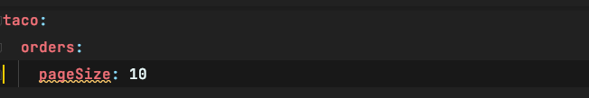
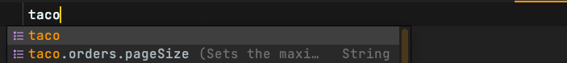

# 5장. 구성 속성 사용하기

### 🧑🏻‍🏫 배우는 내용

* 자동-구성되는 빈 조정
* 구성 속성을 애플리케이션 컴포넌트에 적용
* 스프링 프로파일 사용

## 5.1 자동-구성 세부 조정하기

앞서, 스프링에서는 다음 두 가지 형태의 서로 다르면서도 관련이 있는 구성의 존재를 아는 것이 중요하다.

* 빈 연결

  > 빈으로 생성되는 컴포넌트 및 상호 간에 주입되는 방법을 선언하는 구성

* 속성 주입

  > 빈의 속성 값을 설정하는 구성

자바 기반 구성에서 `@Bean` 애노테이션으로 지정된 메서드는 사용하는 **빈의 인스턴스를 생성하고 속성 값도 설정**한다.

```java
@Bean
public DataSource dataSource() {
  return new EmbeddedDataBbaseBuilder()
    .setType(EmbeddedDataBbaseType.H2)
    .addScript("schema.sql")
    .addScripts("user_data.sql", "ingredient_data.sql")
    .build();
}
```

위 코드는 내장 데이터베이스 중에 H2를 구성하는 클래스로 속성을 정의하고 H2가 준비되면 각 스크립트의 SQL이 실행되어 데이터베이스에 적용된다. 스프링 부트가 아니라면, 해당 메서드는 DataSource 빈을 구성할 수 있는 방법이 된다. 하지만 **스프링 부트를 사용한다면 자동-구성이 DataSource 빈을 구성**해주므로 위 메서드는 필요없다.

스프링 부트의 DataSource 빈 자동-구성은 다음과 같이 이루어진다.

1. H2 의존성 라이브러리를 런타임 시에 classpath에서 확인
2. 사용할 수 있다면 해당 빈을 찾아 스프링 애플리케이션 컨텍스트에 생성
3. SQL 스크립트인 schema.sql(스키마 생성용), data.sql(초기 데이터 추가용)를 찾아 실행하고 데이터베이서에 적용

하지만, 위에서 사용한 메서드처럼 더 많은 SQL 스크립트를 실행하고 싶다면 어떻게 할까? 바로 **구성 속성을 사용**해야 한다.

### 스프링 환경 추상화

**스프링 환경 추상화는 구성 가능한 모든 속성을 한 곳에서 관리하는 개념**이다. 즉, 모든 속성들을 하나로 추상화하여 스프링에서 이를 필요로하는 빈에게 사용할 수 있도록 넘겨준다.

간단한 예시로 애플리케이션의 기본 포트 번호는 8080으로 다음과 같은 설정을 application.yml 파일에 정의하면 8081 포트로 변경된다.

```yaml
# application.yml
server:
  port : 8081
```

이 방법 외에도 애플리케이션을 시작할 때 명령행 인자로 넘길 수도 있고, 운영체제 환경변수에 설정할 수도 있다.

이렇게 스프링 빈이 동작하는 방법을 변경하고 조정하기 위해 사용할 수 있는 구성 속성은 몇백개가 존재한다.

<br>

## 5.2 우리의 구성 속성 생성하기

구성 속성의 올바른 주입을 지원하기 위해 `@ConfigurationProperties` 애노테이션을 제공한다. 이 애노테이션이 지정되면 해당 빈의 속성들이 스프링 환경의 속성으로부터 주입이 될 수 있다.

### 구성 속성 홀더 정의

해당 애노테이션의 경우 어디에든 사용이 가능하기에 클래스 혹은 메서드에도 지정이 가능하다. 그렇기 때문에 하나의 클래스에 따로 지정하여 사용하는 경우가 많다. 이렇게 되면 설정 값과 로직들이 따로 분리가 되어 가독성도 좋아지기 때문이다. 

```java
@Component
@ConfigurationProperties(prefix="taco.orders")
@Data
public class OrderProps {
  private int pageSize = 20;
}
```

다음은 한 페이지에 볼 수 있는 주문 개수에 대해 설정해 놓은 것이다. 이제 이를 사용할 컨트롤러나 빈에 주입하여 사용하면 된다. ConfigurationProperties의 속성으로 prefix를 사용한 것을 볼 수 있다. 이는 구성 속성의 접두어로, pageSize 구성 속성 값을 설정할 때는 taco.orders.pageSize라는 이름을 사용해야 한다.

```yaml
taco:
  orders:
    pageSize: 10
```

다음과 같이 속성을 설정했다면 한 페이지에 최대 주문 개수는 10개가 된다.

> 이상한 점!
>
> `@ConfigurationProperties` 를 사용하면 Intellij IDEA IDE에서 다음과 같은 빨간 경고 표시가 뜬다.
>
> 
>
> 해당 경고창 오른 Open Dacumentation...을 눌러 보면 `spring-boot-configuration-processor` 을 추가하라는 설명이 나온다.  
>
> 설명대로 추가했으나 계속해서 사라지지 않아서 찾아보며 이것저것 해본 결과 갑자기 사라졌다...  
> 이후에 추가한 라이브러리도 없애봤지만 계속해서 나타나지 않는다...  

### 구성 속성 메타데이터 선언하기



우리가 선언한 구성 속성에 노란색으로 밑줄이 존재하고 이를 클릭해서 보면 구성 키를 선언하라고 되어있다 이는 메타데이터가 없으므로 이를 클릭해서 생성해보면 자동으로 만들어 준다.

> 책과 다른 점!
>
> 책에서는 STS IDE(이클립스 기반)에서 사용하여 메타데이터를 생성하면 additional-spring-configuration-metadata.json에 정의가 되고 바로 적용이 된다고 적혀있다. 하지만 Intellij IDE에서는 이가 사라지지 않는다.
>
> 찾아본 결과 spring-configuration-metadata.json에 정의를 하면 사라지며, IDE에서 인식하는 것을 볼 수 있다.
>
> 

<br>

## 5.3 프로파일 사용해서 구성하기

애플리케이션이 서로 다른 런타임 환경에서의 구성 명세는 다르기 마련이다. 즉, 프로덕션(실제 운영중인 서버) 환경과 개발 환경은 다르다. 이때 사용할 수 있는 방법이 바로 **프로파일**이다. **프로파일은 런타임 시에 활성화 되는 프로파일에 따라 서로 다른 빈, 구성 클래스 구성 속성들이 적용 또는 무시되도록 하는 것**이다.

이러한 프로파일에 정의하는 방법중 하나는 각 환경에 대한 속성만 존재하는 파일을 만드는 것이다. 이때 파일 이름은 application-{프로파일 이름}.yml 규칙을 따른다.

또 다른 방법으로는 **YAML 파일에서 사용할 수 있은 것으로 하나의 파일에 여러 프로파일이 존재**할 수 있다. 그렇다면 어떻게 이를 구분하는 것일까? 바로 **하이픈 3개(---)**를 이용하여 구분을 지을 수 있다.

```yaml
logging:
  level:
    tacos: DEBUG

---

spring:
  profiles: prod
  datasource:
    url: jdbc:mysql://localhost/tacocloud
    username: user
    password: pass

logging:
  level:
    tacos: WARN
```

하이픈 윗부분은 spring.profiles를 설정하지 않았기 때문에 모든 프로파일에 공통적으로 적용된다. 밑 부분은 prod로 설정을 했기 때문에 prod 환경일 때만 설정된다.

### 프로파일 활성화

프로파일 특정 속성들의 경우 해당 프로파일이 활성화가 되야 유효하다. 이는 다음과 같이 설정할 수 있다.

```yaml
# application.yml
spring:
  profiles:
    active:
    - prod
```

하지만, 다음과 같이 `application.yml`에 설정을 해버리면 해당 프로파일이 기본 프로파일이 되기 때문에 **환경 변수를 사용하여 활성화를 하는 것을 권장**한다. 이 외에도 JAR 파일을 실행할 때 명령행 인자로 활성화를 설정할 수 있다.

### 프로파일을 사용해서 조건별로 빈 생성

전체적으로 프로파일을 사용해야 할 때가 있지만, 빈 별로 적절한 프로파일을 나누어 제공하는것이 유용할 때가 있다. 빈 별로 제공하기 위해서는 `@Profile` 애노테이션을 사용하여 나타낼 수 있다. 

```java
@Bean
@Profile("dev")
public CommandLineRunner dataLoader() {
  	....
}
```

다음과 같이 `CommandLineRunner`를 사용하여 초기 데이터를 넣는 빈이 존재할 때, 해당 빈은 프로덕션 환경에서는 필요가 없다. 따라서 위와 같이 개발 환경에서만 사용할 수 있도록 설정할 수 있다.

하나의 프로파일만이 아닌 여러개의 프로파일이 활성화 될 때 사용할 수 있도록 설정할 수 있다.

```java
@Profile({"dev", "qa"})
```

위와 같이 설정 했을 때는 dev 프로파일 혹은 qa 프로파일 중 하나만 활성화 되었을 때로 설정하는 것이다. 이 외에도 아래와 같이 해당 프로파일이 활성화 되지 않았을 때로 설정할 수 도 있다.

```java
@Profile("!prod")
```

