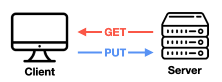
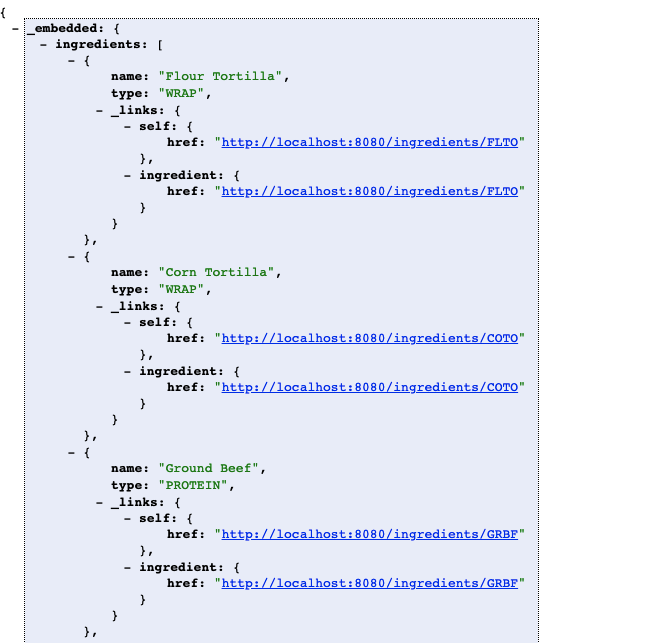

# 6장. REST 서비스 생성하기

### 👩🏾‍🏫 배우는 내용

* 스프링 MVC에서 REST 엔드포인트 정의하기
* 하이퍼링크 REST 리소스 활성화하기
* 레포지토리 기반의 REST 엔드포인트 자동화

## 6.1 REST 컨트롤러 작성하기

SPA(Single-Page Application)이 등장하면서 서버에서는 여러개의 뷰를 반환해주는 것이 아닌 데이터만 제공하며, 이를 클라이언트 단에서 처리하게 된다. **SPA에서는 프리젠테이션 계층(뷰)이 아래 계층과는 거의 독립적**이므로 다른 애플리케이션(모바일)에서도 사용이 가능하다. 하지만, 항상 SPA가 정답은 아니며 단순하게 정보만 보여주는 페이지일 경우 MPA(Multi-Page Application)이 좋을 수 있다.

앵귤러 혹은 리액트와 같은 프론트의 프레임워크 혹은 라이브러리에서는 SPA를 구축한다면, 데이터를 저장하거나 가져오기 위해서 REST API를 생성해야 한다. 2장에서 보았던 @GetMapping 혹은 @PostMapping 등 여러가지 HTTP 요청-처리 애노테이션들은 REST API에서도 사용된다.

### @RestController

@RestController 애노테이션은 @Controller와 @Service와 같은 스테레오 타입의 애노테이션으로 컴포넌트 스캔에 의해 발견되어질 수 있다. 또, **컨트롤러의 모든 HTTP 요청 처리 메서드의 반환값이 Body에 담긴다는 것**을 스프링에 알려준다. **즉, 반환값이 뷰로 이어지는 것이 아닌 HTTP 응답으로 브라우저에 전달되어 나타난다.**

꼭 이 애노테이션을 사용해야하는 것은 아니다. 기존 @Controller 애노테이션을 사용해서도 똑같은 기능을 만들 수 있는데 이때는 @ResonseBody 애노테이션을 사용해야 한다. @RestController의 코드를 살펴보면 @Controller와 @ResonseBody 애노테이션이 내부에서 지정되어 있는 것을 볼 수 있다.

```java
@Target(ElementType.TYPE)
@Retention(RetentionPolicy.RUNTIME)
@Documented
@Controller
@ResponseBody
public @interface RestController {

	/**
	 * The value may indicate a suggestion for a logical component name,
	 * to be turned into a Spring bean in case of an autodetected component.
	 * @return the suggested component name, if any (or empty String otherwise)
	 * @since 4.0.1
	 */
	@AliasFor(annotation = Controller.class)
	String value() default "";

}
```

이외에도 ResponseEntity 객체를 반환하는 방법이 존재하기도 한다.

### @CrossOrigin

브라우저에서는 보안 목적으로 다른 도메인에 요청에 대한 응답을 차단하고 있다([SOP(Same-Origin Poicy)](https://developer.mozilla.org/ko/docs/Web/Security/Same-origin_policy)). 하지만 [CORS(Cross-Origin Resource Sharing)](https://developer.mozilla.org/ko/docs/Web/HTTP/CORS)를 통해 예외적인 상황을 만들 수 있다. 자세한 내용은 링크를 타고 들어가 보기를 바란다. 스프링에서는 @CrossOrigin 애노테이션을 통해 쉽게 CORS를 적용할 수 있다.

### PUT vs PATCH

데이터 변경을 위해 HTTP 메서드는 PUT과 PATCH가 존재한다. 무엇이 다른점일까?

PUT은 데이터를 변경하는 데 사용하긴 하지만, 실제로는 GET과 반대의 의미를 갖는다. **GET은 서버에서 클라이언트로 데이터를 전송**하는 반면, **PUT 요청은 클라이언트에서 서버로 데이터를 전송**한다.

<p align="center"></p>

이러한 관점에서 **PUT은 데이터 전체를 교체**하는 것이며,  **PATCH의 목적은 데이터의 일부분만 변경**하는 것이다. 만약 일부분을 변경하는데 PUT 메서드를 사용한다면 다른 속성들은 null로 변경이 된다.

PATCH를 사용할 때는 두가지 제약이 존재한다.

1. 특정 필드의 데이터를 변경하지 않는다는 것으로 null을 사용한다면, 클라이언트에서는 이를 나타낼 수 있는 방법이 필요하다.
2. 컬렉션에 저장된 항목을 삭제 혹은 추가할 방법은 없다. 이를 하려면 전체를 전송해야 한다.

<br>

## 6.2 하이퍼미디어 사용하기

REST한 API를 만들기 위해서 **HATEOAS(**Hypermedia As The Engine Of Application State)를 만족해야 한다. 이는 **API로부터 반환되는 리소스에 해당하여 관련된 하이퍼링크들이 포함**되어야 한다.

### HAL(Hypertext Application Language)

HAL은 HATEOAS의 format중 하나로 JSON 또는 XML 응답에 하이퍼링크를 포함시킬 때 주로 사용된다. 응답의 모습은 다음과 같다.

```json
{
  "_embedded" : 
  {
    "tacoResourceList" : 
    [
      {
        "name": "Veg-Out",
      	"createdAt": "~~",
      	"ingredients": 
      	[
      		{
      			"name": "Flour Tortilla", 
      			"type": "WRAP",
      			"_links" : 
      			{
      				"self" : {"href": "http://localhost:8080/ingredients/FLTO"}
      			}
      		}
          ...
    		]
      }
    ]
  },
  "_links": {
    "recents": {
      "href": "http://localhost:8080/design/recent"
    }
  }
}
```

이와 같이 전달하려는 데이터 안에 `_links` 라는 속성을 포함하게 된다. 이는 데이터를 받는 클라이언트 측에서 API를 수행 할 수 있는 하이퍼링크를 포함하고 있다. 

이를 사용하기 위해서 우리는 `spring-boot-stater-hatedoas` 의존성을 추가하기만 하면된다.

### 링크 추가하기

책에서 하이퍼링크 리소스를 나타내는 타입으로  `Resource`와 `Resources` 를 설명하고 있다. 이는 `EntityModel` 과 `CollectionModel` 으로 변경되었기에 변경된 이름으로 사용할 것이다(자세한 내용을 [링크](https://docs.spring.io/spring-hateoas/docs/current/reference/html/#reference) 참고). **`EntityModel` 타입은 단일 리소스**를 그리고 **`CollectionModel` 타입은 리소스 컬렉션**을 나타내며, 이 둘은 다른 리소스를 링크할 수 있다.

이를 통해서 우리는 다음과 같이 링크를 추가 할 수 있다.

```java
@GetMapping("/recent")
public CollectionModel<EntityModel<Taco>> recentTacos() {
	PageRequest page = PageRequest.of(0, 12, Sort.by("createdAt").descending());
        
	List<Taco> tacos = tacoRepo.findAll(page).getContent();
	CollectionModel<EntityModel<Taco>> recentResources = CollectionModel.wrap(tacos);
	recentResources.add(Link.of("http://localhost:8080/design/recent","recents"));
	return recentResources;
}
```

하나하나 하드코딩으로 링크를 추가한다면 굉장히 좋지 않은 방법이다. 스프링 HATEOAS에서는 링크 빌더를 제공하여 URL을 하드코딩하지 않는 방법을 제공한다. `WebMvcLinkBuilder` 이 바로 HATEOAS 링크 빌더에서 가장 유용하게 사용할 수 있다.(책에서는 `ControllerLinkBuilder` 라고 적혀있는데 이가 `WebMvcLinkBuilder` 로 변경) 링크 빌더를 사용하면 위 코드를 다음과 같이 나타낼 수 있다.

```java
recentResources.add(
  WebMvcLinkBuilder.linkTo(WebMvcLinkBuilder.methodOn(DesignTacoController.class)
  																					.recentTacos())
  								 .withRel("recents"));
```

위 `WebMvcLinkBuilder.methodOn` 메서드는 `DesignTacoController` 를 인자로 받아 `recentTacos()` 메서드를 호출할 수 있게 해준다. 따라서 해당 컨트롤러의 기본 경로와 `recentTacos()` 의 매핑 경로를 모두 결정하는데 사용한다.

### 리소스 어셈블러 생성

리스트에 포함된 각 리소스에 대한 링크도 추가해줘야 한다. 이때 할수 있는 방법 중 하나는 반복문을 돌려 위와 같은 방법으로 링크를 추가하는 것이다. 하지만 이는 리스트를 반환하는 API일 경우에 계속해서 반복문이 들어가게 된다.

이를 해결하기 위해 각 리소스들을 Resource 객체로 생성하는 방식 대신에 링크를 추가로 가지고 있는 새로운 객체를 만들어 변환하는 과정을 거칠 것이다. 이 변환을 도와주는 것이 바로 리소스 어셈블러이다.

```java
public class TacoResourceAssembler extends RepresentationModelAssemblerSupport<Taco, TacoResource>{

  // 상위 클래스를 호출, TacoResource를 생성하고 만들어지는 링크의 기본 경로를 결정하기 위해 DesignTacoController를 사용
	public TacoResourceAssembler() {
		super(DesignTacoController.class, TacoResource.class);
	}

  // 만약 TacoResource의 기본 생성자가 존재한다면 생략 가능
	@Override
	protected TacoResource instantiateModel(Taco taco) {
		return new TacoResource(taco);
	}

  // Taco 객체로 TacoResource 인스턴스를 생성하면서 Taco 객체의 id 속성 값으로 생성되는 self 링크가 URL에 자동 지정
	@Override
	public TacoResource toModel(Taco entity) {
		return createModelWithId(taco.getId(), taco);
	}
}
```

책에서의 `ResourceAssemblerSupport` 는 `RepresentationModelAssemblerSupport` 로 변경되었다.

<br>

## 6.3 데이터 기반 서비스 활성화

### 스프링 데이터 REST

스프링 데이터 REST는 스프링 데이터의 또 다른 모듈이며, 스프링 데이터가 생성하는 레포지토리에 REST API를 자동으로 생성한다. 이는 `spring-boot-starter-data-rest` 의존성만 추가해주면 사용이 가능하다. 의존성을 추가하면 스프링 데이터를 사용 중인 프로젝트에서 REST API를 노출이 가능하다. **기존에 존재하던 @RestController와 엔드 포인트가 겹칠 수 도 있으니 주의**해야 된다.

```
http://localhost:8080/ingredients
```

위의 주소에 들어가 보면, 스프링 데이터 REST에서 자동-구성으로 이미 API를 만들어 놓은것을 볼 수 있다.

<p align="center"></p>

위 그림은 자동으로 만들어진 API의 일부만 캡쳐하였다. 이렇게 자동으로 만들어진 엔드포인트들은 GET, POST, PUT, DELETE 메서드를 지원하므로 여러가지 작업을 할 수 있다.

추가적으로 할 일은 우리가 작성한 컨트롤러의 엔드포인트와 충돌하지 않게 자동으로 생성되는 API의 기본 경로를 설정해주어야 한다. 이는 `application.yml` 파일에 `spring.data.rest.base-path` 속성을 설정해주면 된다.

### 리소스 경로와 관계 이름 조정

자동으로 API를 구성할 때, 이름의 경우 스프링에서 알아서 정하기 때문에 기본적으로는 해당 엔티티 클래스 이름의 복수형을 사용한다.(taco → tacoes, ingredient → ingredients)

이는 엔티티 클래스에 `@RestResource` 애노테이션을 사용하면 된다. 

```java
@Data
@Entity
@RestResource(rel="tacos", path="tacos")
```

위와 같이 설정을 한다면 기본적으로 생기는 tacoes가 아닌 tacos로 변경할 수 있다.

### 페이징과 정렬

홈 리소스(모든 엔티티의 링크를 보여줌)의 모든 링크는 선택적 매개변수인 page, size, sort를 제공한다. 따라서 이를 파라미터로 넘기게 되면 원하는 페이지, 페이지의 크기, 정렬 상태를 적용하여 볼 수 있다.

```
http://localhost:8080/api/tacos?size=5&page=1
```

위와 같이 요청을 보내면 페이지 크기가 5이면서 2번째 페이지를 보여주게 된다.(페이지는 0부터 시작) 이외에도 전체가 몇개인지, 전체 페이지수는 몇인지에 대한 표시도 볼 수 있다.

### 커스텀 엔드포인트 추가

스프링의 자동-구성 기능으로 많은 엔드포인트를 만들어 놓았지만, 조금더 다른 로직의 엔드포인트를 설정하고 싶을 경우도 존재한다. 이때 @RestController 애노테이션이 지정된 빈을 구현하여 스프링 데이터 REST가 자동 생성하는 엔드포인트에 보충할 수 있다. 하지만 두가지를 고려해서 작성해야 한다.

1. 새로 만든 엔드포인트는 스프링 데이터 REST의 기본 경로로 매핑되지 않는다. 따라서, 기본 경로를 포함하여 우리가 원하는 기본 경로가 앞에 붙도록 매핑해야 된다. 만약 기본 경로가 바뀌면 해당 컨트롤러의 매핑 또한 일치 시켜주어야 한다.
2. 새로 정의한 엔드포인트는 하이퍼링크에 자동으로 포함되지 않는다.

컨트롤러에 스프링 데이터 REST 기본 경로를 적용하기 위해 `@RepositoryRestController` 애노테이션을 추가한다. 이는 `@RestController` 와 거의 흡사하게 생겼는데 동일하게 수행하지 않는다. `@RepositoryRestController` 는 반환값을 요청 바디에 자동으로 넣지 않기 때문에 `@ResponseBody`  애노테이션을 추가하거나, ResponseEntitiy를 반환해야 한다.