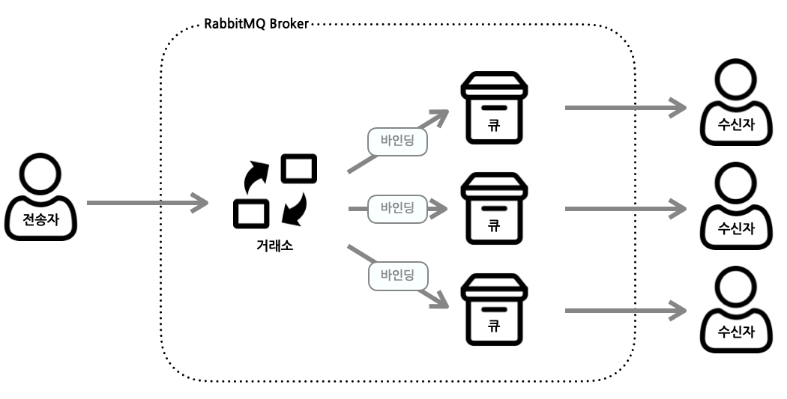
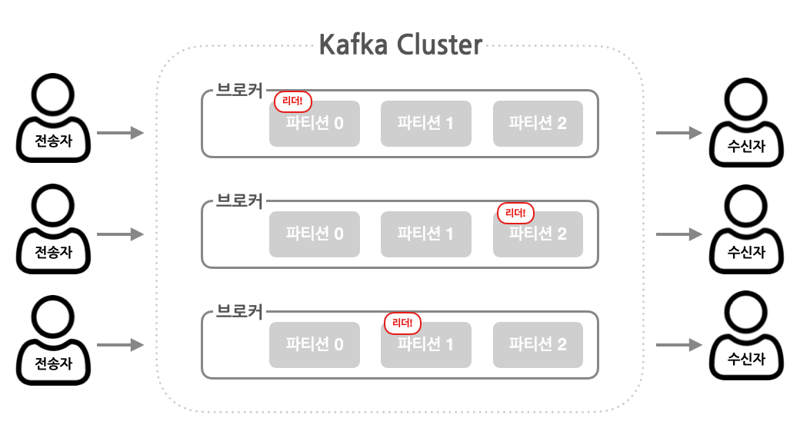

# 8장. 비동기 메시지 전송하기

### 🕵🏿‍♀️ 배우는 내용

* 비동기 메시지 전송
* JMS, RabbitMQ, Kafka를 사용해서 메시지 전송
* 브로커에서 메시지 가져오기
* 메시지 리스닝

> ### 들어가기 앞서!
>
> 이전 장에서는 **REST를 사용하여 동기화 통신**을 알아보았다면, 이번 장에서는 **비동기 메시징**에 대해 알아보도록 한다. 비동기 메시징은 **애플리케이션 간의 응답을 기다리지 않고 간접적으로 메시지를 전송하는 방법으로 통신하는 애플리케이션들의 결합도를 낮추고 확장성을 높힌다**. 스프링에서 제공되는 비동기 메시징에는 JMS(Java Message Service), RabbitMQ, AMQP(Advance Message Queueing Protocol), Apache Kafka 등이 존재한다. 이들이 어떻게 사용되는지 간단하게 알아보자.

## 8.1 JMS로 메시지 전송

JMS는 **두 개 이상의 클라이언트 간에 메시지 통신을 위한 공통 API를 정의하는 자바 표준**이며, 오랫동안 비동기 메시징을 처리하는 가장 좋은 방법으로 사용되었다. JMS가 나오기 전에는 메시지 통신을 중개하는 메시지 브로커들이 나름의 API를 가지고 있어 메시징 코드의 호환이 어려웠으나, JMS 사용하면서 이를 준수하는 모든 코드가 공통 인터페이스를 통해 함께 작동할 수 있다.

스프링에서는 **`JmsTemplate`이라는 템플릿 기반의 클래스를 통해 JMS를 지원**한다. 이를 사용하면 Producer가 큐와 토픽에 메시지를 전송하고, Consumer는 이 메시지를 받을 수 있다. 또한, 스프링에서는 메시지 기반의 POJO를 지원하는데 이는 큐 혹은 토픽에 도착하는 메시지에 반응하여 비동기 방식으로 메시지를 수신하는 간단한 자바 객체이다.

### 설정

JMS를 사용하기 위해서는 기본적으로 내장된 브로커를 사용하거나(스타터 안에 포함), 사용하고 싶은 브로커의 의존성만 추가해주면 된다.

```java
// Apache ActiveMQ Artemis (ActiveMQ를 새롭게 구현한 차세대 브로커)
implementation 'org.springframework.boot:spring-boot-starter-artemis'

// Apache ActiveMQ
implementation 'org.springframework.boot:spring-boot-starter-artemis'
```

기본적으로 스프링에서는 아르테미스 브로커가 localhost의 61616 포트를 리스닝하는 것으로 간주한다. 개발에서는 이를 사용해도 되겠지만, 실무 환경에서는 포트를 변경해야 할 경우가 존재한다. 이를 위해 몇가지 속성을 설정할 수 있다.

#### Artemis

* spring.artemis.host → 호스트
* spring.artemis.port → 포트
* spring.artemis.user → 사용하기 위한 사용자(선택)
* spring.artemis.password → 사용하기 위한 사용자 암호(선택)

#### ActiveMQ

* spring.activemq.broker-url → URL
* spring.activemq.user → 사용하기 위한 사용자(선택)
* spring.activemq.password → 사용하기 위한 사용자 암호(선택)
* spring.activemq.in-memory → 인메모리 브로커로 시작 여부

만약 ActiveMQ를 사용한다면, 인메모리 브로커로 시작하지 않도록 하는 것이 좋다. 이는 같은 애플리케이션에서 메시지를 주고 받을 때만 유용하기 때문이다.

### 메시지 전송

JMS 스타터가 의존성에 포함되면 JmsTemplate를 스프링 부트가 자동-구성하게 된다. 이 **JmsTemplate는 스프링 JMS 통합 지원의 핵심으로 브로커와의 연결 및 세션 생성, 메시지 전송중 예외 처리 등 수많은 일들을 대신 해준다**. 따라서 우리는 메시지 전송에만 집중 할 수 있다.

JmsTemplate 안에는 `send()`, `convertAndSend()` 라는 두가지 종류의 메서드가 존재한다.

* send()

  > Message 객체를 생성하기 위해 MessageCreator가 필요

* convertAndSend()

  > Object 타입 객체를 받아 내부적으로 Message 타입으로 변환하나, 메시지 전송 전에 Message를 커스터마이징 할 수 있도록 MessagePostProcessor를 인자로 받을 수 있음

결과적으로 `convertAndSend()` 은 추가적으로 메시지를 생성하여 변환까지 한 뒤  `send()` 와 같은 동작을 하는 것이다. 이는 JmsTemplate 코드를 보면 알 수 있다.

```java
@Override
public void convertAndSend(Destination destination, final Object message) throws JmsException {
  send(destination, session -> getRequiredMessageConverter().toMessage(message, session));
}
```

위 코드는 여러개의 `convertAndSend()` 중 하나만 가져온 것이다. 내부적으로 `send()` 메소드를 호출하는 것을 볼 수 있으며, 그 안에서 메시지를 변환하는 것 또한 볼 수 있다. 

스프링에서 메시지 변환기의 경우 다음과 같이 기본적으로 제공하고 있다.(org.springframework.jms.support.converter 패키지 안에 존재)

* MappingJackson2MessageConverter

  > Jackson 2 JSON 라이브러리를 사용하여 JSON으로 상호 변환

* MarshallingMessageConveter

  > JAXB를 사용하여 메시지를 XML로 상호 변환

* MessagingMessageConverter

  > 수신된 메시지의 MessageConveter를 사용하여 해당 메시지를 Message 객체로 상호 변환
  > 혹은, JMS 헤더와 연관된 JmsHeaderMapper를 표준 메시지 헤더로 상호 변환

* SimpleMessageConveter

  > 문자열을 TestMessage, Byte 배열을 BytesMessage, Map을 MapMessage로, Serializable 객체를 ObjectMessage 상호 변환

**기본적으로는 SimpleMessageConveter가 사용되며, 이 경우에 객체는 Serializable 인터페이스를 구현**해야 된다. 이를 피하기 위해서 MappingJackson2MessageConverter와 같은 다른 메시지 변환기도 사용할 수 있다. 다른 변환기의 경우, 해당 변환기의 인스턴스를 빈으로 선언만하면 된다.

다음으로는 `send()` 메소드를 확인해 보자.

```java
@Override
public void send(final Destination destination, final MessageCreator messageCreator) throws JmsException {
  execute(session -> {
    doSend(session, destination, messageCreator);
    return null;
  }, false);
}
```

`send()` 메소드에서는 `excute()` 라는 메서드를 호출하고 있다.

```java
@Nullable
public <T> T execute(SessionCallback<T> action, boolean startConnection) throws JmsException {
  Assert.notNull(action, "Callback object must not be null");
  Connection conToClose = null;
  Session sessionToClose = null;
  try {
    Session sessionToUse = ConnectionFactoryUtils.doGetTransactionalSession(obtainConnectionFactory(), this.transactionalResourceFactory, startConnection);
    if (sessionToUse == null) {
      conToClose = createConnection();
      sessionToClose = createSession(conToClose);
      if (startConnection) {
        conToClose.start();
      }
      sessionToUse = sessionToClose;
    }
    if (logger.isDebugEnabled()) {
      logger.debug("Executing callback on JMS Session: " + sessionToUse);
    }
    return action.doInJms(sessionToUse);
  }
  catch (JMSException ex) {
    throw convertJmsAccessException(ex);
  }
  finally {
    JmsUtils.closeSession(sessionToClose);
    ConnectionFactoryUtils.releaseConnection(conToClose, getConnectionFactory(), startConnection);
  }
}
```

`excute()` 메서드는 다음과 같은 모습을 하고 있다. 코드를 살펴보면 브로커와의 연결 그리고 세션 생성, 메시지 보내기, 세션과 연결 끊기를 수행하고 있다. 이 부분이 앞서 말했듯 우리는 메시지를 보내는 것에만 집중할 수 있도록 해주는 곳이다. 이제 이들을 사용하는 방법을 알아보자.

```java
@Service
@RequiredArgsConstructor
public class JmsOrderMessagingService implements OrderMessagingService{

  private final JmsTemplate jms;

  @Override
  public void sendOrder(Order order) {
    jms.send(session -> session.createObjectMessage(order))
    jms.convertAndSend("tacocloud.order.queue", order, this::addOrderSource);
  }

  private Message addOrderSource(Message message) throws JMSException {
    message.setStringProperty("X_ORDER_SOURCE", "WEB");
    return message;
  }
}
```

JmsTemplate를 통해 `send()` 와 `convertAndSend()` 메서드를 호출하고 있다. `send()` 의 경우 목적지를 작성하지 않았으므로 기본 목적지로 가게 되고, `convertAndSend()` 은 `tacocloud.order.queue` 라는 목적지로 커스터마이징 된 메시지를 보내고 있다. 

### 도착지 설정

기본 도착지의 경우 `spring.jms.template.default-destination` 속성으로 설정이 가능하다.

만약 Destination 객체를 전달하고 싶다면, Destination 빈을 선언한 뒤 메시지 전송을 수행하는 빈에 주입하면 된다.

```java
@Bean
public Destination orderQueue() {
  return new ActiveMQQueue("tacocloud.order.queue");
}
```

이렇게 Destination 객체를 사용하여 목적지를 정한다면 도착지 이름뿐만 아니라 다양하게 목적지를 구성할 수 있다.

### 메시지 수신

메시지를 수신하는 방법은 두 가지가 존재하면 이는, **메시지를 요청하고 도착할 때까지 기다리는 풀(pull) 모델**과 **메시지가 수신 가능하게 된다면 우리 코드로 자동 전달하는 푸시(push) 모델**이 존재한다.

JmsTemplate의 모든 메서드의 경우 풀 모델을 사용하기에 메서드를 호출할 경우엔 스레드에서 메시지를 수신할 수 있을 때까지 기다린다. 푸시 모델의 경우엔 메시지가 수신 가능할 때 자동으로 호출되는 메시지 리스너를 정의한다.

#### 풀 모델

JmsTemplate에서 제공되는 메서드를 통해 다음과 같은 코드로 메시지를 가져올 수 있다.

```java
public Order receiveOrder() {
  Message message = jms.receive("tacocloud.order.queue");
  return (Order) conveter.fromMessage(message);
}
```

`receive()` 메서드를 통해 목적지에서 메시지를 가져올 수 있고 이를 알맞은 객체로 변환하여 반환을 하고 있다. 이는 메시지의 속성과 헤더를 살펴볼 때 적절한 방법이며, 만약 메시지 안에 페이로드(순수한 데이터)만 필요할 시에는 `reciveAndConvert()` 메서드를 사용할 수 있다.

```java
public Order receiveOrder() {
  return (Order) jms.receiveAndConvert("tacocloud.order.queue");
}
```

앞서 설명한 `send()` 와 `convertAndSend()` 와 같은 방식으로 구현되어 있다.

#### 리스너 선언하기

메시지 리스너의 경우 메시지가 도착할 때까지 대기하는 수동적인 컴포넌트이다. 이를 생성하기 위해서는 컴포넌트의 메서드에 `@JmsListener` 를 선언하면 된다.

```java
@Component
public class OrderListener {
  
  @JmsListener(destination = "tacocloud.order.queue")
  public void receiveOrder(Order order) {
    ....
  }
}
```

풀 방식에 비해 중단 없이 다수의 메시지를 빠르게 처리할 수 있기에 좋은 선택이 될 수 있으나, **심각한 병목 현상이 생길 수 있기 때문에 조심해서 사용해야 한다.**

<br>

## 8.2 RabbitMQ와 AMQP

AMQP의 대표적인 구현체라고 할 수 있는 RabbitMQ는 JMS보다 더 좋은 메시지 라우팅 전략을 제공한다. 도착지만 설정하는 JMS와는 달리 AMQP 메시지에서는 수신자가 메시지를 가져가는 **큐**와 **거래소(Exchnage) 이름**, **라우팅 키**를 주소로 사용한다.

<p align="center"></p>

전송자가 메시지를 RabbitMQ 브로커에 전달을 하게되고 브로커에서는 라우팅 키를 기반으로 거래소를 찾아 메시지를 보낸다. 거래소에서는 하나 이상의 큐에 메시지를 전달할 책임을 가지고 있기에 **거래소 타입**, **거래소와 큐 간의 바인딩**, **라우팅 키 값**을 기반으로 하여 큐로 메시지를 전달한다. 이후, 수신자는 원하는 큐에서 메시지를 가져가거나 대기한다.

```
메시지 --> 브로커 -- [라우팅 키로 거래소 찾음] -> 거래소 -- [바인딩 키로 큐 찾음] -> 큐 --> 소비
```

거래소의 종류는 여러가지가 존재하는데 다음과 같다.

* 기본

  > 브로커가 자동으로 생성하는 특별한 거래소로 해당 메시지의 라우팅 키와 이름이 같은 큐로 메시지를 전달  
  > 모든 큐는 자동으로 기본 거래소와 연결

* 다이렉트

  > 바인딩 키가 해당 메시지의 라우팅 키와 같은 큐에 메시지를 전달

* 토픽

  > 바인딩 키(와일드카드 포함)가 해당 메시지의 라우팅 키와 일치하는 하나 이상의 큐에 메시지를 전달

* 팬아웃

  > 바인딩 키 혹은 라우팅 키에 상관없이 모든 연결된 큐에 메시지를 전달

* 헤더

  > 토픽 거래소와 유사, 라우팅 키 대신 메시지 헤더 값을 기반

* 데드 레터

  > 어떤 거래소-큐 바인딩과 일치하지 않는 모든 메시지를 보관하는 잡동사니 거래소

이 중 가장 간단한 형태의 거래소는 기본과 팬아웃 거래소이며, 이들은 JMS의 큐 및 토픽과 거의 일치한다. 만약 더 유연한 라우팅을 원한다면 다른 거래소 형태를 사용해야 한다.

### 사용 준비

스프링에서 RabbitMQ를 사용하기 위해서는 AMQP 스타터를 의존성에 추가하면 된다.

```java
implementation 'org.springframework.boot:spring-boot-starter-amqp'
```

스타터 하나로 다른 지원 컴포넌트들과 AMQP 연결 팩토리, RabbitTemplate 빈을 생성하는 자동-구성이 이루어진다. RabbitMQ의 경우 기본적으로 5672 포트를 사용한다. JMS와 마찬가지로 운영 환경에서는 속성을 정의하여 다른 값으로 변경 할 수 있다.

* spring.rabbitmq.addresses → 쉼표로 구분된 리스트 형태의 RabbitMQ 브로커 주소
* spring.rabbitmq.host → 브로커의 호스트(기본값 : localhost)
* spring.rabbitmq.port → 브로커의 포트(기본값 : 5672)
* spring.rabbitmq.username → 브로커를 사용하기 위한 사용자 이름(선택)
* spring.rabbitmq.password → 브로커를 사용하기 위한 사용자 암호(선택)

### 메시지 전송

RabbitMQ 스타터의 핵심은 **RabbitTemplate** 이다. RabbitTemplate는 JmsTemplate와 유사하게 사용이 가능하다. `send()`, `convertAndSend()` 메서드 이름은 같으나, 전달하는 인자에 **거래소**, **라우팅 키**, **메시지**를 사용하여 메시지를 보낸다. 또 메시지를 전달하기 전에 메시지를 조작할 수 있는 `MessagePostProcessor` 인자도 받을 수 있다(`convertAndSend()` 메서드의 경우). 만약 인자들을 주지 않았을 시에는 기본으로 설정된 거래소 혹은 라우팅 키로 메시지가 생성된다.

```java
private final RabbitTemplate rabbit;

public void sendOrder(Order order) {	
  MessageConverter converter = rabbit.getMessageConverter();
  MessageProperties props = new MessageProperties();
  Message message = converter.toMessage(order, props);
  rabbit.send("tacocloud.order", message);
}
```

다음은 메시지를 생성하는 기본적인 예시이다. 메시지에 속성을 정의하기 위해 `Messageproperties` 를 생성하고 RabbitTemplate에서 사용하는 기본적인 컨버터로 전달할 메시지와 속성을 변환한다. 이후, `send()` 메서드에 들어갈 라우팅 키와 메시지를 인자로 전달하여 호출하여 메시지를 브로커로 전달한다.

위에서는 거래소를 전달하지 않았으므로 자동으로 빈 문자열("")으로 설정한다. 만약 라우팅 키도 전달하지 않았다면 똑같이 빈 문자열로 설정된다. 이들은 `spring.rabbitmq.template.exchange` 와 `spring.rabbitmq.template.routing-key` 속성을 통해 설정할 수 있다.

만약, 메시지를 변환하는 작업을 맡긴다면 다음과 같이 코드가 줄어들 수 있다.

```java
public void sendOrder(Order order) {	
  rabbit.convertAndSend("tacocloud.order", order);
}
```

### 메시지 컨버터 구성

스프링에서는 RabbitTemplate에서 사용할 수 있는 여러가지 메시지 컨버터를 제공한다.

* Jackson2JsonMessageConverter

  > Jackson2JSONProcessor를 사용하여 객체를 JSON으로 변환

* MarshallingMessageConveter

  > 스프링 Marshaller와 Unmarshaller를 사용하여 변환

* SerializerMessageConverter

  > 스프링의 Serializer와 Deserializer를 사용하여 String과 객체를 변환

* SimpleMessageConveter

  > String, byte 배열, Serializer 타입을 변환

* ContentTypeDelegatingMessageConveter

  > contentType 헤더를 기반으로 다른 메시지 변환기에 변환을 위임

JMS와 같이 변환기를 변환할 때는 MessageConverter 타입의 빈을 구성하면 된다.

```java
@Bean
public MessageConveter messageConverter() {
  return new Jackson2JsonMessageConveter();
}
```

다음과 같이 선언하면 스프링 부트 자동-구성에서 이 빈을 찾아 기본 메시지 변환기 대신에 RabbitTemplate로 주입한다.

### 메시지 수신

RabbiMQ 또한 **`RabbitTemplate`를 사용하여 큐로부터 메시지를 받아오는 풀 모델**과 **`@RabbitListener`를 지정하여 메시지를 수신하는 푸시 모델이 존재**한다.

#### 풀 모델

**수신하는 메서드에서는 거래소, 라우팅 키를 매개변수로 받지 않는다.** 이는 수신쪽에서는 **이미 큐에 들어간 메시지를 가져오기만 할 뿐**이기에 큐까지 메시지를 넣기 위한 거래소와 라우팅 키 값은 필요가 없다. 따라서 **큐의 이름만 알면 된다**. 또한, 대부분의 수신 메서드는 메시지의 수신 타임아웃을 나타내기 위해 `long` 타입의 `timoutMillis` 라는 변수를 갖는다. 기본 값으로는 0밀리초(1/1000 초)이며, 호출 즉시 결과를 반환한다. 만약 반환할 메시지가 없다면 `null`을 반환한다.

```java
private final RabbitTemplate rabbit;
private final MessageConverter conveter;

public Order receiveOrder() {
  Message message = rabbit.receive("tacocloud.orders", 30000);
  return message != null ? (Order) converter.fromMassage(message) : null;
}
```

위 코드는 메시지를 수신하는 코드로 애플리케이션 사용 환경에 따라 약간의 지연이 발생할 수 있으므로 어느정도의 타임아웃을 설정하는 것이 좋다. 타임아웃의 경우 `spring.rabbitmq.template.receive-timeout` 속성을 통해 설정할 수 있다.

만약 메시지 컨버팅을 RabbitTemplate에게 맡기고 싶다면 `receiveAndConveter()` 메소드를 호출 할 수 있다.

```java
public Order receiveOrder() {
  return (Order) rabbit.receiveAndConvert("tacocloud.orders");
}
```

타입 캐스팅 또한 거슬리다면 `ParameterizedTypeReference`를 `receiveAndConveter()`  인자로 전달하여 직접적으로 원하는 객체를 수신하게 하면 없앨 수 있다.

```java
public Order receiveOrder() {
  return rabbit.receiveAndConvert("tacocloud.orders", new ParameterizedTypeReference<Order>(){});
}
```

해당 방법이 캐스팅 보다 좋은점은 타입-안전 측면이다. 단 이를 사용하기 위해서는 **메시지 변환기가 SmartmessageConveter 인터페이스를 구현한 클래스(Jackson2JsonMessageConverter 등)여야 한다.**

#### 푸시 모델

스프링에서는 `@JmsListener`와 유사한 `@RabbitListener` 를 제공한다. 해당 메서드가 자동으로 호출되기 위해서는 `@RabbitListener` 애노테이션을 메서드에 선언하면 된다.

```java
@Component
public class OrderListener {
  
  @RabbitListener(queues = "tacocloud.order.queue")
  public void receiveOrder(Order order) {
    ....
  }
}
```

위 `@JmsListener`와 거의 동일하게 작동하기 때문에 예제 코드 또한 거의 동일한 것을 볼 수 있다.

<br>

## 8.3 카프카 사용하기

아파치 카프카는 가장 최신의 메시징 시스템이며 위에서 본 메시징 시스템들과 거의 유사한 메시지 브로커이다. 카프카의 경우 **높은 확장성을 제공하는 클러스터 형태로 실행**되도록 설계가 되었다. 클러스터의 모든 카프카 인스턴스에 걸쳐서 **토픽(Topic)을 파티션(Partition)으로 분할하여 메시지를 관리**하게 된다. 

<p align="center"></p>

카프카의 토픽은 모든 브로커에 걸쳐 복제(Replicated)되며, 각 파티션마다 리더를 선정한다(리더는 브로커에 골고루 분배). 만약 리더가 중지 된다면 나머지 팔로워에서 리더를 선정한다. 카프카에 대해 깊게는 설명한다면 굉장히 길어지기에 따로 살펴보도록 하자.

### 준비하기

카프카를 사용하기 위해서는 의존성을 추가해야되는데 스타터가 존재하지 않는다. 따라서 다음과 같은 의존성을 추가해주자.

```java
implementation 'org.springframework.kafka:spring-kafka'
```

이 의존성을 추가해준다면 위의 다른 메시징 시스템들과 같이 KafkaTemplate를 사용할 수 있다. 카프카는 기본적으로 localhost에서 실행되며 9092 포트를 리스닝하는 브로커를 사용한다.

`spring.kafka-bootstrap-servers` 속성을 통해 서버의 위치를 설정할 수 있으며 복수개도 가능하다.

```yaml
spring:
  kafka:
    bootstrap-servers:
    - kafka.tacocloud.com:9092
    - kafka.tacocloud.com:9093
    - kafka.tacocloud.com:9094
```

### 메시지 전송

다른 메시징 시스템과는 달리 전송 메서드에서 조금의 차이를 보여준다. 먼저 `convertAndSend()`에 해당하는 메서드가 없다는 것인데, 이는 **KafkaTemplate에서는 제네릭 타입을 사용하고 메시지 전송시 직접 도메인 타입을 처리할 수 있기 때문**이다. 즉, 모든 `send()` 메서드에 기본적으로 컨버팅 기능이 들어가 있다고 생각할 수 있다.

또, 여러가지 매개변수를 받을 수 있는데 다음과 같다.

* 메시지가 전송될 토픽(`send()` 에서 필요)
* 토픽 데이터를 쓰는 파티션(선택)
* 레코드 전송 키(선택)
* 타임스탬프(선택, 기본값 : System.currentTimeMillis())
* 페이로드(순수 데이터, 필수)

```java
private final KafkaTemplate<String, Order> kafkaTemplate;

public void sendOrder() {
  kafkaTemplate.send("tacocloud.orders.topic", order);
}
```

`send()` 메서드를 통해 `"tacocloud.orders.topic"` 이란 토픽으로 Order 객체를 전송하는 코드이다. 만약 기본 토픽을 설정한다면 `sendDefault()` 메서드를 통해 더 짧은 형태로 보낼 수도 있다.

```yaml
spring:
  kafka:
    template:
      default-topic: tacocloud.orders.topic
```

```java
private final KafkaTemplate<String, Order> kafkaTemplate;

public void sendOrder() {
  kafkaTemplate.sendDefault(order);
}
```

### 메시지 수신

다음으로 다른 메시징 시스템들과 다른 점은 **메시지를 가져오기 위한 유일한 방법은 메시지 리스너를 작성하는 것**이다. 리스너의 경우 다른 리스너와 비슷하게 `@KafkaListener` 애노테이션을 지정된 메서드에 정의하는 것이다. 

```java
@Component
public class OrderListener {
  
  @KafkaListener(topics = "tacocloud.order.topic")
  public void handle(Order order) {
    ....
  }
}
```

위 코드에서는 페이로드인 Order 객체만 인자로 받고 있지만, 추가적인 메타 데이터가 필요하다면 `ConsumerRecord` 혹은 `Message` 객체도 받을 수 있다.

```java
// ConsumerRecord 객체 사용
@KafkaListener(topics = "tacocloud.order.topic")
public void handle(Order order, ConsumerRecord<Order> record) {
  log.info("Received from partition {} with timestamp {}"
           , record.partition(), record.timestamp());
  ....
}

// Message 객체 사용
@KafkaListener(topics = "tacocloud.order.topic")
public void handle(Order order, Message<Order> message) {
  MessageHeaders headers = message.getHeaders();
  log.info("Received from partition {} with timestamp {}"
           ,headers.get(KafkaHeaders.RECEIVED_PARTITION_ID
           ,headers.get(KafkaHeaders.RECEIVED_TIMESTAMP));
  ....
}
```

`ConsumerRecord` , `Message` 객체를 통해 수신한 메시지의 파티션과 타임스탬프를 로깅하는 예제이다. **메시지 페이로드의 경우, `ConsumerRecord.value()` 혹은 `Message.getPayload()`를 사용해서 받을 수 있다**.
